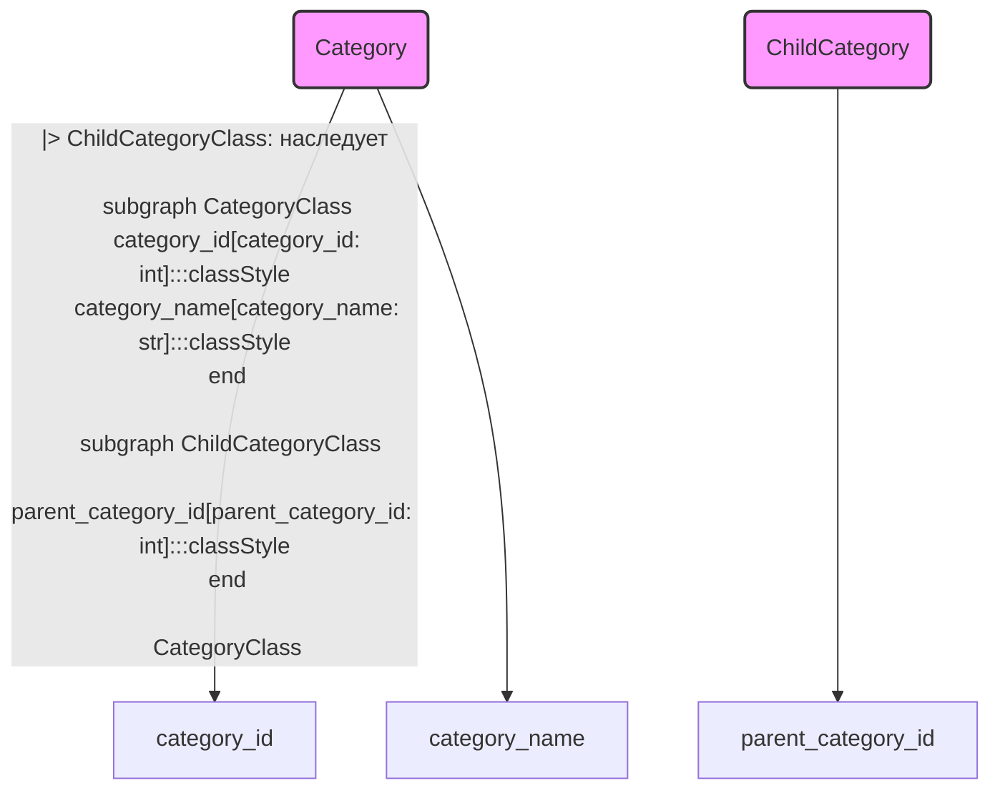

## АНАЛИЗ КОДА: `hypotez/src/suppliers/aliexpress/api/models/category.py`

### <алгоритм>

1. **Определение класса `Category`:**
   - Создается класс `Category`, представляющий собой базовую категорию товара.
   - Атрибуты класса:
     - `category_id`: Целочисленный идентификатор категории.
     - `category_name`: Строковое имя категории.
   - Пример:
     ```python
     category = Category()
     category.category_id = 123
     category.category_name = "Электроника"
     ```

2. **Определение класса `ChildCategory`:**
   - Создается класс `ChildCategory`, наследующий от класса `Category`. Представляет подкатегорию товара.
   - Атрибуты класса:
     - Все атрибуты класса `Category` (`category_id`, `category_name`).
     - `parent_category_id`: Целочисленный идентификатор родительской категории.
   - Пример:
     ```python
     child_category = ChildCategory()
     child_category.category_id = 456
     child_category.category_name = "Смартфоны"
     child_category.parent_category_id = 123 # ссылается на категорию "Электроника"
     ```

3. **Взаимодействие:**
   - Класс `ChildCategory` расширяет функциональность класса `Category` добавляя ссылку на родительскую категорию. Таким образом, они взаимосвязаны через наследование, где дочерний класс является более конкретным представлением родительского класса.

### <mermaid>



**Объяснение `mermaid`:**
-  `CategoryClass(Category)` и `ChildCategoryClass(ChildCategory)`:  Определены два узла, представляющие классы `Category` и `ChildCategory`.  `classDef classStyle` - определяет стиль для классов.
-  `CategoryClass --|> ChildCategoryClass: наследует`: Отображает отношение наследования. `ChildCategory` является подклассом `Category`.
-  `subgraph CategoryClass` и `subgraph ChildCategoryClass`: Определяют области для атрибутов классов.
-  `category_id[category_id: int]`, `category_name[category_name: str]` и `parent_category_id[parent_category_id: int]`:  Представляют атрибуты каждого класса.  `:::classStyle` - применяет стиль.

### <объяснение>

**Импорты:**

-   В данном файле нет импортов, что указывает на то, что классы `Category` и `ChildCategory` являются самодостаточными и не зависят от внешних модулей.

**Классы:**

1.  **`Category`**:
    -   **Роль:**  Представляет базовую категорию товара.
    -   **Атрибуты:**
        -   `category_id` (int): Уникальный идентификатор категории.
        -   `category_name` (str): Название категории.
    -   **Методы:**  Нет методов, класс используется как контейнер данных.
    -   **Взаимодействие:**  Используется как базовый класс для `ChildCategory`.
2.  **`ChildCategory`**:
    -   **Роль:** Представляет подкатегорию товара.
    -   **Атрибуты:**
        -   `category_id` (int):  Уникальный идентификатор подкатегории (унаследован от `Category`).
        -   `category_name` (str): Название подкатегории (унаследован от `Category`).
        -   `parent_category_id` (int):  Идентификатор родительской категории.
    -   **Методы:** Нет методов, используется как контейнер данных и расширяет `Category`.
    -   **Взаимодействие:** Наследует от `Category`, добавляя свойство для связи с родительской категорией.

**Функции:**
   -  В данном файле нет функций.

**Переменные:**
-  Все переменные являются атрибутами классов и используются для хранения данных о категориях. Типы данных для атрибутов указаны явно.

**Потенциальные ошибки и области для улучшения:**

-   **Отсутствие методов:**  Классы `Category` и `ChildCategory` в настоящее время являются контейнерами данных без какой-либо логики. В будущем может потребоваться добавить методы для валидации данных, сравнения или преобразования объектов.
-   **Отсутствие проверок типов:** Можно добавить проверки типов данных для атрибутов во время присваивания значений, чтобы избежать ошибок во время выполнения (например, при использовании `mypy`).
-   **Отсутствие документации:**  Можно добавить docstring для классов и атрибутов, чтобы улучшить читаемость кода и упростить его использование.
-   **Отсутствие __init__**: Для удобства работы с классами можно добавить конструктор `__init__`, что позволит инициализировать атрибуты при создании экземпляра класса.

**Цепочка взаимосвязей с другими частями проекта:**
-   Этот модуль находится в `src/suppliers/aliexpress/api/models/`, что указывает на его роль в представлении моделей данных для API AliExpress.
-   Другие части проекта, вероятно, будут использовать эти модели для получения и обработки информации о категориях товаров с AliExpress.
-   Взаимодействие происходит путем создания объектов этих классов, присваивания им значений и передачи в другие части системы.