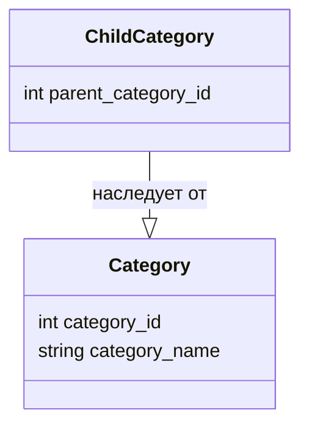

## <алгоритм>
1. **Определение класса `Category`**:
   - Создается класс `Category`.
   - Определяются атрибуты `category_id` (целое число) и `category_name` (строка).
   - Пример:
     ```python
     category1 = Category()
     category1.category_id = 123
     category1.category_name = "Electronics"
     ```

2. **Определение класса `ChildCategory`**:
   - Создается класс `ChildCategory`, который наследуется от класса `Category`.
   - Добавляется атрибут `parent_category_id` (целое число).
    - Пример:
      ```python
      child_category1 = ChildCategory()
      child_category1.category_id = 456
      child_category1.category_name = "Smartphones"
      child_category1.parent_category_id = 123 # id родительской категории
      ```

3. **Поток данных**:
   - Данные передаются при создании экземпляров классов и присвоении значений их атрибутам.
   -  `ChildCategory` наследует атрибуты `category_id` и `category_name` от `Category`, добавляя свой атрибут `parent_category_id`.

## <mermaid>


## <объяснение>

**Импорты**:
- В данном коде нет импортов.

**Классы**:

- **`Category`**:
   - **Роль**: Представляет общую категорию товаров.
   - **Атрибуты**:
      - `category_id` (int): Уникальный идентификатор категории.
      - `category_name` (str): Название категории.
   - **Методы**: Нет явных методов, только атрибуты.
   - **Взаимодействие**: Используется как базовый класс для `ChildCategory`, представляет структуру данных для категории.

- **`ChildCategory`**:
   - **Роль**: Представляет подкатегорию товаров, наследуя основные атрибуты от `Category`.
   - **Атрибуты**:
      - `parent_category_id` (int): Идентификатор родительской категории.
      - Наследует `category_id` и `category_name` от `Category`.
   - **Методы**: Нет явных методов, только атрибуты.
   - **Взаимодействие**: Является расширением `Category`, добавляя связь с родительской категорией, используется для представления иерархической структуры категорий.

**Функции**:
- В коде нет функций.

**Переменные**:
- `category_id`: Целочисленный идентификатор категории.
- `category_name`: Строковое название категории.
- `parent_category_id`: Целочисленный идентификатор родительской категории.

**Цепочка взаимосвязей с другими частями проекта**:
- Данные классы могут использоваться в других частях проекта для представления и обработки данных о категориях товаров, например, при парсинге ответов API AliExpress, формировании структуры данных для отображения категорий в интерфейсе пользователя или для анализа и фильтрации данных.
-  Эти модели могут быть частью более широкой системы управления каталогом товаров.

**Потенциальные ошибки или области для улучшения**:
- В текущем виде классы представляют только структуру данных. Для полноценного использования в проекте могут потребоваться дополнительные методы, например, для валидации данных, сериализации или десериализации.
-  Отсутствует обработка ошибок. Желательно добавить проверку типов и границ для полей.
-  Можно добавить методы для сравнения экземпляров классов или их хеширования.
- Не используются `dataclasses`, которые упростили бы создание и использование этих классов, например, автоматизировали бы `__init__` и `__repr__`.