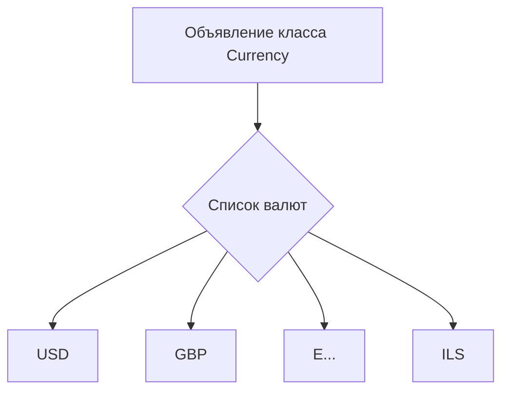
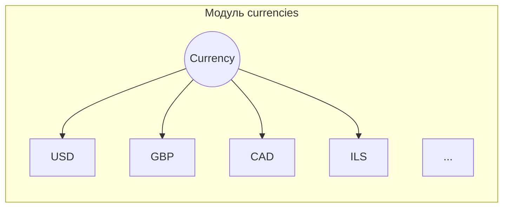

```MD
# Анализ кода файла `hypotez/src/suppliers/aliexpress/api/models/currencies.py`

## <input code>

```python
## \file hypotez/src/suppliers/aliexpress/api/models/currencies.py
# -*- coding: utf-8 -*-\
#! venv/Scripts/python.exe # <- venv win
## ~~~~~~~~~~~~~\
""" module: src.suppliers.aliexpress.api.models """
class Currency:
    USD = 'USD'
    GBP = 'GBP'
    CAD = 'CAD'
    EUR = 'EUR'
    UAH = 'UAH'
    MXN = 'MXN'
    TRY = 'TRY'
    RUB = 'RUB'
    BRL = 'BRL'
    AUD = 'AUD'
    INR = 'INR'
    JPY = 'JPY'
    IDR = 'IDR'
    SEK = 'SEK'
    KRW = 'KRW'
    ILS = 'ILS'
```

## <algorithm>

В данном коде отсутствует логика в виде циклов или условных операторов.  Алгоритм сводится к объявлению констант (атрибутов класса) представляющих валюты.

**Блок-схема:**



**Пример:**

В коде прямо определены значения валют, например, `Currency.USD = 'USD'`. Это не динамический процесс, нет вычислений или обработки данных.


## <mermaid>



## <explanation>

**Импорты:**

В коде отсутствуют импорты. Это обычный Python файл, который не зависит от внешних библиотек, за исключением стандартных библиотек Python.

**Классы:**

* `Currency`:  Этот класс предназначен для хранения значений различных валют.  Он определяет константы, представляющие различные валюты (USD, GBP, и т.д.).  Все значения являются строками.

**Функции:**

Нет функций в этом коде. Всё представлено в виде атрибутов класса.

**Переменные:**

Переменные в данном случае это константы `USD`, `GBP`, ..., `ILS`,  типа `str` (строка). Они представляют собой различные валюты и хранятся как атрибуты класса `Currency`.

**Возможные ошибки и области для улучшений:**

* **Недостаток гибкости:**  Если нужно будет добавить или изменить валюту, придётся вручную изменять код.  В реальных приложениях лучше использовать перечисления (Enum) или другие структуры данных, которые обеспечивают более удобное добавление и управление значениями.  Например, можно было бы использовать словарь для более гибкого доступа к валютам.

* **Отсутствие проверки данных:**  В данном коде нет проверки правильности значений валют.  Например, если понадобится работать с кодами валют в других модулях, следует обеспечить возможность валидации.

**Взаимосвязи с другими частями проекта:**

Этот файл (`currencies.py`) предоставляет список кодов валют, вероятно, для использования другими частями проекта, такими как модули для обработки платежей,  конвертации валют или для отображения списка валют в пользовательском интерфейсе.  Вероятнее всего, эти модули будут импортировать `Currency` для доступа к значениям валют.  Например:

```python
# В другом файле
from suppliers.aliexpress.api.models.currencies import Currency
price_in_usd = get_price_from_api()
price_in_eur = convert_currency(price_in_usd, Currency.EUR) 
```

Этот код показывает, как другие части приложения могут взаимодействовать с классом `Currency` для работы с валютами.