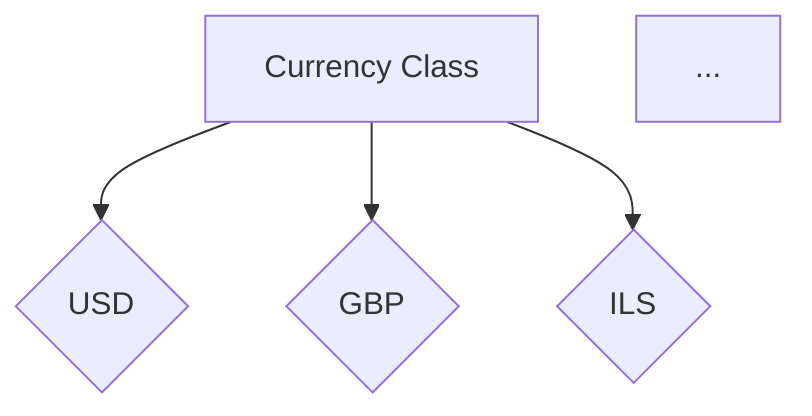
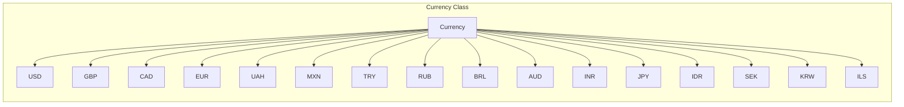

# <input code>

```python
## \file hypotez/src/suppliers/aliexpress/api/models/currencies.py
# -*- coding: utf-8 -*-\
#! venv/Scripts/python.exe # <- venv win
## ~~~~~~~~~~~~~
""" module: src.suppliers.aliexpress.api.models """
class Currency:
    USD = 'USD'
    GBP = 'GBP'
    CAD = 'CAD'
    EUR = 'EUR'
    UAH = 'UAH'
    MXN = 'MXN'
    TRY = 'TRY'
    RUB = 'RUB'
    BRL = 'BRL'
    AUD = 'AUD'
    INR = 'INR'
    JPY = 'JPY'
    IDR = 'IDR'
    SEK = 'SEK'
    KRW = 'KRW'
    ILS = 'ILS'
```

# <algorithm>

Этот код определяет класс `Currency`, содержащий константы, представляющие различные валюты.  Алгоритм прост: определение класса и инициализация константных значений валют. Нет никаких вычислений или других операций.



Данные (значения валют) не передаются между функциями или классами, так как это просто набор констант.


# <mermaid>



# <explanation>

**Импорты**:  Нет импортов, код содержит только определения класса.  Файл расположен в подпапке `models` внутри `api` модуля, что указывает на то, что он определяет структуру данных для использования в API.

**Классы**:  `Currency`:  Этот класс представляет набор константных значений валют.  Он не содержит методов для работы с валютами, а лишь описывает возможные значения.

**Функции**: Нет функций, только классы.

**Переменные**:  `USD`, `GBP`, `CAD`, и т.д. - это константы, хранящие строковые значения. Они представляют собой кодировку валюты (например, 'USD' для доллара США).  Эти константы являются атрибутами класса `Currency`.

**Возможные ошибки или области для улучшений**:  Возможно, стоит добавить обработку или валидацию при использовании этих констант в других частях проекта, чтобы гарантировать, что переменная `currency` всегда имеет допустимое значение из этого списка.

**Цепочка взаимосвязей с другими частями проекта**:  Этот файл `currencies.py` будет использоваться другими модулями в проекте, например, в контроллерах API, для определения и передачи информации о валютах.


**Дополнительные замечания:**

* Комментарии `# -*- coding: utf-8 -*-` и `#! venv/Scripts/python.exe` используются для указания кодировки и интерпретатора Python, соответственно.  Это типично для Python-скриптов.
*  `""" module: src.suppliers.aliexpress.api.models """`  является docstring, который описывает местоположение модуля в проекте.


В целом, код прост и функционален, описывая набор возможных значений для валют.  Он имеет хорошее структурирование, которое упрощает его использование в других частях проекта.