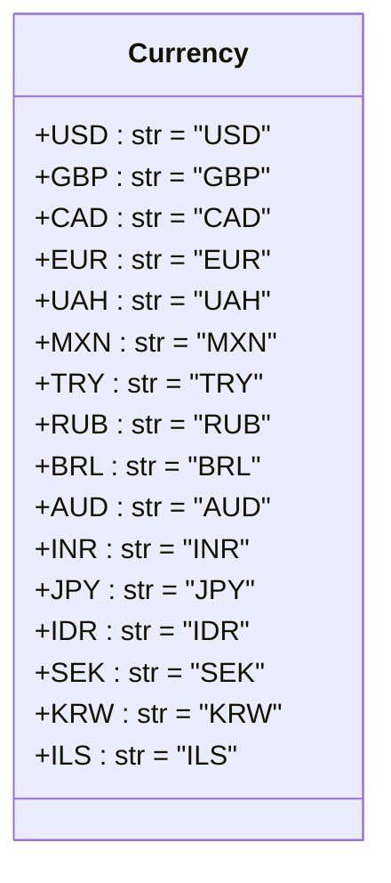

## Анализ кода `src/suppliers/aliexpress/api/models/currencies.py`

### <алгоритм>

1. **Объявление класса `Currency`**:
   - Создается класс `Currency`, который служит для хранения констант, представляющих различные валюты.
   - Пример: `class Currency:`
2. **Определение констант валют**:
   - Внутри класса `Currency` определяются строковые константы, каждая из которых представляет собой трехбуквенный код валюты (ISO 4217).
   - Примеры:
     - `USD = 'USD'` (доллар США)
     - `GBP = 'GBP'` (фунт стерлингов)
     - `CAD = 'CAD'` (канадский доллар)
     - `EUR = 'EUR'` (евро)
     - `UAH = 'UAH'` (украинская гривна)
     - и так далее для остальных валют
3. **Использование класса `Currency`**:
   - Класс `Currency` используется как перечисление, где константы используются для представления и сравнения валют в других частях кода.
   - Пример: `if order.currency == Currency.USD: ...`

### <mermaid>

**Объяснение диаграммы:**

- `classDiagram`: Обозначает, что это диаграмма классов.
- `class Currency`: Описывает класс `Currency`.
- Атрибуты, такие как `+USD : str = "USD"`, указывают на публичные атрибуты (константы) класса `Currency`, представляющие коды валют, типом `str` со строковым значением в виде трехбуквенного кода валюты.
- Символ `+` перед атрибутом указывает на то, что он является публичным.

### <объяснение>

**Импорты:**

- В данном файле нет явных импортов. Это означает, что данный файл не зависит от других модулей и классов проекта.

**Классы:**

- **`Currency`**:
  - **Роль**: Класс `Currency` действует как перечисление (enum), предоставляя набор констант для представления различных валют. Это улучшает читаемость и предотвращает использование "магических строк" в коде.
  - **Атрибуты**: Каждая константа (`USD`, `GBP`, `CAD`, `EUR`, `UAH`, `MXN`, `TRY`, `RUB`, `BRL`, `AUD`, `INR`, `JPY`, `IDR`, `SEK`, `KRW`, `ILS`) является строковой константой, представляющей код валюты.
  - **Методы**: Класс не имеет методов, так как его основная цель - предоставление набора констант.
  - **Взаимодействие**: Класс `Currency` предназначен для использования другими частями проекта. Например, при обработке данных, связанных с ценами, заказов и т.д., валюта будет сравниваться с одной из констант класса.

**Функции:**

- В данном файле нет функций.

**Переменные:**

- **Константы внутри класса `Currency`**:
  - Тип: Строка (`str`).
  - Использование: Представляют коды валют. Используются для сравнения и идентификации валют в других частях кода. Например, `if order.currency == Currency.USD: ...`.

**Потенциальные ошибки и улучшения:**

1. **Расширяемость**: Если потребуется поддержка новых валют, нужно будет изменять код класса. Можно использовать более гибкую структуру данных, например, словарь, если количество поддерживаемых валют станет очень большим.
2. **Типизация**: Хотя тип всех переменных - строка, можно было бы использовать `Enum` из стандартной библиотеки Python для представления валют, чтобы сделать код более типизированным и читаемым.
3. **Обновление**: Если список поддерживаемых валют будет изменяться в соответствии с обновлением стандарта ISO 4217, то код нужно будет обновлять вручную. Можно использовать внешние источники данных для получения списка валют.

**Цепочка взаимосвязей с другими частями проекта:**

- Класс `Currency` скорее всего будет использоваться в модулях, связанных с:
  - Обработкой данных от AliExpress API.
  - Формированием и обработкой заказов.
  - Хранением и анализом данных о товарах.
  - Логикой вычисления цен и конвертации валют.