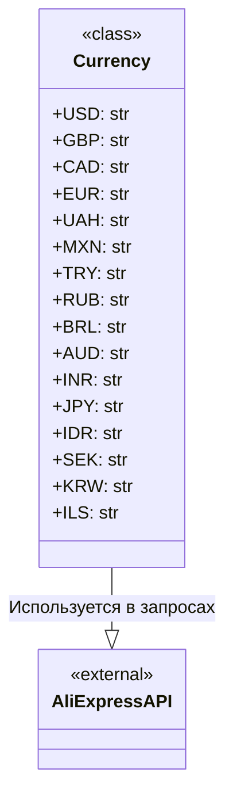

## Анализ кода `hypotez/src/suppliers/aliexpress/api/models/currencies.py`

### <алгоритм>
1. **Определение класса `Currency`**:
   - Создается класс `Currency`, который не имеет методов, но содержит статические атрибуты.
   - Эти атрибуты представляют собой строки, обозначающие коды валют (например, `USD`, `EUR`, `UAH`).
   - Пример: `Currency.USD` возвращает строку `"USD"`.
2. **Использование атрибутов класса**:
   - В других частях проекта атрибуты класса `Currency` могут быть использованы для представления валют при работе с API AliExpress.
   - Например, при формировании запроса к API, атрибут `Currency.EUR` будет использован для указания, что цена товара должна быть в евро.
   - Пример: `current_currency = Currency.UAH` присвоит переменной `current_currency` значение `"UAH"`.

### <mermaid>

**Описание диаграммы `mermaid`**:
- `class Currency`: Представляет класс, содержащий константы (статические переменные), представляющие различные валюты.
- `<<class>>`:  Обозначение того, что `Currency` является классом.
- `+USD: str`, `+GBP: str` и т.д.:  Атрибуты класса `Currency`, которые представляют собой строки, хранящие коды валют. Плюс (+) обозначает, что атрибуты публичные.
- `class AliExpressAPI`: Представляет внешнюю систему API AliExpress, с которой может взаимодействовать данный проект.
- `<<external>>`: Обозначение того, что `AliExpressAPI` является внешней сущностью.
- `Currency --|> AliExpressAPI`: Связь показывает, что класс `Currency` используется для определения валют при взаимодействии с `AliExpressAPI`. Стрелка `|> ` обозначает, что `Currency` используется как данные для `AliExpressAPI`.
### <объяснение>
#### Импорты:
- В данном файле нет импортов. Это означает, что класс `Currency` не зависит от других модулей внутри проекта.

#### Классы:
- **`Currency`**:
  - **Роль**: Этот класс играет роль хранилища констант, представляющих коды валют. Он не имеет методов, а только статические атрибуты.
  - **Атрибуты**: Каждый атрибут (`USD`, `GBP`, `CAD`, `EUR`, `UAH`, `MXN`, `TRY`, `RUB`, `BRL`, `AUD`, `INR`, `JPY`, `IDR`, `SEK`, `KRW`, `ILS`) является строкой, представляющей код валюты.
  - **Методы**: Класс не содержит методов.
  - **Взаимодействие**: Он используется как источник данных для указания валют при взаимодействии с API AliExpress, а также может быть использован в других частях проекта, где требуется представление валют.

#### Функции:
- В данном файле нет функций.

#### Переменные:
- Все переменные являются атрибутами класса `Currency`.
- **Типы**: Все переменные имеют строковый тип (`str`).
- **Использование**: Они используются для представления кодов валют. Например, `Currency.USD` используется для обозначения доллара США.

#### Потенциальные ошибки и области для улучшения:
- **Отсутствие проверок**: Код не проводит проверку валидности введенной валюты.
- **Расширяемость**: Если AliExpress добавит новые валюты, потребуется вручную добавлять их в класс `Currency`, что может привести к ошибкам при забывчивости. Можно было бы рассмотреть вариант считывания списка валют из внешнего файла или API.
- **Типизация**: Можно было бы использовать `Enum` из библиотеки `enum`, что сделает код более читаемым и типобезопасным.

#### Взаимосвязи с другими частями проекта:
- Класс `Currency` используется в модулях, которые делают запросы к API AliExpress, например, в модулях `src.suppliers.aliexpress.api.requests` и `src.suppliers.aliexpress.api.responses`. Он служит для указания валюты при формировании запросов и обработке ответов.
- Также может использоваться в UI модулях, для отображения выпадающего списка валют.

Этот код предоставляет базовую структуру для работы с валютами в контексте AliExpress API. Он может быть расширен и улучшен для повышения надежности и гибкости.