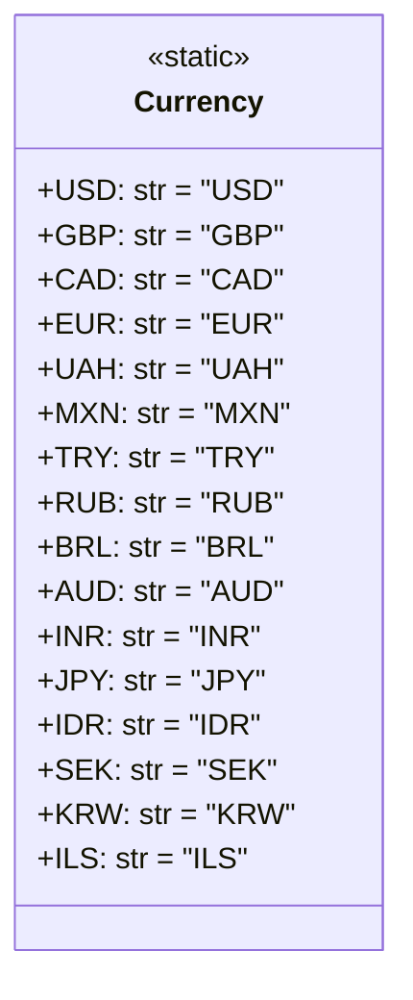

## АНАЛИЗ КОДА: `hypotez/src/suppliers/aliexpress/api/models/currencies.py`

### <алгоритм>

1. **Начало:** Код начинается с определения класса `Currency`.
2. **Определение атрибутов класса:** Внутри класса `Currency` определяются статические атрибуты, которые представляют собой коды валют в виде строк (например, 'USD', 'GBP', 'CAD', 'EUR' и т.д.).
3. **Конец:** Код заканчивается определением всех необходимых валют.

Пример:
-   При обращении к `Currency.USD`, мы получим строку 'USD'.
-   При обращении к `Currency.EUR`, мы получим строку 'EUR'.

### <mermaid>



**Описание диаграммы `mermaid`:**
- `class Currency`: Определяет класс `Currency`, который используется для хранения кодов валют.
- `<<static>>`: Указывает, что все атрибуты внутри класса являются статическими.
- `+USD: str = "USD"`:  Представляет статический атрибут `USD` типа `str` со значением `"USD"`. Аналогично определяются и остальные атрибуты, каждый из которых представляет код определенной валюты.

### <объяснение>

**Импорты:**

-   В данном коде нет явных импортов. Это означает, что код является самодостаточным и не зависит от внешних модулей.

**Классы:**

-   `class Currency`:
    -   **Роль:** Этот класс служит для хранения и предоставления константных значений, представляющих коды различных валют.
    -   **Атрибуты:** Все атрибуты класса `Currency` являются статическими (принадлежат самому классу, а не его экземплярам) и представляют собой строки (например, 'USD', 'GBP', 'EUR' и т.д.). Каждый атрибут представляет код определенной валюты.
    -   **Методы:** Класс не содержит методов. Его основное предназначение — предоставление набора константных значений для кодов валют.
    -   **Взаимодействие:** Класс `Currency` может использоваться в других частях проекта для работы с кодами валют.
    -   **Пример использования:**
    ```python
    from src.suppliers.aliexpress.api.models.currencies import Currency

    def process_payment(currency_code):
      if currency_code == Currency.USD:
        print("Payment in USD")
      elif currency_code == Currency.EUR:
        print("Payment in EUR")
      else:
        print("Payment in other currency")

    process_payment(Currency.USD)  # Выведет "Payment in USD"
    process_payment(Currency.EUR)  # Выведет "Payment in EUR"
    process_payment("JPY") # Выведет "Payment in other currency"
    ```

**Функции:**
-  В данном коде нет функций.

**Переменные:**

-   Все переменные в данном коде являются атрибутами класса `Currency` и представляют собой строки, содержащие коды валют.
    -   `USD`: Строка 'USD', код доллара США.
    -   `GBP`: Строка 'GBP', код фунта стерлингов.
    -   `CAD`: Строка 'CAD', код канадского доллара.
    -   `EUR`: Строка 'EUR', код евро.
    -   `UAH`: Строка 'UAH', код украинской гривны.
    -   `MXN`: Строка 'MXN', код мексиканского песо.
    -   `TRY`: Строка 'TRY', код турецкой лиры.
    -   `RUB`: Строка 'RUB', код российского рубля.
    -   `BRL`: Строка 'BRL', код бразильского реала.
    -   `AUD`: Строка 'AUD', код австралийского доллара.
    -   `INR`: Строка 'INR', код индийской рупии.
    -   `JPY`: Строка 'JPY', код японской йены.
    -   `IDR`: Строка 'IDR', код индонезийской рупии.
    -   `SEK`: Строка 'SEK', код шведской кроны.
    -   `KRW`: Строка 'KRW', код южнокорейской воны.
    -   `ILS`: Строка 'ILS', код израильского шекеля.

**Потенциальные ошибки и области для улучшения:**

-   **Отсутствие документации:** Коду не хватает строк документации (`docstring`) для класса и его атрибутов, что затрудняет понимание его назначения.
-   **Обновление списка валют:** Список валют статичен и может потребовать обновления в будущем, если AliExpress добавит новые валюты. Для решения этой проблемы можно рассмотреть использование конфигурационного файла или API для получения актуального списка.
-   **Отсутствие валидации:** Код не проверяет, является ли полученный код валюты допустимым значением, определенным в классе `Currency`.
-   **Неструктурированность:** Расположение всех кодов валют прямо в классе может сделать его большим и нечитабельным, когда количество валют увеличится. Рассмотреть возможность использовать структуры данных, например, словарь.
-   **Цепочка взаимосвязей с другими частями проекта:** Этот модуль используется для представления доступных валют в API AliExpress и может использоваться в других частях проекта, где нужно обрабатывать или отображать валюты. Например, при парсинге данных AliExpress, при валидации данных, или при отображении валюты пользователю.