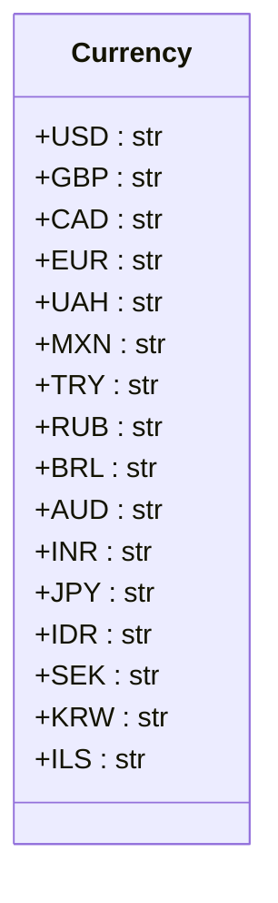

## АНАЛИЗ КОДА: `src/suppliers/aliexpress/api/models/currencies.py`

### 1. <алгоритм>

**Описание:**

1.  **Объявление класса `Currency`:**
    *   Начинается определение класса `Currency`.
    *   **Пример:** `class Currency:`
2.  **Объявление констант валют:**
    *   Внутри класса `Currency` объявляются строковые константы, представляющие коды различных валют.
    *   Каждая константа (например, `USD`, `GBP`, `EUR`) присваивается строковому значению, которое является кодом валюты.
    *   **Пример:** `USD = 'USD'`, `GBP = 'GBP'`, `EUR = 'EUR'`.
3. **Использование:**
   *  Класс `Currency` используется как набор констант для представления кодов валют.
   *  В других частях проекта можно обращаться к этим константам как `Currency.USD`, `Currency.EUR` и т.д.
   *  Это обеспечивает унифицированный и типобезопасный способ использования кодов валют.
   *  **Пример:** `if current_currency == Currency.USD:`

### 2. <mermaid>



**Объяснение `mermaid`:**

Диаграмма `classDiagram` представляет класс `Currency`, как определено в коде.

*   `class Currency`: Отображает класс `Currency`.
*   `+USD : str`, `+GBP : str`, ..., `+ILS : str`:
    *   Показывают атрибуты (константы) внутри класса `Currency`,
    *   Каждый атрибут является строковой константой.
    *   `+` обозначает, что атрибуты являются публичными.
    *   `: str` указывает, что тип данных каждого атрибута — строка.
**Импорты**
В данном коде нет импортов, следовательно, нет необходимости в их анализе.

### 3. <объяснение>

**Импорты:**

*   В данном файле нет явных импортов. Это означает, что класс `Currency` не зависит от других модулей или библиотек.

**Классы:**

*   `class Currency`:
    *   **Роль:** Этот класс служит как пространство имен для хранения констант, представляющих коды различных валют.
    *   **Атрибуты:**
        *   `USD`, `GBP`, `CAD`, `EUR`, `UAH`, `MXN`, `TRY`, `RUB`, `BRL`, `AUD`, `INR`, `JPY`, `IDR`, `SEK`, `KRW`, `ILS` : Все эти атрибуты являются строковыми константами, содержащими коды валют.
    *   **Методы:** Класс не содержит методов, поскольку его основная цель — предоставлять набор констант.
    *   **Взаимодействие:**  Класс `Currency` предназначен для использования в других частях проекта. Он предоставляет набор заранее определенных кодов валют, к которым можно обращаться через `Currency.USD`, `Currency.EUR` и т.д. Это обеспечивает единообразие и предотвращает ошибки, связанные с опечатками при написании кодов валют.

**Функции:**

*   В данном коде нет функций.

**Переменные:**

*   В данном коде переменными являются атрибуты класса, т.е. `USD`, `GBP`, и т.д.
*   Все переменные являются строками (`str`).
*   Их использование заключается в качестве предопределенных констант кодов валют.

**Потенциальные ошибки и области для улучшения:**

*   **Расширяемость:**  Если в будущем потребуется добавить новые валюты, придется вручную добавлять их в класс `Currency`.
*   **Исключения:** На данный момент отсутствует обработка неправильного ввода кодов валют (однако класс Currency и не предназначен для этого).
*   **Типизация:** Хотя атрибуты явно имеют строковый тип данных, можно было бы использовать `Enum` для более строгой типизации и дополнительных возможностей.
*   **Описание валют:** В коде присутствуют только коды валют, не хватает их полного наименования, и связи между ними. Для этого потребовалось бы добавить еще один класс.

**Взаимосвязь с другими частями проекта:**

*   Класс `Currency` предназначен для использования в других частях проекта, где требуется работать с кодами валют, например, в модулях, отвечающих за обработку цен, конвертацию валют, запросы к API, и т.д.
*   Он используется для унификации и стандартизации кодов валют по всему проекту, что снижает вероятность ошибок и упрощает поддержку кода.

**Примеры использования:**

```python
from src.suppliers.aliexpress.api.models.currencies import Currency

def process_price(price, currency_code):
    if currency_code == Currency.USD:
        print(f"Price in USD: {price}")
    elif currency_code == Currency.EUR:
        print(f"Price in EUR: {price}")
    else:
        print(f"Price in another currency: {price} ({currency_code})")


price = 100.00
process_price(price, Currency.USD) # Выведет: Price in USD: 100.0
process_price(price, Currency.EUR) # Выведет: Price in EUR: 100.0
process_price(price, "XYZ") # Выведет: Price in another currency: 100.0 (XYZ)
```