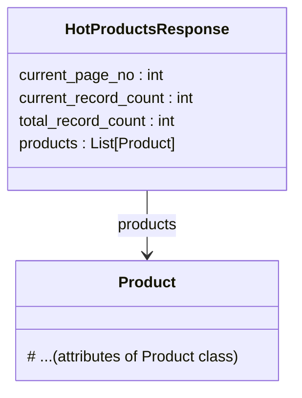

# <input code>

```python
## \file hypotez/src/suppliers/aliexpress/api/models/hotproducts.py
# -*- coding: utf-8 -*-
#! venv/Scripts/python.exe # <- venv win
## ~~~~~~~~~~~~~\
""" module: src.suppliers.aliexpress.api.models """
from .product import Product
from typing import List


class HotProductsResponse:
    current_page_no: int
    current_record_count: int
    total_record_count: int
    products: List[Product]
```

# <algorithm>

Этот код определяет класс `HotProductsResponse`.  Он представляет собой модель данных, которая используется для хранения информации о горячих продуктах с AliExpress.  Алгоритм работы – это просто хранение данных в объекте. Нет действий или вычислений.

**Пошаговая блок-схема:**

1. **Определение класса:** Определяется класс `HotProductsResponse`.
2. **Атрибуты:**  Класс содержит атрибуты `current_page_no`, `current_record_count`, `total_record_count` и `products`. Эти атрибуты хранят значения, характеризующие страницу данных и количество продуктов.
3. **Инициализация:** При создании объекта `HotProductsResponse` эти атрибуты инициализируются.
4. **Возврат данных:** Объект содержит необходимые данные для обработки.  

**Пример:**

Представьте, что API вернуло данные о 10 горячих продуктах на первой странице.  Объект `HotProductsResponse` будет содержать:
* `current_page_no`: 1
* `current_record_count`: 10
* `total_record_count`: 100 (например)
* `products`: Список из 10 объектов `Product`, содержащих информацию о каждом продукте.


# <mermaid>



Диаграмма показывает, что класс `HotProductsResponse` содержит список объектов `Product`.  Подразумевается, что `Product` – это другой класс, определенный в файле `product.py` (импортируется как `from .product import Product`).


# <explanation>

**Импорты:**

* `from .product import Product`: Импортирует класс `Product` из папки `models` текущего модуля. Это ключевой импорт, показывающий, что модель `HotProductsResponse` полагается на модель `Product`. Это предполагает, что файл `product.py` уже определяет класс `Product`.
* `from typing import List`: Импортирует тип данных `List` из модуля `typing`. Это используется для объявления того, что `products` является списком.

**Классы:**

* **`HotProductsResponse`:**  Этот класс представляет собой структуру данных, содержащую информацию о горячих продуктах, полученную с API.  Атрибуты `current_page_no`, `current_record_count`, `total_record_count` и `products`  содержат информацию о текущей странице, количестве элементов на странице, общем количестве элементов и список самих продуктов.

**Функции:**

Нет функций в данном коде.  Это определение класса, который служит структурой данных.


**Переменные:**

Нет свободных переменных, только атрибуты класса.

**Возможные ошибки или области для улучшений:**

* **Недостающая реализация:** Этот код определяет только структуру данных.  Необходимо реализовать методы для загрузки данных (`load`, `fetch` или аналогичные), чтобы использовать этот класс.
* **Валидация:** Нет проверок данных.  Например, важно убедиться, что `current_page_no`  и `current_record_count`  имеют корректные значения.
* **Связь с API:** Отсутствует логика взаимодействия с API AliExpress для получения данных, которые этот класс будет хранить.

**Цепочка взаимосвязей:**

Данный класс `HotProductsResponse` будет использоваться другими частями проекта для работы с данными о горячих продуктах.  Например, в контроллерах (или других частях приложения) будет использоваться `HotProductsResponse` для получения списка `products` для отображения на сайте.  Поэтому `HotProductsResponse` является промежуточным звеном между API и остальным кодом приложения.  В зависимости от реализации, ниже будут контроллеры, которые извлекают данные из `HotProductsResponse`, обрабатывают их и передают в пользовательский интерфейс.