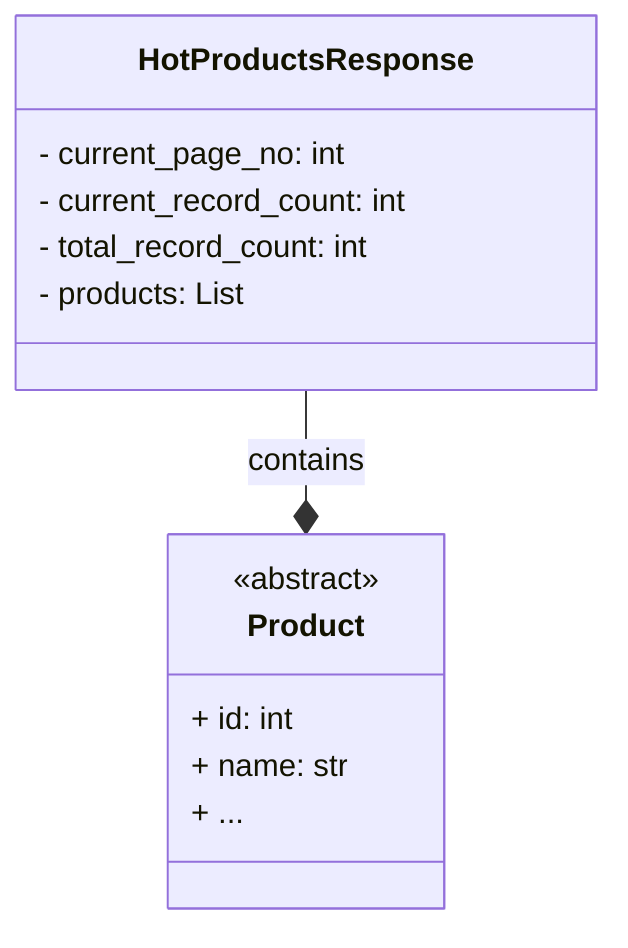

## АНАЛИЗ КОДА

### <алгоритм>

1. **Импорт модуля `Product`**: Импортируется класс `Product` из модуля `product.py`, который находится в том же каталоге. Этот класс, вероятно, представляет информацию об отдельном продукте.
    *Пример*: `from .product import Product`

2. **Импорт модуля `List`**: Импортируется тип `List` из модуля `typing` для аннотации типов.
    *Пример*: `from typing import List`

3. **Объявление класса `HotProductsResponse`**: Создается класс `HotProductsResponse`, который предназначен для хранения ответа с горячими продуктами.
   
4. **Объявление атрибутов класса**: Объявляются атрибуты класса `HotProductsResponse`:
    - `current_page_no: int`: Номер текущей страницы с горячими продуктами.
      *Пример*: `current_page_no = 1`
    - `current_record_count: int`: Количество записей на текущей странице.
      *Пример*: `current_record_count = 20`
    - `total_record_count: int`: Общее количество горячих продуктов.
       *Пример*: `total_record_count = 100`
    - `products: List[Product]`: Список объектов `Product`, представляющих горячие продукты.
      *Пример*: `products = [Product(...), Product(...)]`

5. **Использование класса**: Создается экземпляр `HotProductsResponse` и его атрибутам присваиваются значения.
   *Пример*:
   ```python
   response = HotProductsResponse()
   response.current_page_no = 1
   response.current_record_count = 20
   response.total_record_count = 100
   response.products = [Product(id=1, name="Product 1"), Product(id=2, name="Product 2")]
   ```

### <mermaid>



**Описание диаграммы:**
- **`HotProductsResponse`**: Этот класс представляет структуру ответа, содержащую информацию о горячих продуктах, а также списком самих продуктов.
    - `- current_page_no: int`: Атрибут, представляющий номер текущей страницы.
    - `- current_record_count: int`: Атрибут, представляющий количество записей на текущей странице.
    - `- total_record_count: int`: Атрибут, представляющий общее количество записей.
    - `- products: List<Product>`: Атрибут, представляющий список объектов типа `Product`.
- **`Product`**: Абстрактный класс, представляющий продукт. Ожидается, что в другом файле будет описан более конкретный класс Product с полями id, name.  В данном контексте известен только интерфейс класса.
- **`HotProductsResponse --* Product : contains`**: Отношение ассоциации, показывающее, что класс `HotProductsResponse` содержит список (`List`) объектов типа `Product`.

### <объяснение>

**Импорты:**
- `from .product import Product`: Импортирует класс `Product` из модуля `product.py`, находящегося в той же директории. Это обеспечивает возможность использовать структуру продукта внутри `HotProductsResponse`. Путь импорта указывает на то, что  `product.py` является модулем в том же пакете.
- `from typing import List`: Импортирует `List` из модуля `typing` для определения типов данных, в частности для атрибута `products` в классе `HotProductsResponse`, который является списком объектов типа `Product`.

**Классы:**
- `HotProductsResponse`:
    - **Роль**: Класс представляет структуру ответа, который содержит данные о горячих продуктах с пагинацией.
    - **Атрибуты**:
        - `current_page_no: int`: Целое число, представляющее номер текущей страницы.
        - `current_record_count: int`: Целое число, представляющее количество продуктов на текущей странице.
        - `total_record_count: int`: Целое число, представляющее общее количество доступных горячих продуктов.
        - `products: List[Product]`: Список объектов типа `Product`, представляющих горячие продукты.
    - **Методы**: В представленном коде нет методов. Этот класс является структурой данных для хранения и передачи информации.
    - **Взаимодействие**: Класс предназначен для хранения и обработки данных, полученных из API, и используется для представления ответа в удобном для дальнейшей обработки формате.

**Функции:**
- В данном коде функции отсутствуют.

**Переменные:**
- `current_page_no`, `current_record_count`, `total_record_count`: Переменные целого типа, используемые для хранения информации о пагинации и количества записей.
- `products`: Переменная, представляющая список объектов `Product`. Используется для хранения детальной информации о горячих продуктах.

**Потенциальные ошибки и области для улучшения:**
- **Отсутствие конструктора**: У класса нет конструктора `__init__`, поэтому объекты необходимо инициализировать после создания. Это может привести к ошибкам, если какой-либо из атрибутов не будет инициализирован. Рекомендуется добавить `__init__` для инициализации полей класса с соответствующими значениями по умолчанию.
- **Отсутствие валидации**: Класс не проводит валидацию данных. Например, `current_page_no` должно быть положительным числом. Рекомендуется добавить валидацию входных данных.
- **Отсутствие docstring**: Желательно добавить docstring для класса и его атрибутов для лучшей читаемости и понимания кода.
- **`Product` как абстрактный класс**: Класс Product импортируется, но он не имеет реализации и описан как <<abstract>> в mermaid диаграмме. Рекомендуется указать, что класс Product должен быть определен где-то в другом файле.

**Цепочка взаимосвязей:**
1. Данный модуль `hotproducts.py` зависит от модуля `product.py`, который должен содержать класс `Product`, представляющий продукт.
2. Класс `HotProductsResponse` используется в API для представления ответа на запрос о горячих продуктах.
3. В дальнейшем данные, полученные в `HotProductsResponse`, могут быть использованы для отображения на фронтенде или для других бизнес-целей.

Этот анализ предоставляет подробное понимание структуры и назначения кода.