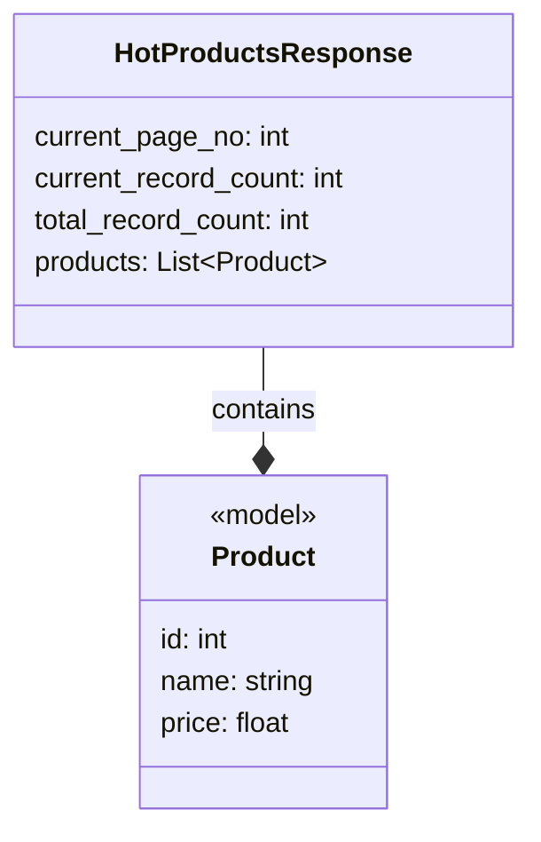

## Анализ кода `hypotez/src/suppliers/aliexpress/api/models/hotproducts.py`

### <алгоритм>

1. **Импорт зависимостей:**
   - Импортируется класс `Product` из модуля `src.suppliers.aliexpress.api.models.product`. Этот класс, предположительно, описывает структуру данных для отдельного продукта.
   - Импортируется `List` из модуля `typing` для аннотации типов, указывая, что `products` будет списком.

2. **Определение класса `HotProductsResponse`:**
   - Создается класс `HotProductsResponse`, предназначенный для представления ответа API, содержащего список горячих продуктов.
   - Определяются следующие атрибуты:
     - `current_page_no: int` - Номер текущей страницы в пагинации результатов (например, `1`, `2`, `3` и т.д.).
     - `current_record_count: int` - Количество продуктов на текущей странице (например, `20`, `50`, и т.д.).
     - `total_record_count: int` - Общее количество продуктов, соответствующих запросу (например, `100`, `500`, и т.д.).
     - `products: List[Product]` - Список объектов `Product`, представляющих данные о каждом продукте.

   **Пример использования:**

   ```python
   from .product import Product  # Пример фиктивного импорта

   class Product:
       def __init__(self, id, name, price):
           self.id = id
           self.name = name
           self.price = price

   # Пример создания объекта HotProductsResponse
   products_list = [
       Product(id=1, name="Product 1", price=100.00),
       Product(id=2, name="Product 2", price=200.00)
   ]

   response = HotProductsResponse()
   response.current_page_no = 1
   response.current_record_count = 2
   response.total_record_count = 10
   response.products = products_list

   print(f"Current page: {response.current_page_no}") # Output: Current page: 1
   print(f"Current record count: {response.current_record_count}") # Output: Current record count: 2
   print(f"Total record count: {response.total_record_count}") # Output: Total record count: 10
   for product in response.products:
        print(f"Product ID: {product.id}, Name: {product.name}, Price: {product.price}")
        # Output: Product ID: 1, Name: Product 1, Price: 100.0
        # Output: Product ID: 2, Name: Product 2, Price: 200.0
   ```

### <mermaid>



**Объяснение зависимостей в `mermaid`:**

- **`HotProductsResponse`**:  Класс, который представляет ответ API с информацией о горячих продуктах.
-   `current_page_no`: Целое число, представляющее номер текущей страницы.
-   `current_record_count`: Целое число, представляющее количество элементов на текущей странице.
-   `total_record_count`: Целое число, представляющее общее количество элементов.
-   `products`: Список объектов типа `Product`.
- **`Product`**: Класс, который представляет информацию об одном товаре.
    - `<<model>>`: Показывает, что это модель данных.
    - `id`: Идентификатор товара (целое число).
    - `name`: Название товара (строка).
    - `price`: Цена товара (число с плавающей точкой).

-   **`HotProductsResponse --* Product : contains`**:  Отношение ассоциации "один-ко-многим", показывающее, что `HotProductsResponse` содержит список объектов `Product` (агрегация).

### <объяснение>

**Импорты:**

-   `from .product import Product`:  Импортирует класс `Product` из файла `product.py`, находящегося в той же директории (`.`). Это позволяет использовать структуру данных `Product` для представления информации о продуктах внутри `HotProductsResponse`. Класс `Product` (не показанный в предоставленном коде) вероятно содержит атрибуты, такие как `id`, `name`, `price` и т.д.
-   `from typing import List`: Импортирует `List` из модуля `typing`. `List` используется для статической типизации, позволяя объявлять, что атрибут `products` в `HotProductsResponse` является списком объектов типа `Product`. Это помогает в отладке и повышает читаемость кода.

**Классы:**

-   `HotProductsResponse`:
    -   **Роль:** Представляет структуру данных для ответа API, содержащего информацию о горячих продуктах. Этот класс используется для организации и передачи данных, полученных от API AliExpress, в приложении.
    -   **Атрибуты:**
        -   `current_page_no`:  Целое число, представляющее номер текущей страницы в пагинации результатов.
        -   `current_record_count`: Целое число, представляющее количество продуктов на текущей странице.
        -   `total_record_count`: Целое число, представляющее общее количество продуктов, соответствующих запросу.
        -   `products`: Список объектов `Product`, представляющих данные о каждом продукте.
    -   **Методы:** В текущей версии класса нет определенных методов, только атрибуты.
    -   **Взаимодействие:**  `HotProductsResponse` зависит от класса `Product` (использует его объекты в своем списке `products`).

**Функции:**

-   В данном коде нет явно определенных функций. Класс `HotProductsResponse` представляет собой структуру данных, а не набор исполняемых операций.

**Переменные:**

-   В классе `HotProductsResponse` переменные являются атрибутами, которые определяют структуру данных и хранят информацию о странице, количестве продуктов и списке самих продуктов.

**Потенциальные ошибки и области для улучшения:**

-   **Отсутствие методов:** Класс `HotProductsResponse` в настоящее время является простым контейнером данных. Для более полной реализации можно добавить методы для валидации данных, преобразования в другие форматы (например, JSON) или для фильтрации продуктов.
-   **Обработка ошибок:** В коде не предусмотрена обработка ошибок (например, ошибок API, неправильных типов данных). В реальном приложении необходимо добавить обработку исключений и валидацию получаемых данных.
-   **Описание Product:** Код предполагает существование класса `Product`. Для полноценного анализа необходимо также рассмотреть его структуру.

**Цепочка взаимосвязей:**

1.  **Запрос к API AliExpress:**
    -   Этот код является частью модуля `src.suppliers.aliexpress.api.models`, и скорее всего, используется после того, как сделан запрос к API AliExpress для получения горячих продуктов.
2.  **Обработка ответа:**
    -   Полученный JSON-ответ от API преобразуется в объект `HotProductsResponse`, где данные о продуктах представляются в виде списка `Product`.
3.  **Использование в приложении:**
    -   Объект `HotProductsResponse` передается в другие части приложения, например, в слой представления (UI) или слой обработки данных.

В целом, код предоставляет понятную структуру для представления ответа API с горячими продуктами, но его можно улучшить путем добавления методов для манипуляции данными, валидации и обработки ошибок.