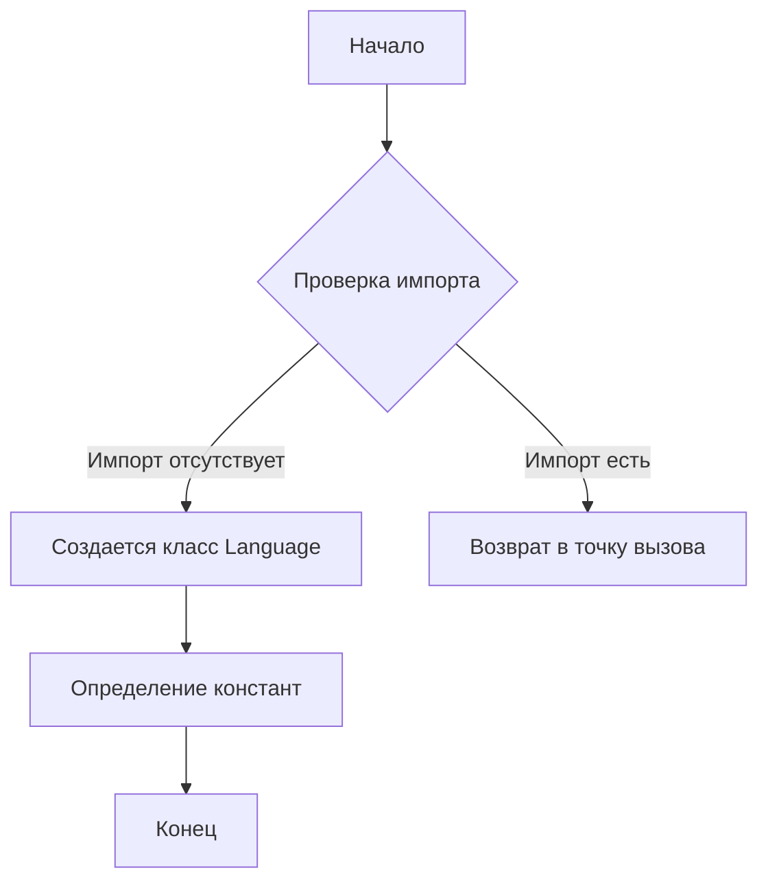
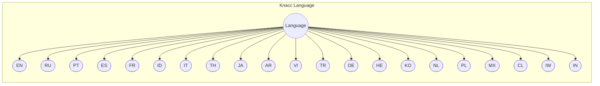

```MD
# Анализ кода файла `hypotez/src/suppliers/aliexpress/api/models/languages.py`

## <input code>

```python
## \file hypotez/src/suppliers/aliexpress/api/models/languages.py
# -*- coding: utf-8 -*-\
#! venv/Scripts/python.exe # <- venv win
## ~~~~~~~~~~~~~\
""" module: src.suppliers.aliexpress.api.models """
class Language:
    EN = 'EN'
    RU = 'RU'
    PT = 'PT'
    ES = 'ES'
    FR = 'FR'
    ID = 'ID'
    IT = 'IT'
    TH = 'TH'
    JA = 'JA'
    AR = 'AR'
    VI = 'VI'
    TR = 'TR'
    DE = 'DE'
    HE = 'HE'
    KO = 'KO'
    NL = 'NL'
    PL = 'PL'
    MX = 'MX'
    CL = 'CL'
    IW = 'IW'
    IN = 'IN'
```

## <algorithm>



Пример:

При запуске скрипта, если нет импорта, выполняется создание класса `Language` и  заполнение его константами. В противном случае, выполняется возврат в точку вызова.

## <mermaid>



## <explanation>

**Импорты:**

В данном файле нет импортируемых модулей.  Файл `languages.py` определяет константы, представляющие языки. Он располагается в иерархии `hypotez/src/suppliers/aliexpress/api/models`, что указывает на то, что он предназначен для использования в модулях, относящихся к API поставщика AliExpress.


**Классы:**

Класс `Language` — это пустой класс, служащий для группировки констант, представляющих различные языки.  Его единственное назначение — хранение строк, обозначающих языки (например, 'EN', 'RU').

**Функции:**

Нет функций, только константы.


**Переменные:**

`EN`, `RU`, `PT`, и т.д. — строковые константы, представляющие языки. Они определяются в теле класса `Language`.


**Возможные ошибки или области для улучшений:**

* Отсутствие смысловой логики в классе.  Для хранения таких констант, как коды языков, в Python лучше использовать перечисления (`enum`).  Это приведёт к более надёжному коду, позволяющему избежать ошибок с неверными значениями, например.
* Нет валидации значений констант. Если значения не являются корректными кодами языков, это не будет заметно.

**Взаимосвязи с другими частями проекта:**

Этот файл, скорее всего, будет использован в других модулях проекта, где понадобится хранить и использовать информацию о поддерживаемых языках. Например, при обработке данных о товарах, заказах или запросах от пользователей API AliExpress.  Вероятно, эти данные будут использоваться в методах обработки запросов API, например, для перевода текста или настройки языка отображения.


**Вывод:**

Файл `languages.py` содержит список констант, представляющих поддерживаемые языки. Он демонстрирует плохую практику, так как содержит много жесткокодированных значений. Рекомендуется использовать перечисления (`enum`), что сделает код более читаемым и надежным.