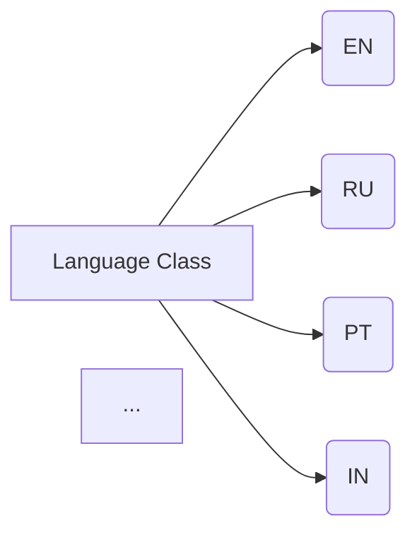
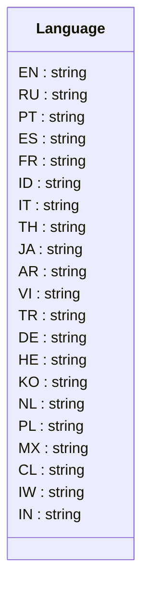

# <input code>

```python
## \file hypotez/src/suppliers/aliexpress/api/models/languages.py
# -*- coding: utf-8 -*-\
#! venv/Scripts/python.exe # <- venv win
## ~~~~~~~~~~~~~\
""" module: src.suppliers.aliexpress.api.models """
class Language:
    EN = 'EN'
    RU = 'RU'
    PT = 'PT'
    ES = 'ES'
    FR = 'FR'
    ID = 'ID'
    IT = 'IT'
    TH = 'TH'
    JA = 'JA'
    AR = 'AR'
    VI = 'VI'
    TR = 'TR'
    DE = 'DE'
    HE = 'HE'
    KO = 'KO'
    NL = 'NL'
    PL = 'PL'
    MX = 'MX'
    CL = 'CL'
    IW = 'IW'
    IN = 'IN'
```

# <algorithm>

Этот код определяет класс `Language` с константами, представляющими языковые коды.  Алгоритм очень прост: он просто создает набор констант, которые представляют разные языки.  Данные не перемещаются между функциями или методами, так как их нет.  Этот код - это просто определения имен для языков.



# <mermaid>




# <explanation>

**Импорты:**

В коде нет импортов, так как он содержит только определение класса.


**Классы:**

Класс `Language` - это просто контейнер для констант, представляющих языки.  Он не содержит методов, а только атрибуты-константы ( `EN`, `RU`, `PT` и т.д.), которые хранят строковые значения языков.

**Функции:**

В данном коде нет функций.


**Переменные:**

Переменные `EN`, `RU`, `PT` и т.д. - это константы (постоянные значения), объявленные внутри класса `Language`.  Их типы - строки (string).  Эти переменные используются для представления кодов языков (например, "EN" для английского).


**Возможные ошибки или области для улучшений:**

* **Нет обработки ошибок:**  Код не обрабатывает никакие исключения, что может быть проблемой в реальном приложении.
* **Использование констант:** Хотя сейчас это просто список языков, в будущем этот класс можно было бы использовать для сохранения данных о языках (например, названия языков, предпочтения пользователей или другие данные).
* **Проверка на корректность:** В случае использования данных из других источников, необходимо проверять, что входные данные соответствуют заданным значениям языков.
* **Устойчивость:**  Если вам нужно расширить список языков, можно создать словарь или использовать Enum для лучшей поддержки добавления новых элементов.

**Взаимосвязи с другими частями проекта:**

Этот файл (`languages.py`) скорее всего используется модулями или классами, которые работают с языками (например, в файлах, связанных с переводом или обработкой входных данных, использующих язык).  Например, метод в другом модуле может принимать `Language.EN` в качестве параметра, чтобы определить, каким образом отобразить определённый текст. Этот файл служит справочником кодов языков, предоставляя возможность работы с ними другим частям приложения.