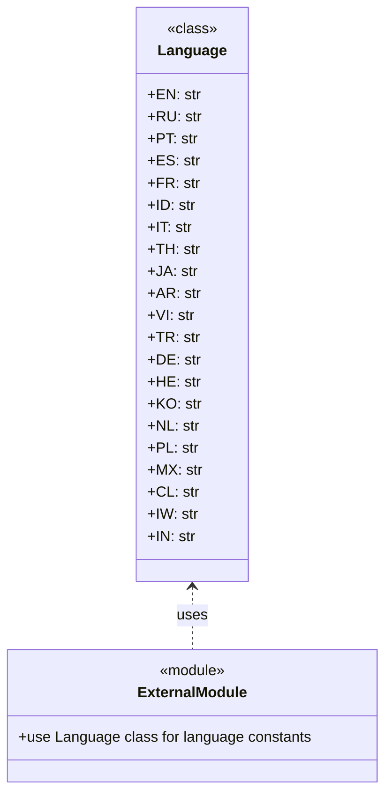

## Анализ кода `hypotez/src/suppliers/aliexpress/api/models/languages.py`

### <алгоритм>

1. **Определение класса `Language`**:
   - Создается класс `Language`, который предназначен для хранения констант, представляющих языки.
   - Этот класс не имеет методов и служит только контейнером для статических атрибутов.
   - Пример: `class Language:`
2. **Определение атрибутов-констант**:
   - Внутри класса `Language` определяются статические атрибуты, которые являются строками, представляющими коды языков (например, `EN` для английского, `RU` для русского).
   - Каждая константа присваивает строковое значение соответствующему коду языка.
   - Пример: `EN = 'EN'`, `RU = 'RU'`, `PT = 'PT'`, ...
3. **Использование класса**:
   - Класс `Language` может быть использован в других частях программы для обращения к константам языков через `Language.EN`, `Language.RU` и т.д., что улучшает читаемость и поддерживаемость кода.
   - Пример: `current_language = Language.RU`

### <mermaid>



**Объяснение диаграммы:**

- **`Language`**: Представляет класс `Language` из кода, который содержит статические атрибуты, обозначающие коды различных языков. У каждого атрибута указан тип данных `str`.
- **`ExternalModule`**:  Представляет другие модули проекта, которые могут использовать класс `Language` для получения кодов языков.
- **`<..`**:  Обозначает пунктирной стрелкой зависимость, указывающую, что `ExternalModule` использует класс `Language`.
- **`uses`**:  Подпись к стрелке, указывающая на тип зависимости.

### <объяснение>

**Импорты:**

- В данном файле нет импортов. Это означает, что класс `Language` самодостаточен и не зависит от других модулей или пакетов.

**Классы:**

- **`class Language`**:
    - **Роль**: Класс `Language` служит для определения констант, представляющих коды языков. Он не предназначен для создания экземпляров (объектов); это класс-контейнер, хранящий статические атрибуты.
    - **Атрибуты**:
        - Все атрибуты — статические переменные, представляющие языковые коды в виде строк (например, `EN`, `RU`, `PT`).
        -  Эти атрибуты доступны через класс `Language` (например, `Language.EN`).
    - **Методы**:
        - Класс не имеет методов.
    - **Взаимодействие**:
        - Класс предназначен для использования в других модулях проекта, где нужно обращаться к константам языков. Он улучшает читаемость кода, заменяя магические строки на именованные константы.

**Функции:**

- В данном файле нет функций.

**Переменные:**

- Все переменные внутри класса `Language` являются константами, представляющими коды языков.
    - **Тип**: `str` (строка).
    - **Использование**: Эти константы используются в других частях программы для указания языка. Например, при запросе к API или при отображении текста пользователю.

**Потенциальные ошибки или области для улучшения:**

1. **Отсутствие проверки корректности языка**:
   - В коде не предусмотрена проверка на допустимость языка. Если в каком-то другом месте программы будет использован код языка, не определенный в классе `Language`, это может привести к ошибке или неверному поведению.
   - **Предложение**: Можно добавить метод, который проверяет, есть ли переданный код языка в списке доступных языков, или создать Enum вместо класса.
2. **Поддержка новых языков**:
   - Чтобы добавить поддержку новых языков, придется изменять этот файл, что является не лучшей практикой.
   - **Предложение**: Можно пересмотреть архитектуру и сделать так, чтобы список языков мог подгружаться из конфигурационного файла или БД.

**Цепочка взаимосвязей с другими частями проекта:**

- Другие модули в пакете `src.suppliers.aliexpress.api`, или в других пакетах, которые взаимодействуют с API Aliexpress могут импортировать `Language` для использования констант языков. Например:

   ```python
   # src/suppliers/aliexpress/api/some_module.py
   from src.suppliers.aliexpress.api.models.languages import Language

   def get_translated_product_name(product_id, language_code):
      if language_code == Language.RU:
          # Logic to get Russian translation
          ...
      elif language_code == Language.EN:
          # Logic to get English translation
          ...
   ```
   
- Класс `Language` помогает обеспечить согласованность используемых языковых кодов во всем проекте.