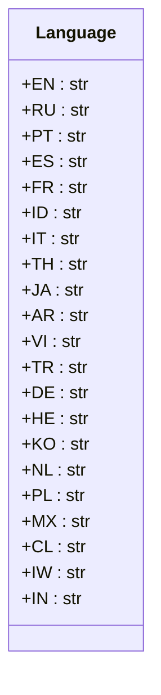

## Анализ кода `hypotez/src/suppliers/aliexpress/api/models/languages.py`

### 1. <алгоритм>

1.  **Начало**: Инициализируется модуль `languages.py`.
2.  **Определение класса `Language`**:
    *   Создаётся класс `Language`, который предназначен для хранения констант, представляющих различные языки.
    *   Внутри класса `Language` определяются статические переменные (константы), каждая из которых представляет код языка в виде строки.
    *   **Примеры**:
        *   `Language.EN`  соответствует английскому языку (English).
        *   `Language.RU` соответствует русскому языку (Russian).
        *   `Language.PT` соответствует португальскому языку (Portuguese).
        *   `Language.ES` соответствует испанскому языку (Spanish).
        *   И так далее для всех объявленных языков.
3.  **Использование класса**: Класс `Language` предназначен для использования в других частях приложения, где требуется представление языка в виде константы.
4.  **Завершение**: Работа модуля `languages.py` завершается.

### 2. <mermaid>

**Объяснение `mermaid`:**

*   `classDiagram`: Объявляет диаграмму классов.
*   `class Language`: Описывает класс `Language`.
*   `+EN : str`, `+RU : str` и т.д: Описывают публичные атрибуты (статические переменные) класса `Language` с их типами (`str`). `+` означает, что это публичный атрибут.

Здесь нет импортов, поэтому нет диаграммы для `header.py`.

### 3. <объяснение>

**Импорты**:
В данном коде нет импортов. Модуль `languages.py` не зависит от других частей проекта и предназначен для хранения констант, используемых в других модулях.

**Классы**:

*   **`class Language`**:
    *   **Роль**: Класс `Language` выступает в роли контейнера для хранения констант, представляющих различные языки. Это паттерн "Enum" (перечисление), реализованный через статические переменные (константы) класса.
    *   **Атрибуты**: Все атрибуты являются статическими (классовыми) переменными, представляющими коды языков в виде строк:
        *   `EN` (английский), `RU` (русский), `PT` (португальский), `ES` (испанский), `FR` (французский), `ID` (индонезийский), `IT` (итальянский), `TH` (тайский), `JA` (японский), `AR` (арабский), `VI` (вьетнамский), `TR` (турецкий), `DE` (немецкий), `HE` (иврит), `KO` (корейский), `NL` (голландский), `PL` (польский), `MX` (мексиканский испанский), `CL` (чилийский испанский), `IW` (иврит - устаревший код), `IN` (хинди).
    *   **Методы**: Класс не имеет методов. Он используется только для хранения констант.
    *   **Взаимодействие**:  Этот класс используется как хранилище констант в других модулях, где требуется работать с кодами языков. Например, при отправке запросов к API AliExpress для указания языка или для определения локализации контента.

**Функции**:
В данном коде нет функций.

**Переменные**:
*   Переменные внутри класса `Language` являются статическими и строковыми (`str`) константами.
*   Они представляют собой коды языков и используются для доступа к ним, например `Language.EN` вернёт `"EN"`.

**Потенциальные ошибки и области для улучшения**:

*   **Устаревшие коды языков**: Код `IW` (устаревший код иврита)  может быть заменён на `HE` (современный код иврита), чтобы избежать путаницы.
*   **Ограниченное количество языков**: Список языков может быть расширен по мере необходимости, в зависимости от потребностей API AliExpress и требований приложения.
*   **Отсутствие проверки**: Нет проверки на корректность значения при использовании. Это следует учитывать при использовании констант в других модулях.
*   **Типизация**: Можно было бы использовать `Enum` из библиотеки `enum`, чтобы сделать код более читаемым и типобезопасным, но в данном случае использование статических переменных не противоречит логике кода.

**Взаимосвязи с другими частями проекта**:

*   Этот модуль может быть использован в модулях, которые отправляют запросы к API AliExpress, чтобы указывать язык при формировании URL-адресов или параметров запроса.
*   Может использоваться в модулях, обрабатывающих ответы от API для определения языка контента.
*   Модуль может быть использован для выбора языка интерфейса.

**Цепочка взаимосвязей:**

1.  Другие части проекта импортируют `Language` из `src.suppliers.aliexpress.api.models.languages`.
2.  При формировании HTTP-запросов к API AliExpress, используют, например `Language.RU`, как значение для параметра языка.
3.  При разборе ответов, используют, например `Language.EN`, чтобы понять, что контент на английском.