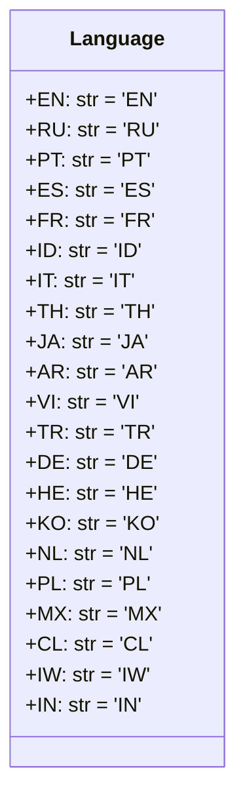

## Анализ кода `src/suppliers/aliexpress/api/models/languages.py`

### <алгоритм>

1. **Объявление класса `Language`**:
   - Начинается определение класса `Language`, который служит для хранения констант, представляющих языковые коды.
   - Пример: `class Language:`

2. **Определение констант (языковых кодов)**:
   - Внутри класса `Language` определяются статические атрибуты, каждый из которых является строкой, представляющей языковой код (например, `'EN'` для английского, `'RU'` для русского).
   - Пример: `EN = 'EN'`, `RU = 'RU'`, `PT = 'PT'`, и т.д.
   - Эти константы могут использоваться в других частях проекта для указания языка при взаимодействии с API AliExpress.

3. **Использование в других модулях**:
   - Другие модули могут импортировать класс `Language` и использовать его атрибуты для получения языковых кодов.
   - Пример: `from src.suppliers.aliexpress.api.models.languages import Language`, затем можно использовать `Language.EN`, `Language.RU`, и т.д.

### <mermaid>

**Объяснение зависимостей в `mermaid`:**

-   `classDiagram`:  Указывает, что это диаграмма классов.
-   `class Language`: Определяет класс `Language`.
-   `+EN: str = 'EN'`, `+RU: str = 'RU'`, ... : Указывают на статические публичные (знак `+`) атрибуты класса `Language`, представляющие языковые коды. Тип данных `str`, и значение присваиваемое атрибуту.

### <объяснение>

**Импорты:**

-   В данном коде нет явных операторов `import`. Этот файл определяет только класс `Language` и его атрибуты.

**Классы:**

-   **`class Language`**:
    -   **Роль**:  Класс `Language` служит для хранения статических констант, которые представляют собой двухбуквенные коды языков (например, 'EN' для английского, 'RU' для русского, и т.д.).
    -   **Атрибуты**:
        -   `EN`, `RU`, `PT`, `ES`, `FR`, `ID`, `IT`, `TH`, `JA`, `AR`, `VI`, `TR`, `DE`, `HE`, `KO`, `NL`, `PL`, `MX`, `CL`, `IW`, `IN`:  Статические атрибуты, каждый из которых является строковым представлением языкового кода.
    -   **Методы**: Класс не содержит методов, он используется только для хранения констант.
    -   **Взаимодействие**: Класс `Language` используется другими модулями в проекте для получения языковых кодов. Это обеспечивает централизованное управление языковыми кодами и избегает дублирования строк в разных частях кода.

**Функции:**

-   В данном файле нет функций.

**Переменные:**

-   `EN`, `RU`, `PT`, ... `IN`:  Строковые константы (атрибуты класса),  представляющие двухбуквенные коды языков. Их тип данных – `str`. Используются как предопределенные значения для выбора языка при запросах к API.

**Потенциальные ошибки и области для улучшения:**

-   **Отсутствие комментариев**: Отсутствуют docstring  или комментарии, описывающие назначение каждого языкового кода, что могло бы сделать код более читаемым.
-   **Повторное использование строк**: Строки-константы для языков могут быть вынесены за пределы класса, если это потребуется по проекту, чтобы избежать их повторного определения, если, например, их будет нужно хранить не только в классах.

**Цепочка взаимосвязей:**

1.  Другие части проекта, такие как модули, отвечающие за взаимодействие с API AliExpress, могут импортировать класс `Language`.
2.  Когда необходимо указать язык в запросе к API, используется константа из `Language` класса (например, `Language.RU` для русского языка) вместо использования жестко закодированной строки.
3.  Это обеспечивает согласованность и легкость изменения используемых языковых кодов. Например, при добавлении нового языка необходимо изменить этот файл, и изменения автоматически распространятся по всему проекту.