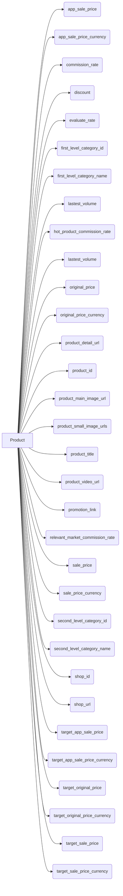

# <input code>

```python
## \file hypotez/src/suppliers/aliexpress/api/models/product.py
# -*- coding: utf-8 -*-
#! venv/Scripts/python.exe # <- venv win
## ~~~~~~~~~~~~
""" module: src.suppliers.aliexpress.api.models """
from typing import List


class Product:
    app_sale_price: str
    app_sale_price_currency: str
    commission_rate: str
    discount: str
    evaluate_rate: str
    first_level_category_id: int
    first_level_category_name: str
    lastest_volume: int
    hot_product_commission_rate: str
    lastest_volume: int
    original_price: str
    original_price_currency: str
    product_detail_url: str
    product_id: int
    product_main_image_url: str
    product_small_image_urls: List[str]
    product_title: str
    product_video_url: str
    promotion_link: str
    relevant_market_commission_rate: str
    sale_price: str
    sale_price_currency: str
    second_level_category_id: int
    second_level_category_name: str
    shop_id: int
    shop_url: str
    target_app_sale_price: str
    target_app_sale_price_currency: str
    target_original_price: str
    target_original_price_currency: str
    target_sale_price: str
    target_sale_price_currency: str
```

# <algorithm>

**Шаг 1**: Определение класса `Product`.

```
+-----------------+
|  Class Product   |
+-----------------+
| app_sale_price  |
| app_sale_price_...|
| ...             |
+-----------------+
```

Описание: Этот класс предназначен для хранения данных о продукте, полученных с API AliExpress.  Он содержит множество атрибутов, представляющих различные характеристики продукта (цены, ID категорий, ссылки и т.д.).


# <mermaid>



*Описание диаграммы*:

Диаграмма показывает класс `Product` и его атрибуты, представляющие собой данные о продукте. Все атрибуты являются переменными, которые хранят информацию о продукте.  Зависимости между элементами диаграммы представлены стрелками, показывающими, что каждый атрибут связан с классом `Product`.

# <explanation>

**Импорты**:

```python
from typing import List
```

Этот импорт необходим для использования типа данных `List` в классе `Product`. `typing.List` позволяет определить, что атрибут `product_small_image_urls` будет списком строк, улучшая читаемость и типизацию кода. Он находится в стандартной библиотеке Python.

**Классы**:

*   **`Product`**: Этот класс описывает структуру данных для хранения информации о продукте с AliExpress.  Атрибуты класса представляют собой поля данных, такие как цены, ID категорий, ссылки и другие характеристики продукта.  В данный момент класс содержит поля, которые хранят различные параметры продукта, которые могут быть полезными при обработке данных.

**Функции**:

В данном коде нет функций, есть только класс `Product`.

**Переменные**:

Все переменные являются атрибутами класса `Product` и определяют поля для хранения информации о продукте, например, `app_sale_price`, `product_id`, `product_title` и т. д.

**Возможные ошибки или области для улучшений**:

*   **Типы данных**:  Хотя `typing` используется для типов данных, важны конкретные типы для каждого поля (например, `float` для цен, `datetime` для дат). Это повысит корректность работы и позволит использовать атрибуты в последующих операциях.
*   **Проверка данных**: Необходимо добавить проверку типов и корректности данных, которые поступают в поля класса (например, проверка, что цены не отрицательны).
*   **Docstrings**: Добавление docstrings к классу и атрибутам улучшит документирование и поддержку кода.
*   **Стандартизация**: В имени полей следует придерживаться определенного стиля (например, snake_case или camelCase), чтобы улучшить читабельность.

**Взаимосвязи с другими частями проекта**:

Этот код, вероятно, будет использоваться в других частях проекта, например, для обработки данных о продуктах, полученных с AliExpress.  Он подразумевает существование модулей, которые:

*   Получают данные с API AliExpress.
*   Обрабатывают и преобразуют полученные данные.
*   Используют данные о продуктах для последующей обработки (например, для расчета прибыли или для отображения на сайте).


Без дополнительного контекста, точного понимания предназначения проекта и структуры папок, сложно сказать о полном масштабе взаимосвязей.  Этот класс выступает как промежуточный слой, хранящий данные, которые, вероятно, используются для дальнейшей обработки и анализа.