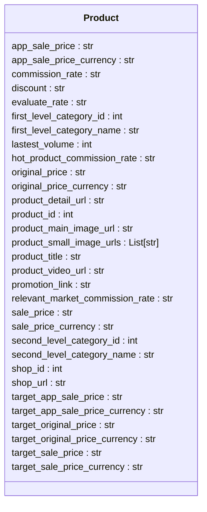

# <input code>

```python
## \file hypotez/src/suppliers/aliexpress/api/models/product.py
# -*- coding: utf-8 -*-\
#! venv/Scripts/python.exe # <- venv win
## ~~~~~~~~~~~~~\
""" module: src.suppliers.aliexpress.api.models """
from typing import List


class Product:
    app_sale_price: str
    app_sale_price_currency: str
    commission_rate: str
    discount: str
    evaluate_rate: str
    first_level_category_id: int
    first_level_category_name: str
    lastest_volume: int
    hot_product_commission_rate: str
    lastest_volume: int
    original_price: str
    original_price_currency: str
    product_detail_url: str
    product_id: int
    product_main_image_url: str
    product_small_image_urls: List[str]
    product_title: str
    product_video_url: str
    promotion_link: str
    relevant_market_commission_rate: str
    sale_price: str
    sale_price_currency: str
    second_level_category_id: int
    second_level_category_name: str
    shop_id: int
    shop_url: str
    target_app_sale_price: str
    target_app_sale_price_currency: str
    target_original_price: str
    target_original_price_currency: str
    target_sale_price: str
    target_sale_price_currency: str
```

# <algorithm>

```mermaid
graph TD
    A[Product Data] --> B{Initialization};
    B --> C{Attributes Set};
    C --> D[Product Object];
    
    subgraph "Data Storage"
        D -- app_sale_price --> E[app_sale_price];
        D -- app_sale_price_currency --> F[app_sale_price_currency];
        ... (all attributes)
    end
```

**Пример:**  Предположим, получены данные о товаре из API AliExpress:
* `app_sale_price` = "10.99"
* `app_sale_price_currency` = "USD"
... и другие данные.

Класс `Product` принимает эти данные и инициализирует свои атрибуты. В результате, у нас есть объект `Product` с заполненными свойствами.

# <mermaid>



**Зависимости**:  Код напрямую зависит от `typing.List`.  Это стандартный модуль Python, входящий в стандартную библиотеку.  Никаких внешних библиотек или других файлов проекта здесь не используется.

# <explanation>

**Импорты:**

* `from typing import List`: Импортирует тип `List` из модуля `typing`.  Это используется для типизации списка `product_small_image_urls`, что делает код более понятным и поддерживаемым, позволяя статическим анализаторам (например, MyPy) обнаруживать потенциальные ошибки.

**Классы:**

* **`Product`**: Определяет структуру данных для представления информации о продукте, полученном с сайта AliExpress.
    * Все атрибуты являются полями класса, что означает, что они хранят данные о товаре.
    * Типизация атрибутов (например, `app_sale_price: str`) указывает ожидаемый тип данных для каждого поля, повышая надежность работы с данными.

**Функции:**

* Нет функций.  Это определение класса, не содержащее никаких функций, но само по себе не является функциональным блоком кода.

**Переменные:**

* Нет переменных в данном коде.  Это определение класса, который содержит только атрибуты.

**Возможные ошибки/улучшения:**

* **Недостаток валидации:**  Код не содержит логики для проверки данных, полученных из API.  Если данные имеют неправильный формат (например, `app_sale_price` - не число), программа может аварийно завершиться или работать некорректно.  Необходимо добавить валидацию входных данных.  Рекомендуется использовать проверку типов (type hinting) для более надежного кода.

* **Проблема с `lastest_volume`:**  Поле `lastest_volume` дублируется.  Возможно, нужно исправить название на `latest_volume` или `last_volume`, чтобы избежать путаницы.


**Цепочка взаимосвязей:**

Этот код, скорее всего, является частью API,  получающего информацию о продуктах от AliExpress.  Он создает объекты `Product`, которые могут использоваться другими частями приложения для отображения информации, сравнения цен, формирования отчетов и т.д.  Следующим шагом может быть загрузка изображений, обработка данных о ценах, передача данных в базу данных и т.д.