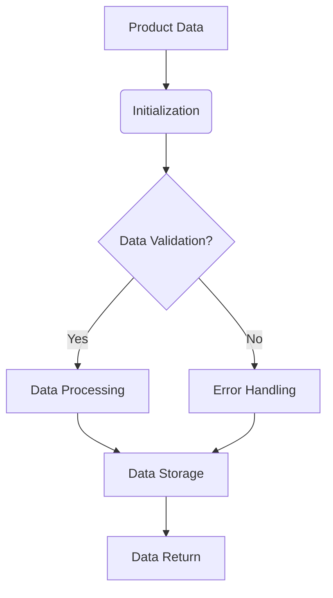
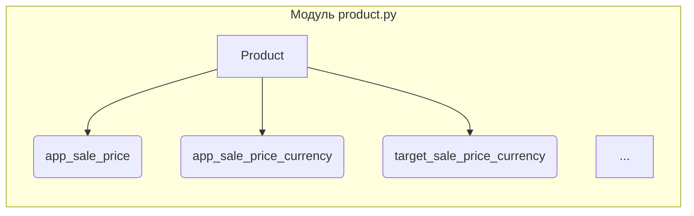

```MD
# Анализ кода файла `hypotez/src/suppliers/aliexpress/api/models/product.py`

## <input code>

```python
## \file hypotez/src/suppliers/aliexpress/api/models/product.py
# -*- coding: utf-8 -*-\
#! venv/Scripts/python.exe # <- venv win
## ~~~~~~~~~~~~~\
""" module: src.suppliers.aliexpress.api.models """
from typing import List


class Product:
    app_sale_price: str
    app_sale_price_currency: str
    commission_rate: str
    discount: str
    evaluate_rate: str
    first_level_category_id: int
    first_level_category_name: str
    lastest_volume: int
    hot_product_commission_rate: str
    lastest_volume: int
    original_price: str
    original_price_currency: str
    product_detail_url: str
    product_id: int
    product_main_image_url: str
    product_small_image_urls: List[str]
    product_title: str
    product_video_url: str
    promotion_link: str
    relevant_market_commission_rate: str
    sale_price: str
    sale_price_currency: str
    second_level_category_id: int
    second_level_category_name: str
    shop_id: int
    shop_url: str
    target_app_sale_price: str
    target_app_sale_price_currency: str
    target_original_price: str
    target_original_price_currency: str
    target_sale_price: str
    target_sale_price_currency: str
```

## <algorithm>



**Описание:**

Код определяет класс `Product`, представляющий данные о продукте с AliExpress. Алгоритм включает инициализацию объекта с данными, валидацию полученных данных (если реализовано в связанных методах) , обработку данных и, возможно, сохранение их в базу данных или передачу в другой компонент.

**Примеры данных:**

* **A[Product Data]:** `{"app_sale_price": "10.99", "product_id": 123, ...}`
* **B(Initialization):** Создание объекта `Product` с присваиванием значений атрибутов из `Product Data`

## <mermaid>



**Описание зависимостей:**

Данный код не содержит прямых внешних зависимостей (кроме `typing`).  Все зависимости, которые могут использоваться, подразумеваются из контекста проекта `hypotez`.  Код определяет модель данных, которая, вероятно, будет использоваться для обработки данных с сайта AliExpress. Для полноценного понимания необходимо знать структуру проекта `hypotez` и как эта модель используется в других модулях.

## <explanation>

**Импорты:**

* `from typing import List`: Импортирует тип данных `List` из модуля `typing`.  Это необходимо для работы с  списком строк `product_small_image_urls`, обеспечивая типизацию и повышая читаемость.

**Классы:**

* **`Product`:** Представляет собой класс, который содержит данные о продукте, полученные с сайта AliExpress.  Атрибуты класса соответствуют различным характеристикам продукта (цена, ID, URL, категории и т.д.).  Ключевая особенность – `typing`.


**Функции (отсутствуют):**

В данном фрагменте кода нет функций. Класс `Product` определяет атрибуты, которые, вероятно, будут заполнены в связанных частях проекта.

**Переменные:**

В данном фрагменте кода переменные определены как атрибуты класса, каждый из которых представляет собой характеристики продукта (строки, числа и т.д.).  Например, `app_sale_price` – это цена товара, `product_id` – идентификатор товара.

**Возможные ошибки и улучшения:**

* **Типизация:** Не указаны типы данных для всех атрибутов.  Хотя указано `typing.List`, другие типы (например, `float` для цен) не указаны, что может привести к ошибкам при работе с данными.

* **Валидация:**  Отсутствуют методы для валидации данных. Это может привести к ошибкам, если данные, полученные от API, не соответствуют ожидаемому формату. Необходима обработка исключений, таких как `ValueError` при неверных типах входных данных.


**Цепочка взаимосвязей:**

Данный класс является частью API для работы с AliExpress. Вероятно, существуют классы для парсинга данных с API, обработки запросов и сохранения данных в базу данных или в структуру данных проекта (например,  в базе данных, на основе `ORM`).  Данные, полученные из API, будут использоваться для формирования списка товаров (например, для анализа, формирования предложений или выдачи результатов поиска).