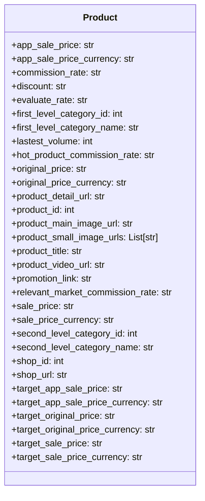

## <алгоритм>

1.  **Определение класса `Product`**:
    *   Создается класс `Product` для представления информации о товаре с AliExpress.
    *   **Пример**: `product = Product()` - создает экземпляр класса `Product`.

2.  **Объявление атрибутов класса**:
    *   Внутри класса `Product` объявляются атрибуты, которые будут хранить данные о товаре. Эти атрибуты представляют собой различные характеристики товара, такие как цена, скидка, категория, URL-адреса изображений, название, и т.д.
    *   **Пример**: `product.app_sale_price = "10.99"` - устанавливает значение атрибута `app_sale_price` экземпляра `product` на строку "10.99".
    *   **Пример**: `product.product_small_image_urls = ["url1.jpg", "url2.jpg"]` - устанавливает значение атрибута `product_small_image_urls` экземпляра `product` на список строк.

3.  **Использование экземпляра класса `Product`**:
    *   Создается экземпляр класса `Product` и его атрибутам присваиваются значения, представляющие информацию о конкретном товаре.
    *   Данные из экземпляра класса могут использоваться для дальнейшей обработки, например, для отображения информации о товаре на сайте или в приложении.
    *   **Пример**:
        ```python
        product = Product()
        product.product_title = "Amazing Product"
        product.sale_price = "15.00"
        print(f"Товар: {product.product_title}, Цена: {product.sale_price}")
        ```

## <mermaid>



**Разбор `mermaid` диаграммы:**

*   `classDiagram`: Объявляет, что это диаграмма классов.
*   `class Product`: Определяет класс с именем `Product`.
*   `+app_sale_price: str` и т.д.: Описывает атрибуты класса `Product`. Знак `+` указывает на то, что атрибуты публичные. Атрибуты представляют собой различные свойства продукта, такие как цены (обычная и акционная), валюты, скидки, оценки, категории, ссылки, идентификаторы и т.д., а также списки URL-адресов изображений.

## <объяснение>

**Импорты:**

*   `from typing import List`: Импортируется `List` из модуля `typing`. Используется для аннотации типа атрибута `product_small_image_urls`, указывая, что это список строк. Это повышает читаемость и позволяет статическим анализаторам кода проверять корректность типов.

**Класс `Product`:**

*   **Роль**: Класс `Product` является моделью данных для представления информации о товаре, полученной из API AliExpress. Этот класс используется для хранения и передачи данных о товарах в пределах приложения.
*   **Атрибуты**: Класс `Product` содержит множество атрибутов, каждый из которых представляет конкретную характеристику товара:
    *   `app_sale_price` (`str`): Цена товара в приложении.
    *   `app_sale_price_currency` (`str`): Валюта цены товара в приложении.
    *  `commission_rate` (`str`): Комиссионный процент.
    *   `discount` (`str`): Скидка на товар.
    *   `evaluate_rate` (`str`): Рейтинг товара.
    *   `first_level_category_id` (`int`): ID категории первого уровня.
    *   `first_level_category_name` (`str`): Название категории первого уровня.
    *  `lastest_volume` (`int`): Количество продаж.
    *   `hot_product_commission_rate` (`str`): Комиссия для горячих товаров.
    *  `original_price` (`str`): Оригинальная цена товара.
    *  `original_price_currency` (`str`): Валюта оригинальной цены товара.
    *   `product_detail_url` (`str`): URL страницы товара.
    *   `product_id` (`int`): ID товара.
    *   `product_main_image_url` (`str`): URL главного изображения товара.
    *   `product_small_image_urls` (`List[str]`): Список URL-адресов маленьких изображений товара.
    *   `product_title` (`str`): Название товара.
    *   `product_video_url` (`str`): URL видео товара.
    *   `promotion_link` (`str`): Ссылка на продвижение.
    *   `relevant_market_commission_rate` (`str`): Процент комиссионных на рынке.
    *   `sale_price` (`str`): Цена товара со скидкой.
    *   `sale_price_currency` (`str`): Валюта цены товара со скидкой.
    *   `second_level_category_id` (`int`): ID категории второго уровня.
    *   `second_level_category_name` (`str`): Название категории второго уровня.
    *   `shop_id` (`int`): ID магазина.
    *   `shop_url` (`str`): URL магазина.
    *  `target_app_sale_price` (`str`): Целевая цена товара в приложении.
     *   `target_app_sale_price_currency` (`str`): Валюта целевой цены в приложении.
    *   `target_original_price` (`str`): Целевая оригинальная цена товара.
    *  `target_original_price_currency` (`str`): Валюта целевой оригинальной цены.
    *   `target_sale_price` (`str`): Целевая цена товара.
     *  `target_sale_price_currency` (`str`): Валюта целевой цены.
*   **Методы**: В данном коде класс `Product` не имеет методов, а только атрибуты. Это делает его простой структурой данных, которая может быть передана между различными частями системы.
*   **Взаимодействие**: Экземпляры класса `Product` будут создаваться на основе данных, полученных из API AliExpress.

**Функции:**
* В данном коде функции отсутствуют, класс `Product` представляет собой структуру данных.

**Переменные:**

*   Атрибуты класса `Product` являются переменными экземпляра. Типы переменных: `str`, `int`, `List[str]`.
*   Эти переменные используются для хранения информации о товарах.

**Потенциальные ошибки и улучшения:**

*   **Отсутствие методов:** Класс `Product` является простым контейнером данных.  В будущем могут потребоваться методы для валидации данных, форматирования цен или других преобразований данных. Можно добавить методы, например, для расчета скидки или форматирования цен.
*   **Типизация:** Использование `str` для числовых значений (таких как цены) может привести к ошибкам. Желательно использовать `float` или `Decimal` для представления цен, чтобы избежать проблем при арифметических операциях.
*   **Валидация данных:** Не выполняется никакой проверки получаемых данных. Желательно добавить валидацию данных, чтобы убедиться, что значения соответствуют ожидаемому формату и диапазону.
*   **Магические строки**: Для валют (например, `app_sale_price_currency`) желательно использовать enum или константы, чтобы избежать опечаток и сделать код более читаемым.
*  **Унификация**: Некоторые атрибуты дублируют данные о цене (например, `sale_price` и `target_sale_price`), возможно стоит их объединить.
*  **Документация**: Отсутствует документация для класса и его атрибутов. Желательно добавить docstring для пояснения назначения атрибутов и класса в целом.

**Взаимосвязь с другими частями проекта:**

*   Данный класс будет использоваться в модуле API (`src.suppliers.aliexpress.api`), для преобразования данных, полученных от API AliExpress, в удобный для работы формат.
*   Экземпляры `Product` будут передаваться в другие части проекта, например, в модули для сохранения в БД или отображения на пользовательском интерфейсе.
*   Цепочка взаимодействия может быть следующей:
    1.  Запрос к API AliExpress.
    2.  Получение JSON данных о товарах.
    3.  Создание экземпляров `Product` на основе этих данных.
    4.  Передача экземпляров `Product` в другие модули для дальнейшей обработки (например, отображение на сайте, сохранение в БД).