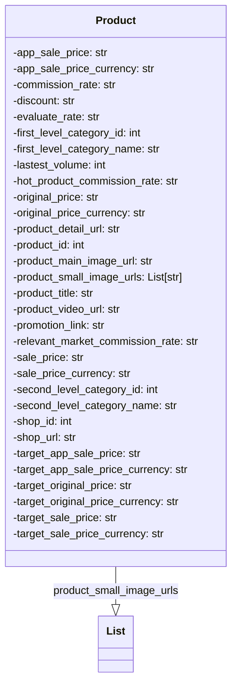

## ИНСТРУКЦИЯ:

Анализируй предоставленный код подробно и объясни его функциональность. Ответ должен включать три раздела:  

1. **<алгоритм>**: Опиши рабочий процесс в виде пошаговой блок-схемы, включая примеры для каждого логического блока, и проиллюстрируй поток данных между функциями, классами или методами.  
2. **<mermaid>**: Напиши код для диаграммы в формате `mermaid`, проанализируй и объясни все зависимости, 
    которые импортируются при создании диаграммы. 
    **ВАЖНО!** Убедитесь, что все имена переменных, используемые в диаграмме `mermaid`, 
    имеют осмысленные и описательные имена. Имена переменных вроде `A`, `B`, `C`, и т.д., не допускаются!  
    
    **Дополнительно**: Если в коде есть импорт `import header`, добавьте блок `mermaid` flowchart, объясняющий `header.py`:
    ```mermaid
    flowchart TD
        Start --> Header[<code>header.py</code><br> Determine Project Root]
    
        Header --> import[Import Global Settings: <br><code>from src import gs</code>] 
    ```

3. **<объяснение>**: Предоставьте подробные объяснения:  
   - **Импорты**: Их назначение и взаимосвязь с другими пакетами `src.`.  
   - **Классы**: Их роль, атрибуты, методы и взаимодействие с другими компонентами проекта.  
   - **Функции**: Их аргументы, возвращаемые значения, назначение и примеры.  
   - **Переменные**: Их типы и использование.  
   - Выделите потенциальные ошибки или области для улучшения.  

Дополнительно, постройте цепочку взаимосвязей с другими частями проекта (если применимо).  

Это обеспечивает всесторонний и структурированный анализ кода.
## Формат ответа: `.md` (markdown)
**КОНЕЦ ИНСТРУКЦИИ**

## <алгоритм>

1. **Импорт `List` из `typing`:**
   - Начинается с импорта `List` из модуля `typing`. Это указывает, что в коде будет использоваться типизированный список, что помогает с аннотацией типов и повышает читаемость.
   - **Пример:** `from typing import List` - импортирует тип `List` для аннотации списков.
2. **Объявление класса `Product`:**
   - Создается класс `Product`, который будет служить моделью данных для представления информации о продукте с AliExpress.
   - **Пример:** `class Product:` - начало определения класса.
3. **Определение атрибутов (полей) класса `Product`:**
   - Внутри класса `Product` объявлено множество атрибутов, каждый из которых описывает определенную характеристику продукта.
   - Эти атрибуты являются аннотированными, с указанием их типа (в основном `str` и `int`, а также `List[str]` для списка URL изображений).
   - Атрибуты охватывают информацию о цене, скидках, комиссионных, категориях, URL-адресах, названиях, идентификаторах, и др.
   - **Пример:** `app_sale_price: str` - атрибут, представляющий цену со скидкой в приложении (строка).
   - **Пример:** `product_small_image_urls: List[str]` - атрибут, представляющий список URL-адресов маленьких изображений продукта.

**Поток данных:**

1. Данные о продукте, полученные от AliExpress API, будут использоваться для создания экземпляров класса `Product`.
2. Каждый атрибут объекта `Product` будет хранить соответствующее значение.
3. Эти объекты `Product` затем могут быть использованы в других частях проекта для представления и обработки данных о продуктах.

## <mermaid>

**Объяснение `mermaid`:**

*   **`classDiagram`:** Определяет, что это диаграмма классов.
*   **`class Product`**: Описывает класс `Product`, который служит моделью данных для представления информации о продукте.
*   **Атрибуты класса Product**: Все атрибуты класса перечислены внутри фигурных скобок `{}` с их типами. Например, `-app_sale_price: str` показывает, что `app_sale_price` является атрибутом типа `str`.
*   **`class List`**: Описывает класс `List`, который импортируется из `typing` и используется для типизации атрибута `product_small_image_urls`.
*   **`Product --|> List : product_small_image_urls`**: Отношение "ассоциация" или "использование" между классом `Product` и `List`, где `product_small_image_urls` является атрибутом класса `Product`, который представляет собой список строк.

## <объяснение>
### Импорты:
*   **`from typing import List`**: 
    *   Импортирует `List` из модуля `typing`.
    *   `typing` используется для аннотации типов в Python, что позволяет статическим анализаторам кода и IDE проверять типы данных, делая код более надежным и понятным. `List` используется для аннотации атрибута `product_small_image_urls`, который представляет собой список строк (URL-адресов).
    *   Это не связано напрямую с другими пакетами `src`, но помогает определить и контролировать типы данных в проекте `src`.

### Классы:
*   **`class Product`**:
    *   Это класс данных (dataclass) для представления информации о продукте, полученной от AliExpress API. 
    *   Атрибуты:
        *   **Цены и валюты**: `app_sale_price`, `app_sale_price_currency`, `original_price`, `original_price_currency`, `sale_price`, `sale_price_currency`, `target_app_sale_price`, `target_app_sale_price_currency`, `target_original_price`, `target_original_price_currency`, `target_sale_price`, `target_sale_price_currency` -  представляют различные цены на товар, включая оригинальную, продажную, и цены для приложения, а также их валюты.
        *   **Комиссии и скидки**: `commission_rate`, `discount`, `evaluate_rate`, `hot_product_commission_rate`, `relevant_market_commission_rate` - представляют информацию о комиссиях и скидках, связанных с продуктом.
        *   **Категории**: `first_level_category_id`, `first_level_category_name`, `second_level_category_id`, `second_level_category_name` - представляют ID и названия категорий продукта.
        *   **Объемы и продажи**: `lastest_volume` - представляет объем последних продаж.
        *   **URL**: `product_detail_url`, `product_main_image_url`, `product_small_image_urls`, `product_video_url`, `shop_url`, `promotion_link` - представляют различные URL-адреса, связанные с продуктом (детали, изображения, видео, магазин, акция).
        *   **Идентификаторы**: `product_id`, `shop_id` - представляют ID продукта и магазина.
        *   **Название**: `product_title` - представляет название продукта.
    *   **Роль:** Этот класс играет роль структуры данных для хранения и передачи информации о продуктах, полученных из AliExpress API. Его использование позволяет структурировать данные и обеспечивает более понятный и типизированный код.
    *   **Взаимодействие**: Этот класс может использоваться другими модулями проекта, например, для получения и обработки информации о товарах, для формирования запросов к API, для отображения информации на UI и т.д.
    *  **Цепочка взаимосвязей:**
        1. API AliExpress: Данные о продукте поступают из API AliExpress.
        2. `src.suppliers.aliexpress.api.models.product.py`: Класс `Product` используется для создания объектов продукта.
        3. Другие модули: Модули проекта могут использовать объекты `Product` для дальнейшей обработки данных.

### Функции:

*   В предоставленном коде нет функций. Все объявленные элементы являются атрибутами класса `Product`.

### Переменные:

*   Все переменные, объявленные в классе `Product`, являются атрибутами экземпляра класса.
*   **Типы**: Большинство переменных имеют тип `str` (строка), некоторые - `int` (целое число), а `product_small_image_urls` имеет тип `List[str]` (список строк).
*   **Использование**: Каждая переменная используется для хранения определенной характеристики продукта, полученной из AliExpress API.

### Потенциальные ошибки и области для улучшения:

1.  **Отсутствие валидации данных**: В коде не выполняется никакая валидация данных. Было бы полезно добавить валидацию для типов данных (например, убедиться, что все `int` являются действительно числами), а также для других параметров (например, длины строк).
2.  **Отсутствие методов**: Класс `Product` представляет собой простой контейнер данных. Было бы полезно добавить методы, например, методы для обработки данных или форматирования вывода, что сделало бы класс более функциональным.
3.  **Дублирование атрибутов**: Присутствует дублирование атрибута `lastest_volume`. Необходимо удалить один из этих атрибутов.
4.  **Строковые значения для числовых данных**: Некоторые атрибуты, такие как `commission_rate`, `discount` и `evaluate_rate`, могут быть представлены в виде чисел (float), а не строк, для упрощения дальнейшей работы с ними.
5. **Отсутствие документации**: Отсутствуют docstrings для класса и атрибутов, что затрудняет понимание кода.

### Дополнительно:

*   Класс `Product` является частью модуля `src.suppliers.aliexpress.api.models`, который, вероятно, отвечает за обработку API AliExpress. Этот модуль входит в пакет `src.suppliers.aliexpress`, который специализируется на поставщиках AliExpress.
*   Цепочка взаимосвязей между модулями проекта помогает понять, как данные, полученные от API, обрабатываются и используются в других частях приложения.

Этот анализ обеспечивает всестороннее понимание предоставленного кода, его функциональности и возможных улучшений.