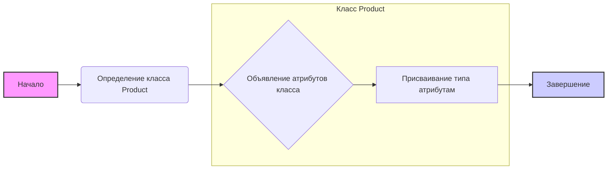
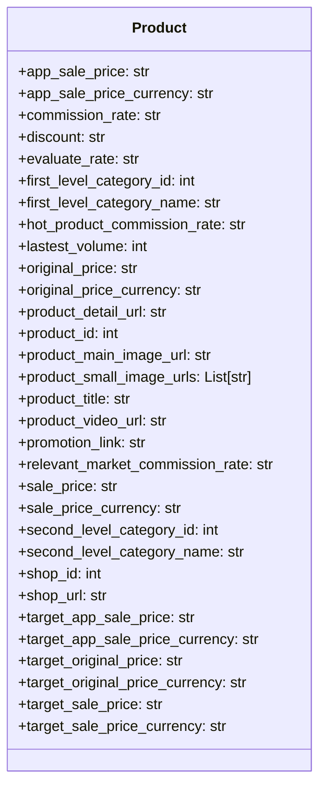

## <алгоритм>

**Описание:**

Модуль `product.py` определяет класс `Product`, который представляет структуру данных продукта, полученного от AliExpress API. Этот класс содержит множество атрибутов, описывающих различные характеристики продукта, такие как цены, скидки, категории, изображения, URL-адреса и т.д.

**Блок-схема:**

**Примеры:**

*   **`app_sale_price: str`**: Цена товара для мобильного приложения, представленная в виде строки (например, `"19.99"`).
*   **`product_id: int`**: Уникальный идентификатор товара (например, `123456789`).
*   **`product_small_image_urls: List[str]`**: Список URL-адресов миниатюр товара (например, `["url1", "url2", "url3"]`).
*   **`shop_id: int`**: Уникальный идентификатор магазина, продающего товар (например, `987654321`).

## <mermaid>

**Объяснение `mermaid` диаграммы:**

*   `classDiagram`: Указывает, что это диаграмма классов.
*   `class Product`:  Объявляет класс `Product` с атрибутами.
*   Атрибуты с префиксом `+`: Показывают, что это публичные атрибуты.
*   `: str`, `: int`, `: List[str]`: Обозначают типы данных для каждого атрибута.
*   Диаграмма наглядно демонстрирует структуру класса `Product` и типы данных, которые он использует.

## <объяснение>

**Импорты:**

*   `from typing import List`: Импортируется `List` из модуля `typing` для указания типа атрибута `product_small_image_urls` как списка строк. Это используется для статической проверки типов и улучшения читаемости кода.

**Классы:**

*   `class Product`: Представляет собой структуру данных для хранения информации о продукте AliExpress. Класс не имеет методов, только атрибуты, и выступает в роли контейнера данных.
    *   **Атрибуты:** Атрибуты класса представляют собой различные свойства товара, такие как:
        *   `app_sale_price` (str): Цена товара для мобильного приложения.
        *   `app_sale_price_currency` (str): Валюта цены товара для мобильного приложения.
        *   `commission_rate` (str): Комиссионный сбор.
        *  `discount` (str): Размер скидки.
        *   `evaluate_rate` (str): Оценочный рейтинг товара.
        *   `first_level_category_id` (int): Идентификатор категории первого уровня.
        *   `first_level_category_name` (str): Название категории первого уровня.
        *   `hot_product_commission_rate` (str): Комиссия для "горячих" товаров.
        *   `lastest_volume` (int): Последний объем продаж.
        *   `original_price` (str): Оригинальная цена товара.
        *   `original_price_currency` (str): Валюта оригинальной цены.
        *   `product_detail_url` (str): URL-адрес страницы с подробной информацией о товаре.
        *   `product_id` (int): Уникальный идентификатор товара.
        *   `product_main_image_url` (str): URL-адрес основного изображения товара.
        *   `product_small_image_urls` (List[str]): Список URL-адресов миниатюр товара.
        *   `product_title` (str): Название товара.
        *   `product_video_url` (str): URL-адрес видео о товаре.
        *   `promotion_link` (str): Ссылка на акцию для товара.
        *    `relevant_market_commission_rate` (str): Комиссионный сбор для определенного рынка.
        *   `sale_price` (str): Цена товара со скидкой.
        *   `sale_price_currency` (str): Валюта цены со скидкой.
        *   `second_level_category_id` (int): Идентификатор категории второго уровня.
        *   `second_level_category_name` (str): Название категории второго уровня.
        *   `shop_id` (int): Идентификатор магазина, продающего товар.
        *   `shop_url` (str): URL-адрес магазина.
        *   `target_app_sale_price` (str): Целевая цена товара для мобильного приложения.
        *   `target_app_sale_price_currency` (str): Валюта целевой цены товара для мобильного приложения.
        *   `target_original_price` (str): Целевая оригинальная цена товара.
        *   `target_original_price_currency` (str): Валюта целевой оригинальной цены товара.
        *   `target_sale_price` (str): Целевая цена товара со скидкой.
        *  `target_sale_price_currency` (str): Валюта целевой цены товара со скидкой.

        *   Все атрибуты представляют собой информацию, полученную из API AliExpress.
    *   **Взаимодействие:** Этот класс, вероятно, будет использоваться для хранения и передачи данных о товарах между различными частями приложения. Например, данные могут быть получены из API, сохранены в экземпляре класса `Product`, а затем использованы для отображения в пользовательском интерфейсе.

**Функции:**
  *  В данном коде нет явных функций, за исключением конструктора класса, который создается автоматически при определении класса.
**Переменные:**

*   В данном коде определены только переменные - атрибуты класса `Product`.
*   Атрибуты класса определены с указанием их типа, что способствует статической типизации и улучшает читаемость кода.

**Потенциальные ошибки и области для улучшения:**

*   **Отсутствие методов**: Класс `Product` сейчас является просто контейнером данных. Можно добавить методы для преобразования данных, форматирования цен, проверки валидности данных и т.д.
*   **Типы данных**: Многие атрибуты, представляющие цены, имеют тип `str`, что может привести к проблемам при вычислениях. Возможно, следует использовать `Decimal` или `float` для точного представления цен и конвертировать их в `str` только для отображения.
*   **Обработка ошибок**: Нет механизма обработки ошибок при получении данных из API. Возможно стоит добавить валидацию, проверки или установить значения по умолчанию для обязательных атрибутов.
*   **Документация**: Код не содержит документации, что может усложнить его понимание и использование. Рекомендуется добавить docstring для класса и атрибутов.

**Взаимосвязи с другими частями проекта:**

*   Этот модуль, скорее всего, используется модулями, которые отвечают за работу с API AliExpress,  и модулями, которые обрабатывают и отображают данные о товарах.
*   Возможная цепочка взаимодействия:
    1.  Модуль API (`api.py`) запрашивает данные у AliExpress.
    2.  Данные о товаре, полученные из API, преобразуются в экземпляр класса `Product`.
    3.  Экземпляр класса `Product` передается в модуль обработки и отображения.
    4.  Модуль обработки и отображения использует атрибуты класса `Product` для представления данных в пользовательском интерфейсе.