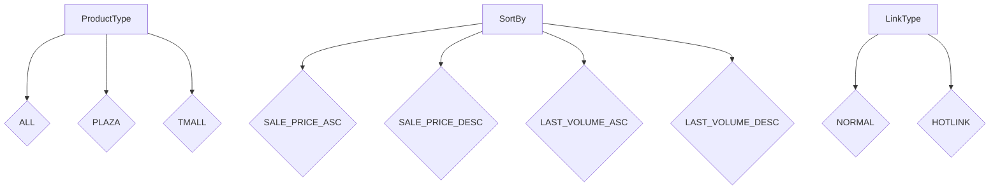
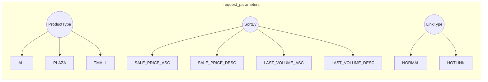

```MD
# Анализ кода файла `hypotez/src/suppliers/aliexpress/api/models/request_parameters.py`

## <input code>

```python
## \file hypotez/src/suppliers/aliexpress/api/models/request_parameters.py
# -*- coding: utf-8 -*-\
#! venv/Scripts/python.exe # <- venv win
## ~~~~~~~~~~~~~\
""" module: src.suppliers.aliexpress.api.models """
class ProductType:
    ALL = 'ALL'
    PLAZA = 'PLAZA'
    TMALL = 'TMALL'

class SortBy:
    SALE_PRICE_ASC = 'SALE_PRICE_ASC'
    SALE_PRICE_DESC = 'SALE_PRICE_DESC'
    LAST_VOLUME_ASC = 'LAST_VOLUME_ASC'
    LAST_VOLUME_DESC = 'LAST_VOLUME_DESC'

class LinkType:
    NORMAL = 0
    HOTLINK = 2
```

## <algorithm>

Данный код определяет три класса, представляющих константы для параметров запроса к API AliExpress.  Блок-схема проста, так как нет вычислений или логики. Каждый класс содержит атрибуты, представляющие возможные значения для соответствующего параметра.




Данные в этом случае не передаются между функциями или классами.  Они хранятся как константы, доступные для использования в других частях приложения.

## <mermaid>



## <explanation>

**Импорты:**  В коде нет импортов, так как он содержит только определения классов.

**Классы:**
* **`ProductType`**:  Представляет типы продуктов, которые можно запросить у AliExpress API.  Константы `ALL`, `PLAZA`, `TMALL` представляют возможные значения для фильтрации.
* **`SortBy`**: Определяет способы сортировки результатов.  Константы описывают разные типы сортировки.
* **`LinkType`**: Определяет типы ссылок на продукты.  Константы `NORMAL` и `HOTLINK` представляют собой варианты ссылок.

**Функции:** Нет функций, только определения классов с атрибутами (константами).

**Переменные:** Нет переменных, только атрибуты классов.

**Возможные ошибки или области для улучшений:**

* **Типизация:**  Хотя код использует строковые литералы, было бы полезно использовать аннотации типов для лучшей читаемости и проверки типов.
* **Документация:** Добавьте docstrings для классов и атрибутов для лучшего понимания их назначения.
* **Использование:**  Код не показывает, как эти константы используются в других частях приложения.

**Цепочка взаимосвязей:**

Этот код определяет параметры запроса для API AliExpress.  В дальнейшем эти константы будут использоваться в других частях приложения (`src.suppliers.aliexpress.api.services`, например), где формируются запросы к API.  Например, в методах класса `ProductFetcher` будет использоваться `ProductType.ALL` для получения всех продуктов, или `SortBy.SALE_PRICE_ASC` для сортировки по цене.


**Вывод:** Код структурирован, легко читаем, и представляет собой хороший пример использования констант для определения параметров запросов.  Однако, добавление аннотаций типов и документации улучшит его.