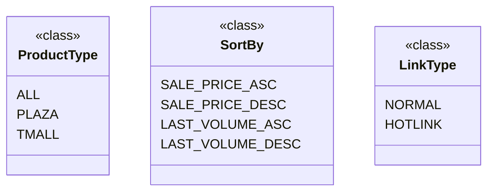

## Анализ кода `hypotez/src/suppliers/aliexpress/api/models/request_parameters.py`

### <алгоритм>

1. **Определение класса `ProductType`**:
   - Создается класс `ProductType` для определения типов продуктов.
   - Внутри класса определяются константы: `ALL`, `PLAZA`, `TMALL`.
   - Эти константы представляют различные типы товаров, которые можно запросить через API AliExpress.
   - **Пример**: Когда необходимо запросить все товары, в запросе будет использована константа `ProductType.ALL`.

2. **Определение класса `SortBy`**:
   - Создается класс `SortBy` для определения параметров сортировки товаров.
   - Внутри класса определяются константы: `SALE_PRICE_ASC`, `SALE_PRICE_DESC`, `LAST_VOLUME_ASC`, `LAST_VOLUME_DESC`.
   - Эти константы представляют различные варианты сортировки товаров, такие как по возрастанию/убыванию цены и объема продаж.
   - **Пример**: Если требуется отсортировать товары по убыванию цены, в запросе будет использована константа `SortBy.SALE_PRICE_DESC`.

3. **Определение класса `LinkType`**:
   - Создается класс `LinkType` для определения типов ссылок.
   - Внутри класса определяются константы: `NORMAL` (со значением 0) и `HOTLINK` (со значением 2).
   - Эти константы представляют различные типы ссылок, которые могут быть использованы для перехода на товар.
   - **Пример**: Для обычной ссылки используется `LinkType.NORMAL`, а для горячей ссылки - `LinkType.HOTLINK`.

### <mermaid>

**Описание диаграммы:**

- Диаграмма представляет три класса: `ProductType`, `SortBy`, и `LinkType`.
- Каждый класс содержит константы, представляющие различные типы продуктов, способы сортировки и типы ссылок.
- Классы не зависят друг от друга и представляют собой наборы констант для использования в запросах к API AliExpress.

### <объяснение>

**Импорты:**
- В данном файле нет импортов. Это означает, что файл не зависит от других частей проекта, кроме базовых конструкций Python.

**Классы:**

1. **`ProductType`**:
   - **Роль**: Определяет возможные типы продуктов при запросах к AliExpress API.
   - **Атрибуты**: 
     - `ALL`: Константа, представляющая все типы продуктов.
     - `PLAZA`: Константа, представляющая товары с AliExpress Plaza.
     - `TMALL`: Константа, представляющая товары с TMall.
   - **Методы**: Нет.
   - **Взаимодействие**: Используется при формировании параметров запроса к AliExpress API.

2. **`SortBy`**:
   - **Роль**: Определяет возможные способы сортировки товаров при запросах к AliExpress API.
   - **Атрибуты**:
     - `SALE_PRICE_ASC`: Константа, представляющая сортировку по цене по возрастанию.
     - `SALE_PRICE_DESC`: Константа, представляющая сортировку по цене по убыванию.
     - `LAST_VOLUME_ASC`: Константа, представляющая сортировку по объему продаж по возрастанию.
     - `LAST_VOLUME_DESC`: Константа, представляющая сортировку по объему продаж по убыванию.
   - **Методы**: Нет.
   - **Взаимодействие**: Используется при формировании параметров запроса к AliExpress API для указания способа сортировки.

3. **`LinkType`**:
   - **Роль**: Определяет типы ссылок, используемых при работе с API AliExpress.
   - **Атрибуты**:
     - `NORMAL`: Константа, представляющая обычную ссылку (значение 0).
     - `HOTLINK`: Константа, представляющая "горячую" ссылку (значение 2).
   - **Методы**: Нет.
   - **Взаимодействие**: Используется при формировании параметров запроса к AliExpress API для указания типа ссылки.

**Функции:**
- В данном файле нет функций.

**Переменные:**
- Константы, определенные внутри классов (`ALL`, `PLAZA`, `TMALL`, `SALE_PRICE_ASC`, `SALE_PRICE_DESC`, `LAST_VOLUME_ASC`, `LAST_VOLUME_DESC`, `NORMAL`, `HOTLINK`) - это переменные, представляющие собой строковые или целочисленные значения. Они используются для задания параметров запросов к API AliExpress.

**Потенциальные ошибки и области для улучшения:**
- **Отсутствие валидации**: Нет проверки на допустимые значения в других частях проекта, которые используют эти константы. Это потенциально может привести к ошибкам, если передать некорректные значения в запросе.
- **Расширение**:  Можно добавить новые типы продуктов, способы сортировки или типы ссылок, если они появятся в API AliExpress.
- **Документация**: Было бы полезно добавить docstrings к классам, чтобы сделать код более понятным и легким в использовании.

**Цепочка взаимосвязей:**
- Этот файл предоставляет модели данных для формирования запросов к AliExpress API. Он взаимодействует с модулями, которые формируют эти запросы, используя константы из этих классов. Например, в файлах, где происходит фактический вызов API, эти константы будут использоваться для задания параметров.