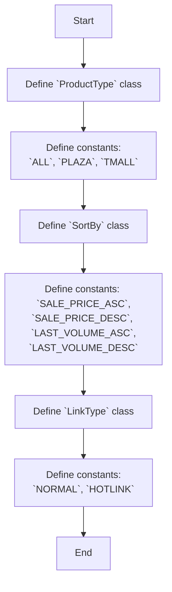
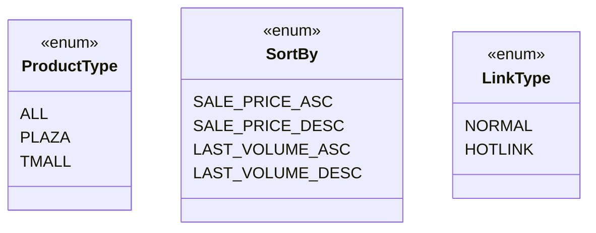

## АНАЛИЗ КОДА: `hypotez/src/suppliers/aliexpress/api/models/request_parameters.py`

### 1. <алгоритм>

**Описание:**
Данный файл определяет три класса, которые используются как перечисления (enum) для задания параметров запросов к API AliExpress.

1.  **`ProductType`**:
    *   Определяет типы продуктов, которые можно запросить.
    *   Содержит константы:
        *   `ALL`:  Все типы продуктов. (Пример: Запрос всех товаров без фильтрации по типу).
        *   `PLAZA`: Продукты из AliExpress Plaza. (Пример: Запрос только товаров из Plaza).
        *   `TMALL`: Продукты из Tmall. (Пример: Запрос только товаров из Tmall).

2.  **`SortBy`**:
    *   Определяет критерии сортировки результатов.
    *   Содержит константы:
        *   `SALE_PRICE_ASC`: Сортировка по цене по возрастанию. (Пример: Получение списка товаров от самых дешевых к самым дорогим).
        *   `SALE_PRICE_DESC`: Сортировка по цене по убыванию. (Пример: Получение списка товаров от самых дорогих к самым дешевым).
        *   `LAST_VOLUME_ASC`: Сортировка по объему продаж по возрастанию. (Пример:  Получение списка товаров с наименьшим объемом продаж).
        *   `LAST_VOLUME_DESC`: Сортировка по объему продаж по убыванию. (Пример: Получение списка товаров с наибольшим объемом продаж).

3.  **`LinkType`**:
    *   Определяет типы ссылок.
    *   Содержит константы:
        *   `NORMAL`: Обычная ссылка. (Пример: Получение обычной ссылки на товар).
        *   `HOTLINK`: "Горячая" ссылка. (Пример:  Получение специальной "горячей" ссылки, возможно, с партнерским ID).

**Пошаговая блок-схема:**

### 2. <mermaid>

**Объяснение:**

Диаграмма классов показывает три класса: `ProductType`, `SortBy` и `LinkType`. Каждый из этих классов представляет собой перечисление (`<<enum>>`), то есть набор именованных констант.

-   `ProductType`: Определяет типы продуктов, которые можно запросить (например, все продукты, продукты Plaza, продукты Tmall).
-   `SortBy`: Определяет параметры сортировки (например, по цене по возрастанию, по объему продаж по убыванию).
-  `LinkType`: Определяет тип ссылки (обычная или "горячая").

Нет импорта других классов или модулей, поэтому в данной диаграмме нет стрелок, показывающих зависимости.
### 3. <объяснение>

**Импорты:**
В данном коде нет импортов. Это говорит о том, что `request_parameters.py` не зависит от других модулей, это самодостаточный файл, определяющий константы.

**Классы:**

*   **`ProductType`**:
    *   **Роль:** Представляет собой перечисление возможных типов продуктов для запросов к API AliExpress.
    *   **Атрибуты:**
        *   `ALL` (str): Строка `'ALL'` для запроса всех типов продуктов.
        *   `PLAZA` (str): Строка `'PLAZA'` для запроса продуктов Plaza.
        *   `TMALL` (str): Строка `'TMALL'` для запроса продуктов Tmall.
    *   **Методы:** Нет.
    *   **Взаимодействие:** Используется как параметр запроса для фильтрации результатов.
*   **`SortBy`**:
    *   **Роль:** Представляет собой перечисление возможных параметров сортировки.
    *   **Атрибуты:**
        *   `SALE_PRICE_ASC` (str): Строка `'SALE_PRICE_ASC'` для сортировки по цене по возрастанию.
        *   `SALE_PRICE_DESC` (str): Строка `'SALE_PRICE_DESC'` для сортировки по цене по убыванию.
        *   `LAST_VOLUME_ASC` (str): Строка `'LAST_VOLUME_ASC'` для сортировки по объему продаж по возрастанию.
        *   `LAST_VOLUME_DESC` (str): Строка `'LAST_VOLUME_DESC'` для сортировки по объему продаж по убыванию.
    *   **Методы:** Нет.
    *   **Взаимодействие:** Используется как параметр запроса для сортировки результатов.
*   **`LinkType`**:
    *   **Роль:** Представляет собой перечисление возможных типов ссылок.
    *   **Атрибуты:**
        *   `NORMAL` (int): Целое число `0` для обычной ссылки.
        *   `HOTLINK` (int): Целое число `2` для "горячей" ссылки.
    *   **Методы:** Нет.
    *   **Взаимодействие:** Используется как параметр запроса для определения типа ссылки.

**Функции:**

В данном коде нет функций.

**Переменные:**
Все переменные являются константами, определенными внутри классов-перечислений. Они имеют строковый или целочисленный тип и представляют собой предопределенные значения для параметров запросов.

**Потенциальные ошибки или области для улучшения:**
*   **Расширяемость:** Если в будущем API AliExpress добавит новые типы продуктов, сортировки или типов ссылок, потребуется модифицировать этот файл. Можно рассмотреть вариант использования более гибкого механизма для расширения перечислений.
*   **Сопровождение:** При добавлении новых значений важно поддерживать единообразие и документировать их назначение.
*   **Типизация**: Использование  `typing.Literal`  могло бы улучшить типизацию для этих перечислений.
    
**Цепочка взаимосвязей с другими частями проекта:**

Эти классы ( `ProductType`, `SortBy`, `LinkType`) вероятно будут импортироваться и использоваться в модулях, которые отправляют запросы к AliExpress API. Например, в модулях для построения URL-запросов или обработки параметров запроса. Примеры использования могут включать следующие ситуации:

1.  При отправке запроса на поиск товаров, параметр `productType` будет определяться как `ProductType.ALL`, `ProductType.PLAZA` или `ProductType.TMALL`.
2.  Параметр сортировки `sortBy` будет задаваться как `SortBy.SALE_PRICE_ASC`, `SortBy.SALE_PRICE_DESC` и т.д.
3.  Тип ссылки  `linkType` будет определяться как `LinkType.NORMAL` или `LinkType.HOTLINK` в зависимости от нужного вида ссылки.