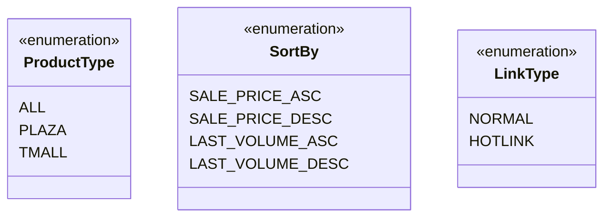

## АНАЛИЗ КОДА: `src/suppliers/aliexpress/api/models/request_parameters.py`

### 1. <алгоритм>

**Общая структура:**

Файл `request_parameters.py` определяет наборы констант, представленных в виде классов, которые используются в качестве параметров при обращении к API AliExpress. Эти константы помогают стандартизировать запросы к API, что упрощает разработку и обслуживание.

**Блок-схема:**

```mermaid
graph LR
    A[Start] --> B(ProductType Class);
    B --> C{ALL = "ALL"};
    B --> D{PLAZA = "PLAZA"};
    B --> E{TMALL = "TMALL"};
    A --> F(SortBy Class);
    F --> G{SALE_PRICE_ASC = "SALE_PRICE_ASC"};
    F --> H{SALE_PRICE_DESC = "SALE_PRICE_DESC"};
    F --> I{LAST_VOLUME_ASC = "LAST_VOLUME_ASC"};
    F --> J{LAST_VOLUME_DESC = "LAST_VOLUME_DESC"};
    A --> K(LinkType Class);
    K --> L{NORMAL = 0};
    K --> M{HOTLINK = 2};
```

**Примеры использования:**

*   **`ProductType.ALL`**: Используется при запросе товаров всех типов.
*   **`SortBy.SALE_PRICE_ASC`**: Используется для сортировки товаров по возрастанию цены.
*   **`LinkType.HOTLINK`**: Используется для запроса горячих ссылок.

### 2. <mermaid>



**Объяснение:**

Диаграмма `classDiagram` показывает три класса, каждый из которых является перечислением.

*   `ProductType`: Определяет типы продуктов, которые могут быть запрошены (все, PLAZA, TMALL).
*   `SortBy`: Определяет способы сортировки результатов запроса (цена по возрастанию/убыванию, объем продаж по возрастанию/убыванию).
*   `LinkType`: Определяет типы ссылок (обычная, горячая).

### 3. <объяснение>

**Импорты:**
   - В данном коде импорты отсутствуют, что означает, что этот модуль не зависит от других модулей в `src`. Он полностью автономный.

**Классы:**

1.  **`ProductType`**:
    *   **Роль**: Определяет константы для типов продуктов при запросе к API AliExpress.
    *   **Атрибуты**:
        *   `ALL`: Строка `'ALL'`, представляющая все типы продуктов.
        *   `PLAZA`: Строка `'PLAZA'`, представляющая продукты Plaza.
        *   `TMALL`: Строка `'TMALL'`, представляющая продукты TMall.
    *   **Взаимодействие**: Класс используется для передачи значений при формировании запросов к API AliExpress для фильтрации по типу продукта.

2.  **`SortBy`**:
    *   **Роль**: Определяет константы для способов сортировки результатов поиска при запросе к API AliExpress.
    *   **Атрибуты**:
        *   `SALE_PRICE_ASC`: Строка `'SALE_PRICE_ASC'`, представляющая сортировку по возрастанию цены.
        *   `SALE_PRICE_DESC`: Строка `'SALE_PRICE_DESC'`, представляющая сортировку по убыванию цены.
        *   `LAST_VOLUME_ASC`: Строка `'LAST_VOLUME_ASC'`, представляющая сортировку по возрастанию объема продаж.
        *   `LAST_VOLUME_DESC`: Строка `'LAST_VOLUME_DESC'`, представляющая сортировку по убыванию объема продаж.
    *   **Взаимодействие**: Класс используется для передачи значений при формировании запросов к API AliExpress для сортировки результатов поиска.

3.  **`LinkType`**:
    *   **Роль**: Определяет константы для типов ссылок, получаемых от API AliExpress.
    *   **Атрибуты**:
        *   `NORMAL`: Целое число `0`, представляющее обычную ссылку.
        *   `HOTLINK`: Целое число `2`, представляющее горячую ссылку.
    *   **Взаимодействие**: Класс используется для определения типа ссылки, получаемой в ответ на запрос к API.

**Переменные:**

*   Все переменные в классах являются константами, определенными как атрибуты класса. Они предназначены для использования в качестве значений, определяющих параметры API-запросов к AliExpress.

**Потенциальные ошибки и улучшения:**

*   **Типизация**: Хотя Python не требует строгой типизации, можно рассмотреть возможность использования `Literal` из модуля `typing` для более явного определения возможных значений переменных.
*   **Описание**: Добавление docstrings для классов и констант могло бы улучшить читаемость и документирование кода.

**Цепочка взаимосвязей:**

Этот модуль является частью `src.suppliers.aliexpress.api.models` и предназначен для использования другими частями API, такими как запросы и обработка результатов. Например, при формировании URL запроса к AliExpress API, эти константы будут использоваться для задания параметров запроса.