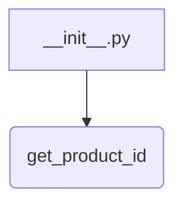
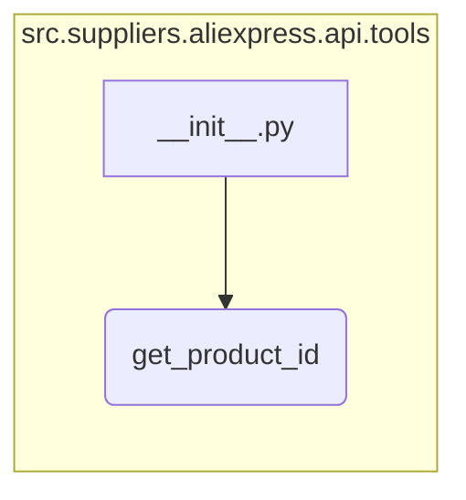

1. **<input code>**:

```python
## \file hypotez/src/suppliers/aliexpress/api/tools/__init__.py
# -*- coding: utf-8 -*-
#! venv/Scripts/python.exe # <- venv win
## ~~~~~~~~~~~~~
""" module: src.suppliers.aliexpress.api.tools """
from .get_product_id import get_product_id
```

2. **<algorithm>**:

Этот код представляет собой инициализирующий модуль пакета `src.suppliers.aliexpress.api.tools`.  Он не содержит собственных функций или классов, а лишь импортирует функцию `get_product_id` из подмодуля `get_product_id`.  Блок-схема крайне простая и сводится к единственной операции - импорту.



Пример:  При импорте из другого файла или модуля `src.suppliers.aliexpress.api.tools`, модуль `__init__.py` будет доступен для использования.  Использование `get_product_id` будет затем зависеть от реализации этой функции.

3. **<mermaid>**:



4. **<explanation>**:

* **Импорты**: Модуль `__init__.py` — это специальный файл, который используется для инициализации пакета Python.  В данном случае он импортирует функцию `get_product_id` из подмодуля `.get_product_id`.  Это указывает, что функциональность поиска идентификаторов продукта находится в отдельном модуле `get_product_id.py` внутри пакета `src.suppliers.aliexpress.api.tools`.   Обратите внимание, что `get_product_id` неявно предполагается, что она находится в этом же подпакете, указывая на модульную структуру пакета.

* **Классы**:  В данном модуле нет определений классов.

* **Функции**:  Этот файл импортирует функцию `get_product_id`, но не определяет ее.  Функциональность `get_product_id` неизвестна без анализа `get_product_id.py`.

* **Переменные**:  Нет объявленных переменных.

* **Возможные ошибки или улучшения**:  Код очень минималистичен и корректен.  Единственное потенциальное улучшение — добавить документацию (docstrings) к функции `get_product_id` в файле `get_product_id.py`, чтобы разъяснить ее поведение, аргументы, и возвращаемые значения.

* **Цепочка взаимосвязей с другими частями проекта**:  Этот файл является частью модуля `src.suppliers.aliexpress.api.tools`.  Функция `get_product_id` скорее всего делает запросы к API AliExpress для получения ID продукта, поэтому она будет взаимодействовать с модулями или библиотеками, которые обрабатывают API-запросы (например, с `requests`). Она, скорее всего, используется в более высоких уровнях кода проекта для работы с данными, полученными с AliExpress.