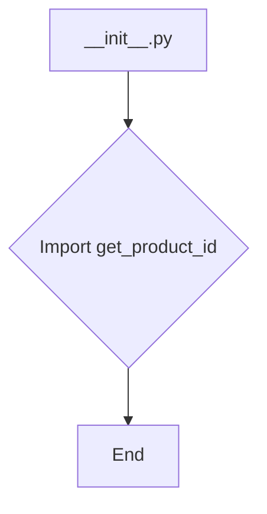
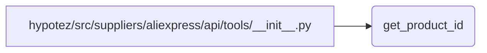

# <input code>

```python
## \file hypotez/src/suppliers/aliexpress/api/tools/__init__.py
# -*- coding: utf-8 -*-
#! venv/Scripts/python.exe # <- venv win
## ~~~~~~~~~~~~
""" module: src.suppliers.aliexpress.api.tools """
from .get_product_id import get_product_id
```

# <algorithm>

Этот файл является инициализатором модуля `tools` в пакете `aliexpress.api`.  Он импортирует функцию `get_product_id` из подпапки `get_product_id`.  Алгоритм работы сводится к импорту, без каких-либо дополнительных вычислений или операций.  Данные не перемещаются между функциями или классами в этом файле.

**Блок-схема:**



Пример:  Файл `__init__.py` просто подключает функцию `get_product_id` для использования в других частях проекта, но сам по себе не выполняет никаких действий.


# <mermaid>



В этой диаграмме показана единственная зависимость: `__init__.py` импортирует функцию `get_product_id` из модуля `get_product_id`.  `get_product_id` не представлен в этой диаграмме, но он находится в том же пакете `tools`.

# <explanation>

**Импорты:**

* `from .get_product_id import get_product_id`: Импортирует функцию `get_product_id` из файла `get_product_id.py` внутри текущей подпапки (`./get_product_id`).  Это типичная структура пакета Python, позволяющая организовать код.  Предполагается, что `get_product_id.py` содержит определение функции с таким же именем.

**Классы:**

Нет классов в данном файле.

**Функции:**

Нет функций в данном файле, только импорты.

**Переменные:**

Нет переменных в данном файле.

**Возможные ошибки и улучшения:**

* **Документация:** Добавьте более подробную документацию к файлу `__init__.py` и функции `get_product_id`, поясняя её функциональность и аргументы.
* **Ошибки импорта:** При ошибке импорта, например, если `get_product_id.py` отсутствует или имеет неправильное имя,  Python выдаст ошибку.
* **Стандартная кодировка:** Инструкция `# -*- coding: utf-8 -*-`  устанавливает кодировку файла в UTF-8. Важно для корректной работы с символами не-ASCII.
* **Пояснение venv:** Строка `#! venv/Scripts/python.exe # <- venv win` указывает на исполняемый файл Python, установленный в среде виртуального окружения `venv`.  Это важно для запуска скриптов Python в данной среде.  Важно, что это не Python код и обрабатывается интерпретатором командной строки.


**Взаимосвязи с другими частями проекта:**

Этот файл является частью пакета `aliexpress.api.tools`.  Его задача — сделать доступной функцию `get_product_id` для других компонентов, которые могут находиться в других частях проекта.  Например, в файлах `aliexpress/api/products/` или `aliexpress/api/parsers/` могут быть функции, которые используют `get_product_id`.  Без кода этих других компонентов невозможно проследить все взаимосвязи.  Можно предположить, что функция `get_product_id` отвечает за получение идентификаторов продуктов с сайта AliExpress через API, и ее результат будет использоваться для дальнейшей обработки.