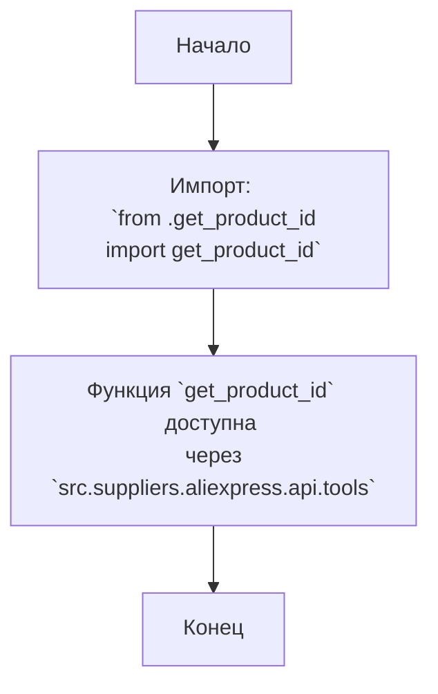

## АНАЛИЗ КОДА: `hypotez/src/suppliers/aliexpress/api/tools/__init__.py`

### <алгоритм>

1. **Импорт модуля `get_product_id`**:
   -  Начало: Файл `__init__.py` обрабатывается интерпретатором Python.
   -  Импорт: Происходит импорт функции `get_product_id` из модуля `get_product_id.py`, находящегося в той же директории (`.`).
   -  Конец: Функция `get_product_id` становится доступной для использования через пакет `src.suppliers.aliexpress.api.tools`.

   Пример:
   ```python
   from src.suppliers.aliexpress.api.tools import get_product_id
   product_url = "https://aliexpress.ru/item/123456789.html"
   product_id = get_product_id(product_url)
   print(product_id) # Output: 123456789 (в случае если id успешно извлечен)
   ```

### <mermaid>



### <объяснение>

**Импорты:**

-   `from .get_product_id import get_product_id`:  
    -   `from .get_product_id`: Импортирует модуль `get_product_id` из текущей директории (обозначено точкой `.`). Это предполагает наличие файла `get_product_id.py` в той же папке, что и файл `__init__.py`.
    -   `import get_product_id`:  Импортирует конкретную функцию `get_product_id` из модуля `get_product_id.py`. Благодаря этому импорту, функция `get_product_id` становится доступной для использования через пакет `src.suppliers.aliexpress.api.tools`.

**Файлы:**

- `__init__.py`:  Этот файл делает директорию `tools` пакетом Python. В данном случае он используется для импорта и экспорта функции `get_product_id`.

**Функции:**
- `get_product_id`: Функция, которая предположительно извлекает ID продукта из URL-адреса AliExpress. Точная реализация этой функции находится в файле `get_product_id.py`, который не был предоставлен.

**Переменные:**
- В данном коде нет явных переменных, но при использовании импортированной функции `get_product_id` будут использоваться переменные для хранения URL и ID продукта.

**Объяснение:**

Файл `__init__.py` служит точкой входа для пакета `src.suppliers.aliexpress.api.tools`. Благодаря ему,  функция `get_product_id` из модуля `get_product_id.py` становится доступной для использования через `import src.suppliers.aliexpress.api.tools`.

**Потенциальные ошибки и области для улучшения:**

-   **Обработка ошибок**:  Код не содержит обработки ошибок. Например, если `get_product_id.py` содержит код для обработки URL-адресов, которые не являются URL-адресами AliExpress, нужно добавить соответствующую проверку и обработку.
-   **Документирование:**  Отсутствует документация для функции `get_product_id` в файле `__init__.py`, что затрудняет понимание ее работы.
-   **Тестирование**:  Необходимы тесты для проверки корректности работы функции `get_product_id`.
-   **Зависимости:**  Для более полного анализа нужно предоставить содержимое `get_product_id.py`.

**Взаимосвязи с другими частями проекта:**

-   Этот модуль предназначен для предоставления инструментов API для работы с AliExpress, поэтому он может использоваться в других частях проекта, где требуется извлечение ID продуктов, например, для сбора информации о товарах, управления ценами и т.д.
-   Зависит от `src` как от базового проекта.