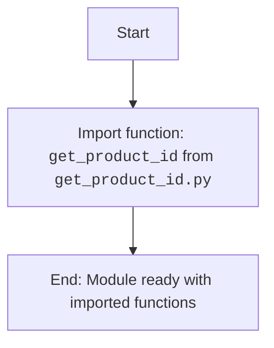

## Анализ кода `hypotez/src/suppliers/aliexpress/api/tools/__init__.py`

### 1. <алгоритм>

1.  **Импорт `get_product_id`**: Из модуля `get_product_id.py` в текущей директории импортируется функция `get_product_id`.
    *   Пример: `from .get_product_id import get_product_id`
    *   Поток данных: Функция `get_product_id`  будет доступна для использования в других модулях, которые импортируют `src.suppliers.aliexpress.api.tools`.

2.  **Конец файла**: Файл завершается, предоставляя функцию `get_product_id` для использования в других частях проекта.

### 2. <mermaid>

**Объяснение зависимостей `mermaid`:**

-   `Start`: Начало выполнения модуля.
-   `ImportGetProductId`: Импорт функции `get_product_id` из модуля `get_product_id.py`, расположенного в той же директории. Это основная операция, выполняемая в данном файле. Импорт делает функцию `get_product_id` доступной для использования в других частях проекта, которые импортируют данный `__init__.py`.
-   `End`: Конец обработки модуля. Теперь модуль готов и предоставляет доступ к импортированной функции.

### 3. <объяснение>

**Импорты:**

-   `from .get_product_id import get_product_id`: Этот импорт делает функцию `get_product_id` доступной для использования в модулях, которые импортируют `src.suppliers.aliexpress.api.tools`. Точка (`.`) в начале пути импорта означает, что модуль `get_product_id` находится в той же директории, что и `__init__.py`.

**Функции:**

-   `get_product_id`: Функция, импортированная из `get_product_id.py`.  Предположительно, её задача - извлекать ID продукта из какой-либо строки или объекта (например, URL).

**Общее объяснение:**

Файл `__init__.py` в пакете `src.suppliers.aliexpress.api.tools` используется для того, чтобы сделать модуль `tools` пакетом.  В данном случае, он импортирует функцию `get_product_id` и делает ее доступной для других модулей, которые импортируют пакет `tools`. Это позволяет централизовать доступ к утилитам, связанным с API Aliexpress. Файл `__init__.py` не содержит собственного кода, а только занимается перенаправлением импорта.

**Потенциальные ошибки и области для улучшения:**

-   На данный момент в файле только один импорт. В будущем может понадобиться добавление других утилит и их импорт в данном файле, чтобы они стали доступны через `src.suppliers.aliexpress.api.tools`.
-   Недостаточно информации о функциональности `get_product_id`, так как код самой функции не предоставлен. Без знания реализации `get_product_id` нельзя оценить потенциальные ошибки в её работе.

**Цепочка взаимосвязей с другими частями проекта:**

-   Другие модули, например, в `src.suppliers.aliexpress.api`, могут импортировать `src.suppliers.aliexpress.api.tools` и использовать функцию `get_product_id`. Это позволяет вынести общие утилиты в отдельный модуль и использовать их в других частях проекта.
-  `src.suppliers.aliexpress.api.tools` является частью более крупной структуры `src`, где есть и другие поставщики и их API (как например `src.suppliers.ozon`).