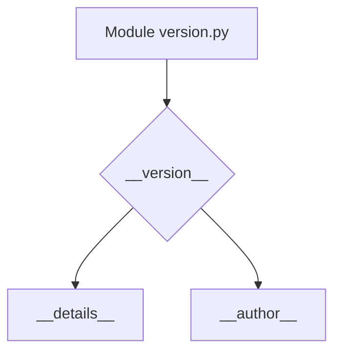

# <input code>

```python
## \file hypotez/src/suppliers/aliexpress/api/version.py
# -*- coding: utf-8 -*-\
#! venv/Scripts/python.exe # <- venv win
## ~~~~~~~~~~~~~\
""" module: src.suppliers.aliexpress.api """

"""
- `__version__`: This variable holds the version of the module or package.
- `__name__`: Contains the name of the module. If the script is being run directly, the value will be `"__main__"`.
- `__doc__`: The module's documentation string.
- `__details__`: This variable likely contains additional details about the module, but the exact purpose depends on the specific module or package.
- `__annotations__`: Contains type annotations for variables and functions in the module.
- `__author__`: The name(s) of the author(s) of the module.
"""
__name__:str
__version__="3.12.0.0.0.4"
__doc__:str
__details__:str="Details about version for module or class"
__annotations__

__author__='hypotez '
```

# <algorithm>

Этот код представляет собой модуль Python, скорее всего, для определения версии API.  Алгоритм прост: он определяет несколько констант, содержащих информацию о модуле.  Блок-схема в данном случае не нужна, поскольку нет управляющих циклов и сложных операций.

```
Start
  Define __version__ = "3.12.0.0.0.4"
  Define __details__ = "Details about version for module or class"
  Define __author__ = "hypotez "
End
```


# <mermaid>




# <explanation>

**Импорты:**  Нет импортов. Этот код представляет собой непосредственно сам модуль, содержащий информацию о нём.

**Классы:**  Нет классов. Код состоит из констант (переменных), которые хранят информацию о модуле: имя, версия, описание.

**Функции:**  Нет функций.

**Переменные:**
- `__version__`: Строковая переменная, содержащая версию модуля.  Этот атрибут чрезвычайно важен для организации проектов и управления версиями.  В данном контексте она хранит специфичную информацию для модуля AliExpress API.
- `__details__`: Строковая переменная, содержащая дополнительные сведения о модуле. Это может быть описание, комментарии, или метки для управления версией.  Важно, чтобы это соответствовало контексту всего проекта.
- `__author__`: Строковая переменная, содержащая имя или имена автора модуля. Стандартная практика для проектов.
- `__name__`, `__doc__`, `__annotations__`:  Переменные, которые, скорее всего, будут заполнены значениями в процессе работы и  используются для meta-данных (имя, документация, annotations).

**Возможные ошибки или области для улучшений:**
- Отсутствие проверки типов.  Хотя и указаны типы данных в комментариях, нет явных проверок (например, `assert isinstance(__version__, str)`).
- Возможность использования специальных методов Python для определения информации о модуле.  Например, можно использовать  `__file__` и `__package__`.  
- Необходимость хранения `__name__` (имя модуля).


**Взаимосвязи с другими частями проекта:** Этот файл определяет информацию о модуле  `aliexpress.api`.  Он, скорее всего, используется другими частями приложения для получения версии модуля, имени автора, или других описательных метаданных. Например, при создании API-documentation, в тестовых случаях, или в процессе работы с модулем внутри самого приложения.

```