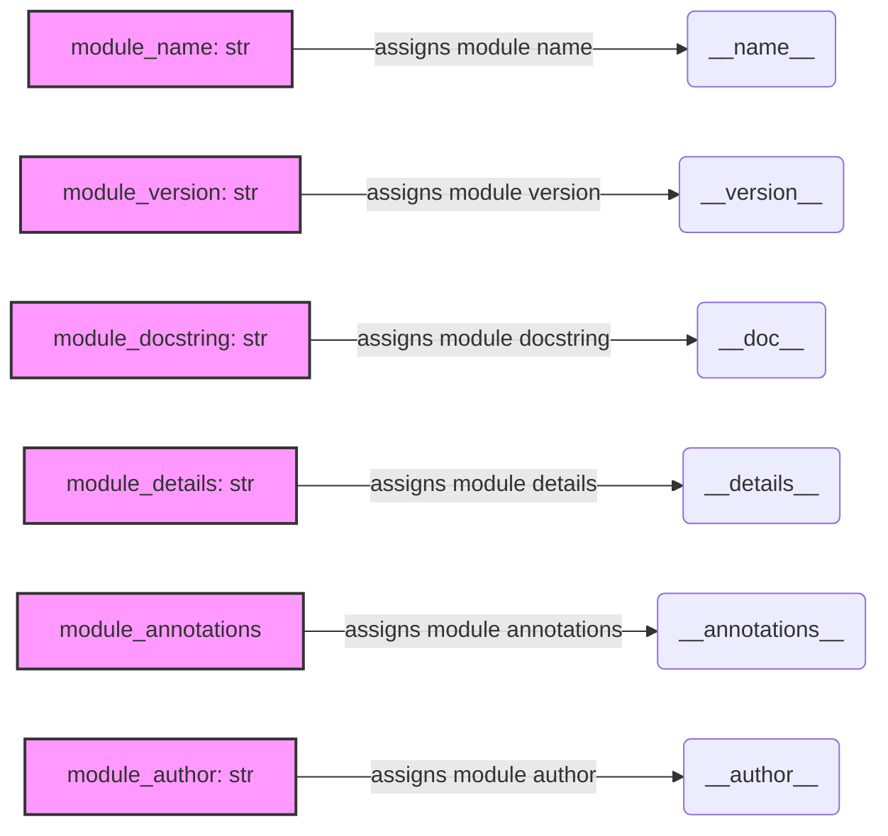

## Анализ кода `hypotez/src/suppliers/aliexpress/api/version.py`

### <алгоритм>

1.  **Инициализация переменных модуля**:
    *   Присваивание значения строке `__name__`.
        *   Пример: `__name__` будет равно `"__main__"` если файл запущен напрямую.
    *   Присваивание строки версии `__version__`.
        *   Пример: `__version__` = "3.12.0.0.0.4"
    *   Присваивание строки `__doc__`, которая будет пустой, если нет докстринга.
        *   Пример: `__doc__` =  ""(так как докстринг явно не присвоен)
    *   Присваивание строки с деталями `__details__`.
        *   Пример: `__details__` = "Details about version for module or class"
    *   Присваивание пустых аннотаций `__annotations__`, если не указаны аннотации
        *   Пример: `__annotations__` = None
    *   Присваивание имени автора `__author__`.
        *   Пример: `__author__` = 'hypotez'

### <mermaid>



**Объяснение диаграммы:**

*   `A[module_name: str]`: Представляет переменную `module_name` типа `str`
*   `B(__name__)`: Представляет переменную `__name__`.
*   `C[module_version: str]`: Представляет переменную `module_version` типа `str`
*   `D(__version__)`: Представляет переменную `__version__`.
*  `E[module_docstring: str]`: Представляет переменную `module_docstring` типа `str`
*   `F(__doc__)`: Представляет переменную `__doc__`.
*   `G[module_details: str]`: Представляет переменную `module_details` типа `str`.
*   `H(__details__)`: Представляет переменную `__details__`.
*   `I[module_annotations]`: Представляет переменную `module_annotations`.
*   `J(__annotations__)`: Представляет переменную `__annotations__`.
*   `K[module_author: str]`: Представляет переменную `module_author` типа `str`.
*   `L(__author__)`: Представляет переменную `__author__`.
*   Стрелки обозначают присваивание значения переменной соответствующему атрибуту модуля.
*   `classDef variable` задаёт стиль отображения переменных

### <объяснение>

**Импорты**:

*   В данном файле нет импортов. Это означает, что он не зависит от других модулей в проекте и является самодостаточным в контексте своей функциональности.

**Классы**:

*   В этом файле нет определения классов. Он предназначен для хранения метаданных о модуле (версия, автор и т.д.).

**Функции**:

*   В этом файле нет определения функций. Он предназначен для хранения метаданных о модуле (версия, автор и т.д.).

**Переменные**:

*   `__name__`: Строка, содержащая имя модуля. В данном случае будет равно "__main__", если файл запущен напрямую.
*   `__version__`: Строка, представляющая версию модуля. Значение "3.12.0.0.0.4".
*   `__doc__`: Строка, содержащая документацию модуля. В данном случае, она не определена, то есть пустая.
*   `__details__`: Строка с дополнительной информацией о модуле, в данном случае "Details about version for module or class".
*   `__annotations__`: Словарь для аннотаций типов. В данном коде не определено явно.
*   `__author__`: Строка, представляющая автора модуля, "hypotez".

**Цепочка взаимосвязей с другими частями проекта**:

*   Данный файл, вероятно, используется в других частях проекта для получения информации о версии API AliExpress.
*   Он может быть импортирован, чтобы получить доступ к переменной `__version__` для логирования, проверок обновлений или отображения версии в интерфейсе.
*   Другие модули, вероятно, используют `__name__` чтобы понять, откуда был импортирован модуль, `__doc__` для получения документации.

**Потенциальные ошибки и области для улучшения**:

1.  **Отсутствие `__doc__`**: Модуль должен иметь докстринг, описывающий его назначение. Рекомендуется добавить `__doc__`, например:
    ```python
    __doc__ = """This module stores metadata about the AliExpress API version."""
    ```
2.  **Неопределенное `__annotations__`**:  Если в коде используются аннотации, то `__annotations__` должно быть заполнено, но по умолчанию это не так. Если аннотации есть в других частях кода, то следует добавить аннотацию типов тут.
3.  **Неоднозначное значение `__version__`**: Значение `__version__` "3.12.0.0.0.4" выглядит не как стандартная семантическая версия. Рекомендуется использовать более понятную и структурированную схему версионирования (например, x.y.z).
4. **Неиспользуемый shebang**: строка `#! venv/Scripts/python.exe # <- venv win` указывает на использование python.exe из виртуального окружения, но этот файл не является исполняемым скриптом, и эта строка бесполезна, поэтому ее можно удалить.