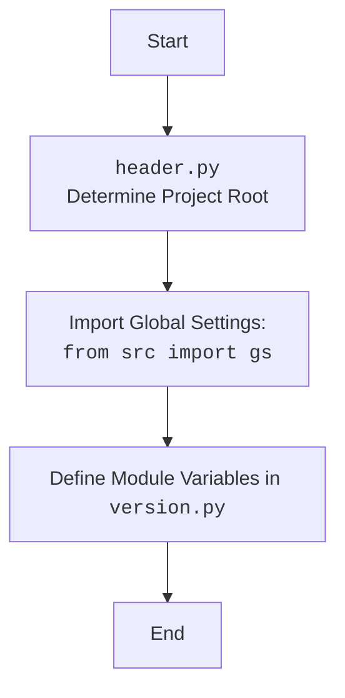

## Анализ кода `hypotez/src/suppliers/aliexpress/api/version.py`

### 1. <алгоритм>

1.  **Начало:** Запуск интерпретатора Python.
2.  **Объявление \_\_name\_\_**:
    *   `__name__` - это строка, определяющая имя модуля. В данном случае, она должна хранить имя модуля, но тип объявлен, а значение не присвоено.
    *   Пример: Если бы файл запускался напрямую, `__name__` было бы равно `"__main__"`.
3.  **Объявление \_\_version\_\_**:
    *   `__version__` - это строка, хранящая версию модуля, например, "3.12.0.0.0.4".
    *   Пример: Значение `__version__` инициализируется строкой "3.12.0.0.0.4".
4.  **Объявление \_\_doc\_\_**:
    *   `__doc__` - это строка, хранящая документацию к модулю. Значение не присвоено.
    *   Пример: Должна содержать описание модуля, но значение не присвоено.
5.  **Объявление \_\_details\_\_**:
    *   `__details__` - это строка, хранящая дополнительные детали о модуле.
    *   Пример: Инициализируется строкой "Details about version for module or class".
6.  **Объявление \_\_annotations\_\_**:
    *   `__annotations__` - это словарь, хранящий аннотации типов для переменных и функций. Значение не присвоено, но тип объявлен.
    *   Пример: Должна содержать аннотации типов, но значение не присвоено.
7.  **Объявление \_\_author\_\_**:
    *   `__author__` - это строка, хранящая имя автора модуля.
    *   Пример: Инициализируется строкой 'hypotez '.
8.  **Конец:** Выполнение модуля завершается.

### 2. <mermaid>

```mermaid
flowchart TD
    Start[Start] --> ModuleVars[Define Module Variables]
    ModuleVars --> DefineName[Define __name__:str]
    DefineName --> DefineVersion[Define __version__="3.12.0.0.0.4"]
    DefineVersion --> DefineDoc[Define __doc__:str]
    DefineDoc --> DefineDetails[Define __details__:str="Details about version for module or class"]
    DefineDetails --> DefineAnnotations[Define __annotations__]
    DefineAnnotations --> DefineAuthor[Define __author__='hypotez ']
    DefineAuthor --> End[End]
```

**Объяснение зависимостей:**

В данном коде нет явных зависимостей от других модулей.  Это файл, который содержит метаданные о текущем модуле `version.py`, такие как версия, автор и прочее. Эти метаданные могут использоваться другими частями проекта для получения информации о текущей версии, для документации и отслеживания авторства.

### 3. <объяснение>

**Импорты:**

В данном коде нет импортов, что означает, что этот модуль не зависит от других частей проекта с точки зрения импорта. Он просто объявляет ряд переменных, описывающих сам модуль.

**Классы:**

В данном коде нет классов. Это просто модуль, который содержит переменные и метаданные о модуле.

**Функции:**

В данном коде нет функций.

**Переменные:**

-   `__name__`:
    -   Тип: `str` (строка).
    -   Назначение:  Представляет имя модуля. При запуске скрипта напрямую `__name__` будет равно `__main__`.
    -   Использование:  Используется Python для идентификации текущего модуля.
-   `__version__`:
    -   Тип: `str` (строка).
    -   Назначение: Хранит версию модуля.
    -   Использование:  Используется для отслеживания версий модуля и может использоваться другими модулями для проверки совместимости.
-   `__doc__`:
    -   Тип: `str` (строка).
    -   Назначение: Предназначена для хранения документации модуля (docstring).
    -   Использование:  Обычно используется для документирования кода, но в данном случае значение не присвоено.
-   `__details__`:
    -   Тип: `str` (строка).
    -   Назначение: Хранит дополнительные детали о версии модуля.
    -   Использование:  Предоставляет дополнительную информацию о модуле.
-   `__annotations__`:
    -   Тип: Не указан, но ожидается словарь.
    -   Назначение: Хранит аннотации типов для переменных и функций модуля.
    -   Использование:  Предназначена для предоставления подсказок о типах, но значение не присвоено.
-   `__author__`:
    -   Тип: `str` (строка).
    -   Назначение: Хранит имя автора модуля.
    -   Использование:  Обеспечивает информацию об авторстве кода.

**Потенциальные ошибки и области для улучшения:**

1.  **Отсутствие значений для `__doc__` и `__annotations__`**: `__doc__` должна содержать документацию к модулю. `__annotations__` ожидается словарь, но он не инициализирован.  Было бы полезно добавить описание модуля в `__doc__` и аннотации типов.
2.  **Тип `__name__` задан, но значение не присвоено:**  Хотя тип `__name__` объявлен, Python сам устанавливает это значение при запуске модуля.
3.  **Оформление**:  Код можно улучшить, добавив docstring с кратким описанием модуля.

**Цепочка взаимосвязей:**

Этот модуль является частью API для AliExpress и предоставляет информацию о версии. Другие модули в `src.suppliers.aliexpress.api` могут использовать эту информацию для проверки совместимости или для других целей. Например, модуль `src.suppliers.aliexpress.api.client` может использовать `__version__` для определения совместимости с конкретной версией API AliExpress.

**Дополнение:**

Хотя в этом коде нет импорта `header`,  данный модуль является частью проекта, и зависимости можно представить  в виде общей схемы.

