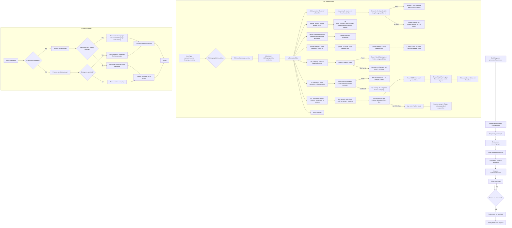

## Анализ кода `README.MD`

### <алгоритм>

**1. Создание рекламной кампании для Facebook:**

*   **Начало**: Запуск процесса создания рекламной кампании.
    *   _Пример_: Пользователь инициирует создание новой кампании через интерфейс.
*   **Инициализация параметров**: Установка имени кампании, языка и валюты.
    *   _Пример_: `Campaign Name: "Summer Sale", Language: "English", Currency: "USD"`
*   **Создание директорий**: Формирование структуры папок для хранения файлов кампании.
    *   _Пример_: Создается папка `/campaigns/summer_sale/` с подпапками для категорий.
*   **Сохранение конфигурации**: Сохранение основных параметров кампании.
    *   _Пример_: Параметры "Summer Sale", "English", "USD" записываются в `config.json`.
*   **Сбор данных о продуктах**: Получение данных о товарах, которые будут продвигаться.
    *   _Пример_: Получение данных о товарах с `id 123, 456, 789` из базы данных.
*   **Сохранение данных о продуктах**: Запись полученных данных.
    *   _Пример_: Данные о товарах записываются в `products.json` в папке кампании.
*   **Создание промоматериалов**: Создание баннеров, изображений и текстов для рекламы.
    *   _Пример_: Генерация баннера `banner.png` и рекламного текста "Лучшие летние скидки!".
*   **Обзор кампании**: Проверка всех элементов кампании перед публикацией.
    *   _Пример_: Человек проверяет корректность текста и изображения.
*   **Готовность к публикации**: Проверка, все ли готово к публикации.
    *   _Пример_: Переменная `is_ready = True` после успешного обзора.
*   **Публикация кампании**: Запуск кампании на Facebook.
    *   _Пример_: Вызов API Facebook для публикации кампании.
*   **Конец**: Завершение процесса.
    *   _Пример_: Сообщение "Кампания успешно запущена!".

**2. Редактирование кампании:**

*   **Инициализация `AliCampaignEditor`**: Создание объекта редактора кампании, принимающего данные кампании.
    *   _Пример_: `editor = AliCampaignEditor(campaign_name='summer_sale', language='en', currency='usd')`
*   **Удаление продукта**: Поиск и удаление продукта из кампании по ID.
    *   _Пример_: Вызов `editor.delete_product('123')` для удаления товара с ID '123'.
*   **Обновление продукта**: Изменение деталей продукта.
    *   _Пример_: `editor.update_product('123', {'price': '25'})` изменит цену товара `123`.
*   **Обновление кампании**: Изменение параметров кампании, таких как описание.
    *   _Пример_: `editor.update_campaign(description="New updated description")`
*   **Обновление категории**: Изменение категории, например, добавление нового товара.
    *   _Пример_: `editor.update_category('summer_wear', {"products": [1,2,3]})`
*   **Получение категории**: Получение данных о категории по имени.
    *   _Пример_: `category = editor.get_category('summer_wear')` вернет SimpleNamespace с данными.
*   **Список категорий**: Получение списка всех категорий в кампании.
    *   _Пример_: `categories = editor.list_categories()` вернет список имен категорий.
*   **Получение продуктов категории**: Получение списка продуктов конкретной категории.
    *   _Пример_: `products = editor.get_category_products('summer_wear')` вернет список объектов продуктов.

**3. Подготовка кампании:**

*   **Старт**: Начало процесса подготовки.
    *   _Пример_: Пользователь вызывает скрипт подготовки.
*   **Обработка всех кампаний**: Проверка, нужно ли обрабатывать все кампании.
    *   _Пример_: Запуск обработки для всех кампаний если опция `--all` установлена.
*   **Обработка конкретной кампании**: Выбор обработки конкретной кампании.
    *   _Пример_: Пользователь указал имя конкретной кампании.
*  **Указаны ли язык и валюта?** Проверка, переданы ли язык и валюта при обработке всех компаний.
    * _Пример_:  Язык и валюта установлены, если аргументы `--language` и `--currency` указаны
*   **Обработка всех локалей**: Обработка всех языков и валют для кампании.
    *   _Пример_: Если не указаны, то обрабатываются все доступные локали.
*   **Указаны ли категории**: Проверка, переданы ли конкретные категории.
    *   _Пример_: Пользователь передал список имен категорий.
*  **Обработка конкретных категорий**: Обработка только указанных категорий.
    *   _Пример_: Обрабатываются только категории 'men' и 'women'
*   **Обработка кампании полностью**: Обработка всей кампании (всех категорий).
    *   _Пример_:  Все категории кампании обрабатываются.
*  **Подготовка категории кампании**: Подготовка отдельной категории кампании.
    *   _Пример_:  Запускается процесс формирования данных для категории 'men'.
*   **Возврат**: Завершение процесса.
    *   _Пример_: Сообщение об окончании подготовки кампании.

### <mermaid>

### <объяснение>

**1.  Общая структура модуля `campaign`:**

*   Модуль `campaign` предназначен для управления рекламными кампаниями на Facebook. Он включает в себя функционал для создания, редактирования и подготовки кампаний.
*   **Импорты**: (не указаны в предоставленном коде, но обычно включают в себя импорты для работы с файловой системой (`os`, `shutil`), JSON (`json`), логированием (`logging`), а также внутренние модули `src` проекта).
*   Модуль обеспечивает организацию кампании, сбор данных, создание рекламных материалов и публикацию на Facebook.
*  Модуль `campaign` взаимодействует с другими частями проекта:
    - Зависит от `src.suppliers.aliexpress.campaign.ali_promo_campaign`, которая отвечает за создание и управление данными рекламной компании.
    - Зависит от настроек проекта `src.gs`, для доступа к глобальным переменным.
    - Зависит от `src.utils.files`, которая предоставляет функции для работы с файловой системой.

**2.  Создание кампании:**

*   **Процесс создания:**
    *   Начинается с определения основных параметров: имя, язык, валюта.
    *   Создаются необходимые папки для хранения файлов.
    *   Конфигурация кампании сохраняется.
    *   Собираются данные о продуктах из системы.
    *   Данные о продуктах сохраняются.
    *   Создаются рекламные материалы (тексты, изображения).
    *   Кампания проверяется на корректность.
    *   Кампания публикуется на Facebook.
*   **Функции и классы:** (явные функции и классы не представлены, но подразумеваются)
    *   `initialize_campaign(name, language, currency)`: Функция, которая принимает имя, язык и валюту кампании и выполняет первичную настройку.
    *   `create_directories(campaign_path)`: Функция для создания папок для кампании.
    *   `save_configuration(campaign_data)`: Функция для сохранения конфигурации кампании.
    *   `collect_product_data()`: Функция для сбора данных о продуктах.
    *   `save_product_data(product_data)`: Функция для сохранения данных о продуктах.
    *   `create_promotional_materials()`: Функция для создания рекламных материалов.
    *   `review_campaign()`: Функция для проверки кампании.
    *   `publish_campaign()`: Функция для публикации кампании.

**3.  Редактирование кампании (`AliCampaignEditor`):**

*   **`AliCampaignEditor`**: Класс, позволяющий редактировать рекламную кампанию.
    *   **`__init__`**:  Конструктор класса, инициализирует редактор кампании, принимая имя кампании, язык и валюту.
    *   **`delete_product(product_id)`**: Метод, который удаляет продукт из кампании, проверяя наличие аффилированной ссылки.
         - считывает список продуктов из `sources.txt`, итеративно сравнивает с `product_id` и удаляет если найдено.
    *  **`update_product(product_id, product_data)`**: Метод, который обновляет данные продукта в кампании.
         - Вызывает метод `dump_category_products_files` для сохранения изменений.
    *   **`update_campaign(campaign_data)`**: Метод, который обновляет параметры кампании.
        - обновляет такие параметры как описание кампании.
    *   **`update_category(category_name, category_data)`**: Метод, который обновляет данные о категории в JSON файле.
        - читает данные категории из JSON файла, обновляет, и сохраняет.
    *   **`get_category(category_name)`**: Метод, возвращающий данные категории в виде `SimpleNamespace` по имени.
         - Проверяет наличие категории и возвращает данные или логирует ошибку, если не найдена.
    *   **`list_categories()`**: Метод, возвращающий список всех категорий кампании.
       -  проверяет наличие категорий, возвращает список или логирует ошибку.
    *  **`get_category_products(category_name)`**: Метод, который возвращает список продуктов для указанной категории.
         - Собирает JSON файлы, парсит их и создает список объектов продуктов.
         - Если файлов нет, логирует ошибку и запускает процесс подготовки данных для категории.
    *   **Другие методы**: Предполагается наличие других методов для управления кампанией.

**4. Подготовка кампании:**

*   **Процесс подготовки**:
    *   Проверяется необходимость обработки всех кампаний или конкретной кампании.
    *   Если необходимо обрабатывать все кампании, проверяется указание языка и валюты.
    *   Обрабатываются либо все локали для каждой кампании, либо только указанные.
    *   Для каждой кампании проверяется, были ли указаны конкретные категории.
    *   Обрабатываются либо указанные категории, либо вся кампания целиком.
*   **Функции:** (явные функции не представлены, но подразумеваются)
    *   `process_all_campaigns()`: Функция для обработки всех кампаний.
    *   `process_specific_campaign(campaign_name)`: Функция для обработки конкретной кампании.
    *   `process_campaign_categories(campaign_name, categories)`: Функция для обработки конкретных категорий в кампании.
    *   `process_campaign_all_locales(campaign_name)`: Функция для обработки всех локалей кампании.

**5. Замечания и потенциальные улучшения:**

*   **Отсутствуют явные импорты**: В предоставленном тексте не указаны импорты, но они критически важны для работоспособности кода.
*   **Недостаток деталей:** Не указаны конкретные типы данных переменных и возвращаемых значений.
*   **Общая архитектура:** Модуль предоставляет концептуальное описание, но реальная реализация потребует более детального проектирования классов и функций.
*   **Обработка ошибок:** Необходимо добавить обработку ошибок для каждого этапа, чтобы обеспечить устойчивость кода.
*   **Логирование:** Добавить логирование для отслеживания прогресса и ошибок.
*   **Тестирование:** Необходимо предусмотреть модульные тесты для каждого компонента системы.

**Взаимосвязи с другими частями проекта:**

*   **`src.suppliers.aliexpress.campaign.ali_promo_campaign`**: Используется для создания экземпляров кампании.
*   **`src.gs`**: Глобальные настройки проекта.
*   **`src.utils.files`**: Функции для работы с файловой системой.

Этот анализ предоставляет структурированное понимание модуля `campaign`, его функций, классов, и взаимодействия с другими частями проекта.