# Анализ кода модуля `campaign`

## <алгоритм>

### Создание рекламной кампании в Facebook

1.  **Начало**: Запускается процесс создания рекламной кампании для Facebook.
    *   *Пример*: Начало работы скрипта `create_campaign.py`.

2.  **Инициализация параметров кампании**: Определяются название, язык и валюта кампании.
    *   *Пример*: Название кампании - "Летняя распродажа", язык - "Русский", валюта - "RUB".

3.  **Создание директорий**: Создаются необходимые директории для хранения файлов кампании (например, папка для каждой категории продуктов).
    *   *Пример*: Создается папка `campaigns/summer_sale/electronics`, `campaigns/summer_sale/clothes` и т.д.

4.  **Сохранение конфигурации**: Параметры кампании сохраняются в файл конфигурации или базу данных.
    *   *Пример*: Конфигурация "Летняя распродажа" сохраняется в `config.json` в формате JSON.

5.  **Сбор данных о продуктах**: Собираются данные о продуктах, которые будут рекламироваться (например, ID, описания, изображения, цены).
    *   *Пример*: Из API Aliexpress или HTML-страниц собираются данные о товарах из категории "Электроника".

6.  **Сохранение данных о продуктах**: Собранные данные сохраняются в базу данных или JSON-файлы.
    *   *Пример*: Данные о продуктах записываются в `campaigns/summer_sale/electronics/products.json`.

7.  **Создание рекламных материалов**: Создаются рекламные материалы (баннеры, изображения, описания).
    *   *Пример*: Создаются изображения и текст для объявления "Купите электронику со скидкой".

8.  **Проверка кампании**: Проводится проверка готовности кампании.
    *   *Пример*: Человек или система проверяет, все ли материалы в порядке, все ли данные собраны.

9.  **Проверка готовности**: Проверяется, готова ли кампания к публикации. Если нет, возвращаемся к шагу 8.
    *   *Пример*: Если есть незаполненные данные, процесс возвращается на шаг сбора данных.

10. **Публикация**: Кампания публикуется на Facebook.
    *   *Пример*: Используется Facebook API для публикации созданных объявлений.

11. **Завершение**: Процесс создания рекламной кампании завершен.
    *   *Пример*: Скрипт завершает свою работу.

### Редактирование рекламной кампании

1.  **Ввод данных пользователя**: Пользователь вводит параметры для редактирования кампании: название, язык, валюта.
    *   *Пример*: Пользователь хочет обновить название кампании и язык: `campaign_name="Autumn Sale", language="en", currency="USD"`.

2.  **Инициализация AliCampaignEditor**: Создаётся экземпляр класса `AliCampaignEditor`, который управляет редактированием кампании.
    *   *Пример*: `editor = AliCampaignEditor(campaign_name="Autumn Sale", language="en", currency="USD")`.

3.  **Инициализация AliPromoCampaign**: Создаётся экземпляр класса `AliPromoCampaign`, который представляет собой кампанию.
    *   *Пример*: `promo_campaign = AliPromoCampaign(...)`.

4.  **Удаление продукта**: Вызывается метод `delete_product`, для удаления продукта из кампании, проверяется наличие аффилиатной ссылки.
    *   *Пример*: `editor.delete_product(product_id='12345')`.

    *   **Чтение списка продуктов**: Читается список продуктов из файла `sources.txt`.
    *   *Пример*: Файл `sources.txt` содержит список `12345, 67890, 13579`.

    *   **Итерация и проверка**: Происходит итерация по списку продуктов и проверка на совпадение с `product_id`.
    *   *Пример*: Проверяется, есть ли в списке `product_id='12345'`.

        *   **Совпадение**: Если `product_id` найден, продукт удаляется из списка, а список сохраняется.
        *   *Пример*: `product_id='12345'` удаляется из `sources.txt`.
        *   **Нет совпадения**: Если `product_id` не найден, файл с информацией о продукте переименовывается.
        *   *Пример*: Файл `products/12345.json` переименовывается в `products/12345.json.bak`.

5.  **Обновление продукта**: Вызывается метод `update_product`, для обновления информации о продукте.
    *   *Пример*: `editor.update_product(product_id='12345', new_data={'title': 'New Title'})`.

    *   **Обновление файлов**: Вызывается метод `dump_category_products_files`, который обновляет категорию с новым продуктом.
    *   *Пример*: JSON файл продукта обновляется с новым title.

6.  **Обновление кампании**: Вызывается метод `update_campaign`, для обновления основных параметров кампании, например, описание.
    *   *Пример*: `editor.update_campaign(description='New description')`.

    *   **Обновление параметров**: Обновляются параметры кампании.
    *   *Пример*: В JSON файле кампании обновляется `description`.

7.  **Обновление категории**: Вызывается метод `update_category`, для обновления данных категории в JSON-файле.
    *   *Пример*: `editor.update_category(category_name='Electronics', new_data={'title': 'Electronics Updated'})`.

    *   **Чтение JSON файла**: Читается JSON файл с данными о категории.
    *   *Пример*: Из `campaign/categories/electronics.json` читается информация.

    *   **Обновление данных**: Обновляются данные о категории.
    *   *Пример*: В JSON файле `categories/electronics.json` обновляется title.

    *   **Сохранение JSON файла**: Обновлённые данные о категории записываются обратно в JSON файл.
    *   *Пример*: Сохраняются изменения в `categories/electronics.json`.

8.  **Получение категории**: Вызывается метод `get_category`, для получения информации о категории по её имени.
    *   *Пример*: `editor.get_category(category_name='Electronics')`.

    *   **Проверка на существование**: Проверяется, существует ли категория в кампании.
    *   *Пример*: Проверяется, есть ли папка `campaign/categories/electronics`.

        *   **Найдена**: Если категория существует, возвращается объект SimpleNamespace с данными о категории.
        *   *Пример*: Возвращается объект с атрибутами `name`, `description` и т.д.
        *   **Не найдена**: Если категория не существует, выводится предупреждение.
        *   *Пример*: Логируется `WARNING: Category Electronics not found in campaign.`

9.  **Список категорий**: Вызывается метод `list_categories`, для получения списка всех категорий в кампании.
    *   *Пример*: `editor.list_categories()`.

    *   **Проверка атрибута**: Проверяется, есть ли в кампании категории.
    *   *Пример*: Проверяется наличие папки `campaign/categories`.

        *   **Найдена**: Если категории существуют, возвращается список имён категорий.
        *   *Пример*: Возвращается список `['Electronics', 'Clothes']`.
        *   **Не найдена**: Если категории не существуют, выводится предупреждение.
        *   *Пример*: Логируется `WARNING: No categories found in campaign`.

10. **Получение продуктов категории**: Вызывается метод `get_category_products`, для получения списка продуктов для заданной категории.
    *   *Пример*: `editor.get_category_products(category_name='Electronics')`.

    *   **Получение пути**: Строится путь до файлов с продуктами для категории.
    *   *Пример*: Строится путь `campaign/categories/electronics/products`.

    *   **Получение имён файлов**: Получается список всех JSON файлов с продуктами.
    *   *Пример*: Получается список `['product1.json', 'product2.json']`.

        *   **Файлы найдены**: Если файлы найдены, читаются данные из JSON файлов.
        *   *Пример*: Читаются данные из `campaign/categories/electronics/products/product1.json` и `campaign/categories/electronics/products/product2.json`.

            *   **Преобразование в SimpleNamespace**: Данные о продуктах преобразуются в объекты `SimpleNamespace`.
            *   *Пример*: Создаётся `SimpleNamespace` для каждого продукта.
            *   **Возврат списка**: Возвращается список объектов продуктов.
            *   *Пример*: Возвращается список объектов `product1`, `product2`.

        *   **Файлы не найдены**: Если JSON файлы не найдены, выводится ошибка, и запускается процесс подготовки продуктов категории.
        *   *Пример*: Логируется ошибка, и вызывается процесс `process_category`.

11. **Другие методы**: Другие методы выполняют дополнительные действия в рамках редактирования кампании.

### Подготовка кампании

1.  **Начало**: Запускается процесс подготовки кампании.

2.  **Обработка всех кампаний**: Проверяется, нужно ли обработать все кампании.
    *   *Пример*: Если указан флаг `process_all=True`, то обрабатываются все кампании.

    *   **Да**: Если нужно обработать все кампании, то переходим к шагу 3.
    *   **Нет**: Если нужно обработать только одну кампанию, переходим к шагу 4.

3.  **Язык и валюта**: Проверяется, предоставлены ли язык и валюта.
    *   *Пример*: Проверяется наличие параметров `language` и `currency`.
        *   **Да**: Если язык и валюта предоставлены, обрабатываем каждую кампанию с предоставленными языком и валютой. Переходим к шагу 5.
        *   **Нет**: Если язык и валюта не предоставлены, обрабатываем все локали для каждой кампании. Переходим к шагу 6.

4.  **Категории**: Проверяется, указаны ли конкретные категории для обработки.
    *   *Пример*: Проверяется наличие параметра `categories`.
        *   **Да**: Если категории указаны, обрабатываем только указанные категории. Переходим к шагу 5.
        *   **Нет**: Если категории не указаны, обрабатываем всю кампанию. Переходим к шагу 6.

5.  **Обработка категории**: Обрабатываем кампанию или указанные категории.
    *   *Пример*: Если указаны `language="en", currency="USD"` и `categories=["electronics"]`, то обрабатывается категория "электроника" на английском языке и в долларах США.
    *   Переходим к шагу 7.

6.  **Обработка всех локалей**: Обрабатывается кампания для всех локалей.
    *   *Пример*: Если не указаны `language` и `currency`, обрабатывается каждая кампания для всех доступных языков и валют.
    *   Переходим к шагу 7.

7.  **Возврат**: Завершение процесса подготовки.

```mermaid
flowchart TD
    subgraph Создание_Рекламной_Кампании
    A[Начало_Создания_Кампании] --> B(Инициализация_Параметров_Кампании);
    B --> C(Создание_Директорий_Кампании);
    C --> D(Сохранение_Конфигурации_Кампании);
    D --> E(Сбор_Данных_О_Продуктах);
    E --> F(Сохранение_Данных_О_Продуктах);
    F --> G(Создание_Рекламных_Материалов);
    G --> H(Проверка_Кампании);
    H --> I{Готова_Ли_Кампания?};
    I -- Да --> J(Публикация_Кампании_В_Facebook);
    I -- Нет --> H;
    J --> K(Завершение_Создания_Кампании);
    end

    subgraph Редактирование_Рекламной_Кампании
    AA[Ввод_Пользователем_Данных] --> BB{AliCampaignEditor_Init};
    BB --> CC[AliPromoCampaign_Init];
    CC --> DD[Инициализация_AliCampaignEditor];
    DD --> EE[AliCampaignEditor];

    EE --> FF[delete_product: Проверка_Аффилиатной_Ссылки];
    FF --> GG[read_text_file: Чтение_Списка_Продуктов];
    GG --> HH[Итерация_Проверка_Product_ID];
        HH -- Совпадение --> II[remove_save: Удаление_Сохранение_Продукта];
        HH -- Нет_Совпадения --> JJ[rename_file: Переименование_Файла];

    EE --> KK[update_product: Обновление_Деталей_Продукта];
        KK --> LL[dump_category_products_files: Обновление_Категории];

    EE --> MM[update_campaign: Обновление_Параметров_Кампании];
        MM --> NN[Обновление_Параметров_Кампании];

    EE --> OO[update_category: Обновление_Категории_В_JSON];
        OO --> PP[j_loads: Чтение_JSON_Файла_Категории];
        PP --> QQ[Обновление_Данных_Категории];
        QQ --> RR[j_dumps: Запись_JSON_Файла_Категории];

    EE --> SS[get_category: Получение_Категории];
        SS --> TT[Проверка_Существования_Категории];
        TT -- Найдена --> UU[return_SimpleNamespace: Возврат_Деталей_Категории];
        TT -- Не_Найдена --> VV[log_warning: Категория_Не_Найдена];

    EE --> WW[list_categories: Список_Категорий_Кампании];
        WW --> XX[Проверка_Существования_Категорий];
        XX -- Найдена --> YY[return_category_list: Возврат_Списка_Категорий];
        XX -- Не_Найдена --> ZZ[log_warning: Категории_Не_Найдены];

    EE --> AAA[get_category_products: Получение_Продуктов_Категории];
        AAA --> BBB[get_category_path: Построение_Пути_К_Продуктам];
        BBB --> CCC[get_filenames: Получение_JSON_Файлов_Продуктов];
            CCC --> DDD[read_JSON_files: Загрузка_Данных_Продуктов];
            DDD --> EEE[create_SimpleNamespace: Создание_Объектов_Продуктов];
            EEE --> FFF[return_products: Возврат_Списка_Продуктов];
            CCC -- Нет_Файлов --> GGG[log_error: Файлы_Не_Найдены];
                GGG --> HHH[process_category: Запуск_Подготовки_Продуктов];

     EE --> III[Other_Methods]
     end

     subgraph Подготовка_Кампании
        JJJ[Start_Prepare_Campaign] --> KKK{Обработка_Всех_Кампаний?};
        KKK -->|Да| LLL[Обработка_Всех_Кампаний];
        KKK -->|Нет| MMM[Обработка_Одной_Кампании];

        LLL --> NNN{Язык_Валюта_Указаны?};
        NNN -->|Да| OOO[Обработка_Кампании_С_Языком_Валютой];
        NNN -->|Нет| PPP[Обработка_Всех_Локалей_Кампании];

        MMM --> QQQ{Категории_Указаны?};
        QQQ -->|Да| RRR[Обработка_Указанных_Категорий];
        QQQ -->|Нет| SSS[Обработка_Всей_Кампании];

        OOO --> TTT[Обработка_Категории_Кампании];
        PPP --> UUU[Обработка_Кампании_Всех_Локалей];
        RRR --> TTT;
        SSS --> UUU;

        TTT --> VVV[Return_Prepare_Campaign];
        UUU --> VVV;
     end
```

## <mermaid>

**Описание диаграммы `mermaid`:**

*   **Создание_Рекламной_Кампании:** Эта поддиаграмма описывает процесс создания рекламной кампании, начиная от инициализации параметров до публикации на Facebook.
    *   `A` - `K`: Последовательность шагов от начала до завершения процесса создания кампании.
*   **Редактирование_Рекламной_Кампании:** Эта поддиаграмма описывает процесс редактирования рекламной кампании.
    *   `AA` - `III`: Последовательность шагов для редактирования кампании: инициализация редактора, удаление, обновление, получение категорий и продуктов, а также другие методы.
    *   **Классы:**
        *   `AliCampaignEditor`: Класс, управляющий редактированием кампании.
        *   `AliPromoCampaign`: Класс, представляющий рекламную кампанию.
    *   **Методы:**
        *   `delete_product`: Удаление продукта из кампании.
        *   `update_product`: Обновление данных продукта.
        *   `update_campaign`: Обновление параметров кампании.
        *   `update_category`: Обновление данных категории.
        *   `get_category`: Получение информации о категории.
        *   `list_categories`: Получение списка категорий.
        *   `get_category_products`: Получение списка продуктов категории.
*   **Подготовка_Кампании:** Эта поддиаграмма описывает процесс подготовки рекламной кампании.
    *   `JJJ` - `VVV`: Последовательность шагов: проверка параметров, обработка кампаний или отдельных категорий.

## <объяснение>

### Общая структура

Модуль `campaign` в `src.suppliers.aliexpress` предназначен для управления рекламными кампаниями на Facebook, используя данные о товарах с AliExpress. Он включает в себя функционал для создания, редактирования и подготовки рекламных кампаний. Модуль взаимодействует с различными частями проекта, включая API AliExpress (через `ali`), обработку HTML (через `html`), и использует JSON для хранения конфигураций и данных.

### Импорты

*   На данный момент явные импорты не указаны в предоставленном коде, но подразумевается наличие импортов внутри классов и функций.

### Классы

*   **`AliCampaignEditor`**:
    *   **Роль**: Основной класс для редактирования кампаний. Управляет процессами обновления, удаления и получения данных о продуктах и категориях.
    *   **Атрибуты**:
        *   `campaign_name`: Название кампании (строка).
        *   `language`: Язык кампании (строка).
        *   `currency`: Валюта кампании (строка).
    *   **Методы**:
        *   `__init__`: Конструктор, инициализирует объект `AliCampaignEditor`.
        *   `delete_product`: Удаляет продукт из кампании на основе ID.
        *   `update_product`: Обновляет информацию о продукте.
        *   `update_campaign`: Обновляет общие параметры кампании.
        *   `update_category`: Обновляет информацию о категории.
        *   `get_category`: Возвращает информацию о категории.
        *   `list_categories`: Возвращает список категорий.
        *   `get_category_products`: Возвращает список продуктов из категории.
    *   **Взаимодействие**: Взаимодействует с файловой системой для чтения и записи JSON-файлов, которые содержат информацию о кампании, категориях и продуктах.

*   **`AliPromoCampaign`**:
    *   **Роль**: Представляет собой рекламную кампанию. Хранит данные о кампании и позволяет управлять ее параметрами.
    *   **Атрибуты**:
        *   Могут включать название, язык, валюту, категории и другие данные кампании.
    *   **Методы**:
        *   `__init__`: Конструктор, инициализирует объект `AliPromoCampaign`.
    *   **Взаимодействие**: Обычно передается и используется в `AliCampaignEditor` для управления параметрами.

### Функции

*   Функции явным образом не указаны, но подразумевается наличие таких функций, как `create_campaign`, `process_campaign` и функции обработки данных.
    *   **`create_campaign`**: Создает новую кампанию. Включает в себя шаги инициализации, создания директорий, сбора данных и сохранения конфигураций.
    *   **`process_campaign`**: Функция для обработки кампании (включает этапы подготовки).

### Переменные

*   `campaign_name`, `language`, `currency`: Строковые переменные, используемые для хранения параметров кампании.
*   `product_id`: Строковая переменная, используется для идентификации продукта.
*   `category_name`: Строковая переменная, используется для идентификации категории.
*   `new_data`: Словарь, используется для хранения обновленных данных.

### Потенциальные ошибки и области для улучшения

1.  **Обработка ошибок**: Необходимо добавить обработку исключений при чтении/записи файлов, работе с API, а также при парсинге данных.
2.  **Логирование**: Добавить более подробное логирование всех важных действий, ошибок и предупреждений.
3.  **Модульность**: Разделить классы и методы на более мелкие компоненты для улучшения читаемости и тестируемости.
4.  **Проверка ввода**: Добавить проверку корректности вводимых данных.
5.  **Конфигурация**: Вынести конфигурационные параметры в отдельный файл для удобства управления.
6.  **Согласованность данных**: Проверить согласованность данных между разными частями системы.
7.  **Документирование**: Добавить подробную документацию к классам, методам и функциям.

### Взаимосвязи с другими частями проекта

*   **`src.suppliers.aliexpress.ali`**: Используется для получения данных о продуктах с AliExpress API.
*   **`src.suppliers.aliexpress.html`**: Используется для парсинга данных со страниц AliExpress.
*   **`src.facebook`**: Используется для публикации кампаний на Facebook.
*   **Файловая система**: Используется для хранения конфигураций, данных о продуктах и категориях.
*   **Логирование**: Используется для отслеживания ошибок и предупреждений.

### Заключение

Модуль `campaign` является центральным компонентом для управления рекламными кампаниями AliExpress на Facebook. Он включает в себя все необходимые этапы для создания, редактирования и подготовки кампаний, взаимодействуя с другими модулями проекта и файловой системой. Улучшение обработки ошибок, добавление подробного логирования и модульность кода сделают этот модуль более надежным и удобным в использовании.