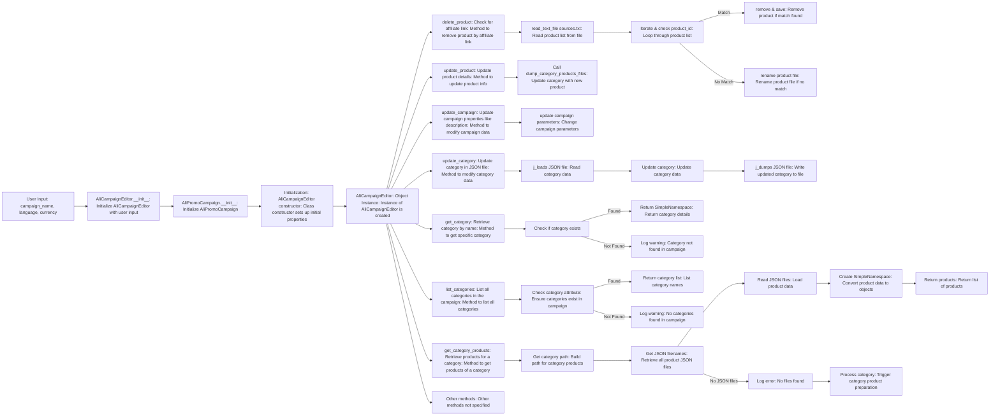
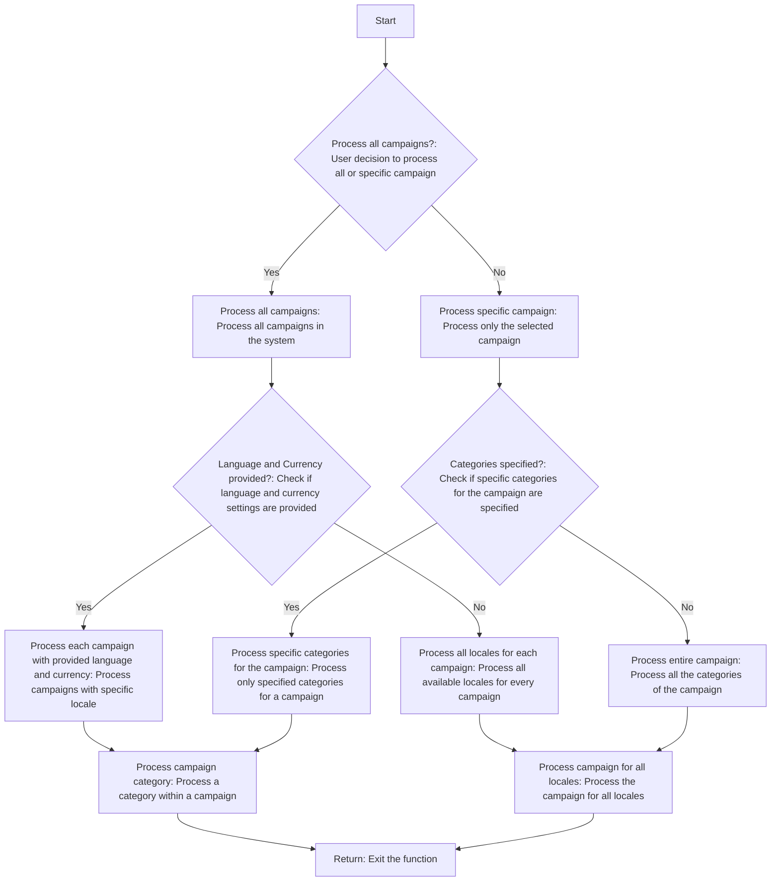

## Анализ кода `README.MD`

### 1. **<алгоритм>**

**1. Создание рекламной кампании для Facebook:**

   1.  **Начало:** Запускается процесс создания рекламной кампании.
      *   *Пример:* Выбор опции "Создать новую кампанию" в интерфейсе.
   2.  **Инициализация параметров:** Определяются имя кампании, язык и валюта.
      *   *Пример:* `Название: "Летняя распродажа", Язык: "Русский", Валюта: "RUB"`.
   3.  **Создание директорий:** Создаются каталоги и файлы для хранения данных кампании.
      *   *Пример:* Создание папки `/campaigns/summer_sale` и вложенных папок для продуктов и изображений.
   4.  **Сохранение конфигурации:** Сохраняются основные настройки кампании.
      *   *Пример:* Сохранение `{"name": "summer_sale", "language": "ru", "currency": "RUB"}` в JSON-файл.
   5.  **Сбор данных о продуктах:** Собирается информация о продуктах, которые будут продвигаться в рамках кампании.
      *   *Пример:* Получение списка продуктов из базы данных: `[{id: 123, name: "Футболка", price: 1500}, {id: 456, name: "Джинсы", price: 3000}]`.
   6.  **Сохранение данных о продуктах:** Сохраненяются собранные данные.
      *   *Пример:* Сохранение данных в `products.json` или в базу данных.
   7.  **Создание промо-материалов:** Генерируются рекламные баннеры и описания для продуктов.
      *   *Пример:* Создание баннера с изображением футболки и надписью "Купи сейчас по выгодной цене!".
   8.  **Ревью кампании:** Проводится проверка всех элементов кампании на готовность.
      *   *Пример:* Проверка соответствия текста, изображений и ссылок.
   9.  **Готовность кампании:** Проверка, готова ли кампания к публикации.
      *   *Пример:* Если есть ошибки - возврат к ревью, иначе переход к публикации.
   10. **Публикация кампании:** Кампания публикуется на Facebook.
       *   *Пример:* Вызов API Facebook для запуска рекламной кампании.
   11. **Конец:** Процесс создания кампании завершен.

**2. Редактирование рекламной кампании:**

   1. **Начало:** Пользователь указывает название кампании, язык и валюту для редактирования.
   2. **Инициализация `AliCampaignEditor`:** Создается экземпляр класса `AliCampaignEditor`, который управляет редактированием.
   3. **Удаление продукта:**
      *   Проверяется наличие партнерской ссылки.
      *   Читается список продуктов из `sources.txt`.
      *   Происходит итерация по списку, проверяя `product_id`.
        *   Если совпадение найдено, продукт удаляется и изменения сохраняются.
        *   Если нет совпадения, файл продукта переименовывается.
   4. **Обновление продукта:**
      *   Вызывается функция `dump_category_products_files`, чтобы обновить категорию новым продуктом.
   5. **Обновление кампании:**
      *   Обновляются параметры кампании (например, описание).
   6. **Обновление категории:**
      *   Читается JSON файл категории.
      *   Обновляются данные категории.
      *   Сохраняются изменения в JSON файл.
   7. **Получение категории:**
      *   Проверяется существование категории.
        *   Если категория существует, возвращается `SimpleNamespace` с ее деталями.
        *   Если нет, в журнал выводится предупреждение.
   8. **Список категорий:**
      *   Проверяется наличие категорий в кампании.
        *   Если категории есть, возвращается список их названий.
        *   Если нет, в журнал выводится предупреждение.
   9. **Получение продуктов категории:**
      *   Строится путь к файлам продуктов категории.
      *   Получаются все JSON файлы продуктов.
      *   Данные читаются из JSON файлов и конвертируются в `SimpleNamespace` объекты.
      *   Если нет JSON файлов, выводится ошибка и запускается процесс подготовки продуктов.
   10. **Другие методы:**  Предполагается наличие других методов, которые не описаны в данной блок-схеме.

**3. Подготовка рекламной кампании:**

   1. **Начало:** Запускается процесс подготовки кампании.
   2. **Обработать все кампании?** Проверяется, нужно ли обрабатывать все кампании или конкретную.
        * Если нужно, переход к обработке всех кампаний.
        * Если нет, переход к обработке конкретной.
   3. **Обработка всех кампаний:**
        * Проверяется, предоставлены ли язык и валюта.
            * Если да, то обрабатываются все кампании с указанными языком и валютой.
            * Если нет, то обрабатываются все локали для каждой кампании.
   4. **Обработка конкретной кампании:**
        * Проверяется, указаны ли категории.
            * Если да, то обрабатываются указанные категории для кампании.
            * Если нет, то обрабатывается вся кампания.
   5. **Обработка категории кампании:** Подготавливается категория в кампании.
   6. **Обработка кампании для всех локалей:** Подготавливаются все локали кампании.
   7. **Конец:** Процесс завершен.

### 2. **<mermaid>**

```mermaid
flowchart TD
    A[Start: Creating an advertising campaign for Facebook placement] --> B[Initialize Campaign Name, Language, and Currency: Define campaign name, language, and currency (e.g., "Summer Sale," "English," "USD")]
    B --> C[Create Campaign and Category Directories: Set up necessary folders and files]
    C --> D[Save Campaign Configuration: Store basic campaign settings]
    D --> E[Collect Product Data: Fetch product details like IDs, descriptions, and prices]
    E --> F[Save Product Data: Store product data for the campaign]
    F --> G[Create Promotional Materials: Generate ads, banners, and creatives]
    G --> H[Review Campaign: Check all campaign components for readiness]
    H --> I{Is the Campaign Ready?: Verify if all parts of the campaign are in place}
    I -- Yes --> J[Publish Campaign on Facebook: Make campaign live via API]
    I -- No --> H
    J --> K[End: Campaign creation process completed]
```

**Объяснение зависимостей:**

В этой диаграмме нет импорта, так как она описывает общий процесс создания кампании. Все шаги следуют друг за другом в логической последовательности, начиная от инициализации и заканчивая публикацией. Поток данных идет от одного шага к другому, где каждый последующий шаг использует данные предыдущего.



**Объяснение зависимостей:**

*   **`AliCampaignEditor`**: Центральный класс для управления изменениями в рекламных кампаниях.
*   **`AliPromoCampaign`**: Класс, который, вероятно, содержит структуру данных для рекламной кампании.
*   **Ввод пользователя**: В начале процесса пользователь передает название, язык и валюту кампании.
*   **Методы `AliCampaignEditor`**: Все методы работают с экземпляром `AliCampaignEditor` для внесения изменений, получения данных и управления жизненным циклом кампании.
*   **Поток данных**: Данные из пользовательского ввода, файлов и других источников передаются между методами класса для внесения изменений и получения данных.



**Объяснение зависимостей:**

*   **Условные блоки**: Решение о том, какие кампании и категории обрабатывать, зависит от пользовательского выбора.
*   **Поток управления**: Поток управления разветвляется в зависимости от условий, чтобы обеспечить гибкость при обработке.
*   **Общие пути**: Независимо от выбора, в конечном итоге процесс сводится к обработке категорий кампании или кампании для всех локалей.
*   **Завершение**: Независимо от выбранного пути, процесс завершается выходом из функции.

### 3. **<объяснение>**

**Общее описание:**

Модуль `campaign` предназначен для управления созданием, редактированием и подготовкой рекламных кампаний для Facebook. Он включает в себя функциональность для инициализации параметров кампании, создания файловой структуры, сохранения конфигураций, сбора и сохранения данных о продуктах, генерации промо-материалов, проверки и публикации кампании на Facebook.

**Импорты:**

В данном `README.md` нет импортов. При анализе реального кода, необходимо учитывать импорты из других частей проекта.

**Классы:**

*   **`AliCampaignEditor`:**
    *   **Роль:** Основной класс для редактирования кампаний.
    *   **Атрибуты:** Имеет атрибуты для хранения данных о кампании (название, язык, валюта, и т.д.) и настроек.
    *   **Методы:**
        *   `__init__()`: конструктор класса.
        *   `delete_product()`: удаляет продукт из кампании.
        *   `update_product()`: обновляет информацию о продукте.
        *   `update_campaign()`: обновляет данные кампании.
        *   `update_category()`: обновляет данные категории.
        *   `get_category()`: возвращает категорию по имени.
        *   `list_categories()`: возвращает список всех категорий.
        *   `get_category_products()`: возвращает список продуктов для категории.
        *   Другие методы для управления кампанией.
    *   **Взаимодействие:** Взаимодействует с другими частями проекта для сохранения и получения данных, а также с API Facebook для публикации кампании.
*   **`AliPromoCampaign`:**
    *   **Роль:** Хранит данные о кампании.
    *   **Атрибуты:** Атрибуты для хранения данных о кампании (название, язык, валюта, список продуктов, категории, и т.д.)
    *   **Методы:** Методы для управления данными кампании.

**Функции:**

В этом файле нет явных функций, но при анализе исходного кода, будут функции, которые выполняют следующие задачи:

*   **Инициализация кампании:** Создание директорий, сохранение настроек, чтение списка продуктов, и т.д.
*   **Сбор данных о продуктах:** Получение информации о продуктах из файлов, баз данных или API.
*   **Создание промо-материалов:** Генерация изображений и описаний для рекламных объявлений.
*   **Публикация кампании:** Вызов API Facebook для публикации кампании.

**Переменные:**

В `README.md` нет описания переменных. В реальном коде, переменные будут представлять:

*   **Строки:** Имена кампаний, языки, валюты.
*   **Списки:** Списки продуктов, категорий.
*   **Объекты:** Объекты классов, содержащие данные о кампаниях.
*   **Булевы значения:** Индикаторы готовности кампании к публикации.

**Потенциальные ошибки и улучшения:**

*   Отсутствие обработки ошибок при чтении файлов или API запросах.
*   Недостаточное логирование процессов.
*   Отсутствие тестов.
*   Необходимо добавить более подробное описание процесса создания и редактирования кампаний.
*   Улучшить структуру кода для лучшей читаемости.

**Взаимосвязи с другими частями проекта:**

*   Модуль `campaign` может взаимодействовать с модулем `ali` или `html` для получения данных о продуктах.
*   Может использовать общие настройки из `src.gs`.
*   Может использовать общие функции для работы с файлами и базами данных.
*   Может взаимодействовать с модулем Facebook API для публикации кампаний.