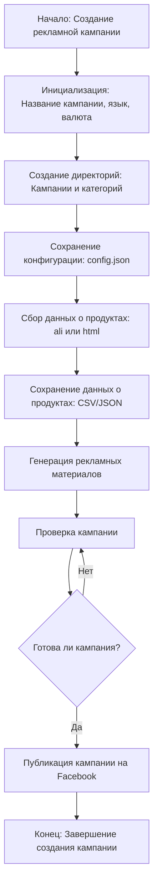

## Анализ кода модуля `campaign`

### 1. <алгоритм>

**Блок-схема процесса создания и публикации рекламной кампании:**

1.  **Начало:** Процесс начинается с запроса на создание новой рекламной кампании для Facebook.
    *   **Пример:** Пользователь инициирует процесс создания кампании через интерфейс.

2.  **Инициализация параметров кампании:**  Устанавливаются основные параметры кампании, такие как имя, язык и валюта.
    *   **Пример:**  `campaign_name = "Весенняя_распродажа", language = "ru_RU", currency = "RUB"`.

3.  **Создание директорий:** Создаются необходимые папки для хранения файлов кампании и категорий товаров.
    *   **Пример:**  Создаются папки `campaign_name`, `campaign_name/categories`, `campaign_name/categories/category_1` и т.д.

4.  **Сохранение конфигурации кампании:** Параметры и настройки кампании сохраняются в конфигурационный файл.
    *   **Пример:**  Данные `campaign_name`, `language`, `currency` сохраняются в `config.json`.

5.  **Сбор данных о продуктах:** Происходит сбор данных о товарах с помощью `ali` или `html` парсинга.
    *   **Пример:** Если используется `ali`, то  с AliExpress считываются данные о товарах. Если используется `html` парсинг, то данные берутся с сайта продавца.

6.  **Сохранение данных о продуктах:**  Собранные данные о товарах сохраняются в файлы.
    *   **Пример:** Информация о товарах сохраняется в CSV или JSON файлах для каждой категории.

7.  **Создание рекламных материалов:** На основе собранных данных генерируются рекламные материалы (тексты, изображения, видео).
    *   **Пример:** Генерируются креативы для Facebook с описанием товаров, ценами и изображениями.

8.  **Проверка кампании:**  Проверяется готовность кампании к публикации, в том числе корректность всех данных.
    *   **Пример:**  Проверяется корректность формата данных, наличие всех необходимых файлов и соответствие заданным критериям.

9.  **Проверка на готовность:** Принимается решение о том, готова ли кампания к публикации.
    *   **Пример:** Если проверка пройдена, переходим к публикации. Если нет, то возвращаемся к шагу проверки.

10. **Публикация кампании на Facebook:** Если кампания готова, она публикуется в Facebook.
    *   **Пример:** Кампания загружается в рекламный кабинет Facebook и запускается.

11. **Конец:** Процесс создания и публикации кампании завершен.
    *   **Пример:** Пользователь получает подтверждение о запуске рекламной кампании.

### 2. <mermaid>

**Описание диаграммы `mermaid`:**

*   **Start (Начало: Создание рекламной кампании):** Начальная точка процесса создания рекламной кампании.
*   **InitParams (Инициализация: Название кампании, язык, валюта):** Этап, на котором устанавливаются основные параметры кампании (название, язык и валюта).
*   **CreateDirs (Создание директорий: Кампании и категорий):** На этом этапе создаются необходимые директории для хранения файлов кампании и категорий товаров.
*   **SaveConfig (Сохранение конфигурации: config.json):** Параметры и настройки кампании сохраняются в конфигурационный файл.
*   **CollectProductData (Сбор данных о продуктах: ali или html):** Данные о товарах собираются с помощью `ali` (вероятно, парсинг AliExpress) или `html` парсинга.
*   **SaveProductData (Сохранение данных о продуктах: CSV/JSON):** Собранные данные о товарах сохраняются в файлы форматов CSV или JSON.
*   **GenerateAds (Генерация рекламных материалов):** Создание рекламных креативов (тексты, изображения, видео) на основе собранных данных о товарах.
*   **CheckCampaign (Проверка кампании):** Проверка готовности кампании к публикации, включая корректность всех данных.
*   **IsCampaignReady (Готова ли кампания?):**  Принятие решения о том, готова ли кампания к публикации. Если нет, процесс возвращается к предыдущему шагу.
*   **PublishCampaign (Публикация кампании на Facebook):** Публикация готовой кампании на платформе Facebook.
*   **End (Конец: Завершение создания кампании):** Завершающий этап процесса создания и публикации кампании.

### 3. <объяснение>

**Импорты:**

*   В предоставленном фрагменте кода отсутствуют импорты, но исходя из описания, модуль `campaign` взаимодействует с другими частями проекта, например, для сбора данных через `ali` или `html`, а также для публикации на Facebook. Для этого могут использоваться следующие потенциальные импорты:
    *   `from src.ali import ali_parser`:  Для сбора данных с AliExpress.
    *   `from src.html_parser import html_parser`:  Для сбора данных с помощью HTML парсинга.
    *   `from src.facebook_api import facebook_client`: Для публикации кампаний на Facebook.
    *   `from src.utils import file_utils`: Для работы с файлами (создание директорий, сохранение данных).
    *   `from src import gs`:  Для получения глобальных настроек.
    *   `import json`: Для работы с конфигурационными файлами формата JSON.

    **Взаимосвязь с пакетами `src`:**
    Модуль `campaign` является частью общего проекта `src` и взаимодействует с различными его подсистемами. Он может использовать модули `ali`, `html_parser`, `facebook_api` и `utils` для выполнения своих задач.

**Классы:**

*   В предоставленном фрагменте кода нет определений классов. Однако, можно предположить, что в рамках функционала модуля `campaign` могут использоваться классы, например:
    *   `Campaign`:  Для представления кампании как объекта с атрибутами (название, язык, валюта, конфигурация) и методами (создание директорий, сохранение конфигурации, сбор данных, генерация рекламы, публикация).
    *   `Product`: Для представления товара с атрибутами (название, цена, описание, изображения) и методами (парсинг, сохранение).

    **Роль классов:**
    Классы будут служить для организации и структурирования кода, а также для представления реальных сущностей проекта.

**Функции:**

*   В предоставленном фрагменте кода нет конкретных функций, но исходя из описания функциональности модуля `campaign`, могут использоваться такие функции, как:
    *   `create_campaign(campaign_name, language, currency)`: Создает новую кампанию.
    *   `create_directories(campaign_name)`: Создает необходимые директории.
    *   `save_config(campaign_name, config_data)`: Сохраняет конфигурацию кампании.
    *   `collect_product_data(source_type, *args)`: Собирает данные о продуктах из `ali` или `html`.
    *   `save_product_data(product_data, filename)`: Сохраняет данные о продуктах.
    *   `generate_ad_materials(product_data)`: Создает рекламные материалы.
    *   `check_campaign_status(campaign_data)`: Проверяет статус кампании.
    *   `publish_campaign(campaign_data)`: Публикует кампанию на Facebook.

    **Аргументы, возвращаемые значения и назначение функций:**
    Функции отвечают за конкретные операции в процессе создания кампании. Каждая функция принимает необходимые аргументы (например, название кампании, данные продукта) и возвращает результат (например, статус операции или собранные данные).

**Переменные:**

*   `campaign_name`: Строка, представляющая название рекламной кампании.
*   `language`: Строка, представляющая язык кампании.
*   `currency`: Строка, представляющая валюту кампании.
*   `config_data`: Словарь, содержащий конфигурационные параметры кампании.
*   `product_data`: Список или словарь, содержащий данные о продуктах.
*   `filename`: Строка, представляющая имя файла.
*   `source_type`: Строка, указывающая тип источника данных (ali или html).

    **Типы и использование переменных:**
    Переменные используются для хранения и передачи данных между функциями и классами в процессе создания и публикации кампании.

**Потенциальные ошибки и области для улучшения:**

*   Отсутствие обработки ошибок: В текущем описании нет обработки потенциальных ошибок, таких как некорректные данные, проблемы с сетью, сбои при сохранении файлов.
*   Нет разделения ответственности: Функциональность не разбита на отдельные классы, что делает код более сложным для поддержки.
*   Отсутствие логирования: Отсутствует логирование, что затрудняет отладку.
*   Недостаточная гибкость: Нет механизма для расширения функциональности (например, добавления новых источников данных).
*   Нет единой точки входа: Нет функции или класса, который координирует работу всех остальных функций.

**Цепочка взаимосвязей с другими частями проекта:**
Модуль `campaign` является частью более крупного проекта и взаимодействует с такими частями, как `ali`, `html_parser`, `facebook_api` и `utils`. Он зависит от этих модулей для сбора данных, публикации кампаний и выполнения общих операций. Таким образом, изменение в одном из этих модулей может повлиять на работу модуля `campaign`, что требует тщательного тестирования при внесении изменений.