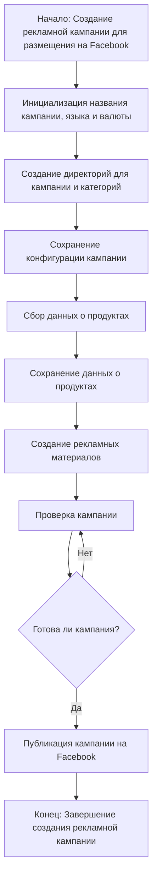
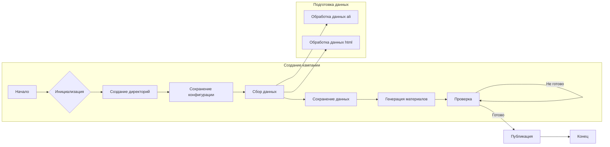

# Анализ кода модуля `campaign`

## <input code>

```
### `campaign`  
**Описание**:  
Модуль `campaign` предназначен для управления процессом создания и публикации 
рекламных кампаний на Фейсбук. 
Он включает функционал для инициализации параметров кампании (название, язык, валюта), 
создания структуры директорий, сохранения конфигураций для новой кампании, 
сбора и сохранения данных о продуктах через `ali` или `html`, 
генерации рекламных материалов, проверки кампании и публикации ее на Facebook.



## <algorithm>

**Шаг 1:** Начало процесса создания рекламной кампании.

**Шаг 2:** Инициализация параметров кампании: название, язык, валюта.
    * **Пример:** `название = "Новинки лета", язык = "ru", валюта = "USD"`

**Шаг 3:** Создание директорий для кампании и категорий.
    * **Пример:** Создаются директории `campaign/новинки_лета/`, `campaign/новинки_лета/тексты/`, `campaign/новинки_лета/изображения/`

**Шаг 4:** Сохранение конфигурации кампании в файлах.
    * **Пример:** Сохраняются данные из шага 2 в `campaign/новинки_лета/config.json`.

**Шаг 5:** Сбор данных о продуктах.
    * **Пример:** Извлечение данных о товарах из файлов форматов `ali` или `html`

**Шаг 6:** Сохранение собранных данных о продуктах.
    * **Пример:** Сохранение данных о товарах в соответствующие поддиректории (например, в `campaign/новинки_лета/продукты.json`)

**Шаг 7:** Генерация рекламных материалов (тексты, изображения).
    * **Пример:** Создание изображений и текстов для объявлений.

**Шаг 8:** Проверка кампании.
    * **Пример:** Проверка соответствия параметров, наличие всех необходимых файлов и данных.

**Шаг 9:** Принятие решения о готовности кампании.  
    * **Пример:** Проверка наличия ошибок. Если ошибок нет, кампания готова к публикации.

**Шаг 10:** Публикация кампании на Facebook.

**Шаг 11:** Завершение процесса создания кампании.


## <mermaid>




## <explanation>

**Импорты:**  В данном коде нет явных импортов, так как это лишь описание модуля.  Реальные импорты будут присутствовать в соответствующих файлах `campaign.py` и связанных с ним.

**Классы:** Отсутствуют.  Здесь описана логика процесса, а не классы с методами.  Реализация будет определять структуры данных и методы для работы с ними.

**Функции:** Также отсутствуют.  Описание лишь предоставляет общую картину процесса.  В реальном коде должны быть функции для инициализации, создания директорий, сбора данных, генерации, проверки и публикации.

**Переменные:**  В описании используются переменные для обозначения названий, языка и валюты, путей к файлам. Реальные переменные будут определяться в коде, хранящие данные и параметры.

**Возможные ошибки и улучшения:**

* **Отсутствие детальной реализации:** Описание не указывает, как именно собираются данные или выполняются проверки.  Необходимо детализировать алгоритмы этих этапов.
* **Обработка ошибок:** Не описана обработка ошибок (например, если отсутствуют необходимые файлы или данные).
* **Проверка корректности данных:**  Необходимо уточнить, как проверяется соответствие параметров кампании, данные из файлов.
* **Логирование:**  В реальной системе нужно добавить логирование для отслеживания progress и ошибок.
* **Подключение к Facebook:** Не указано, каким образом происходит взаимодействие с Facebook API.


**Взаимосвязи с другими частями проекта:**

Модуль `campaign` напрямую зависит от модулей, отвечающих за:
* **Сбор данных:**  `ali` и `html` (модули для парсинга или работы с API этих источников).
* **Взаимодействие с Facebook:** Модули для работы с API Facebook.

Этот модуль будет использоваться другими частями приложения, например, для запуска рекламных кампаний.