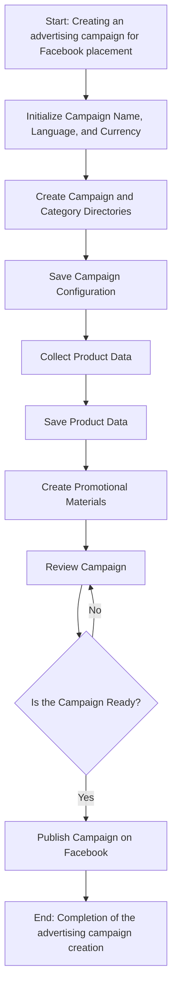
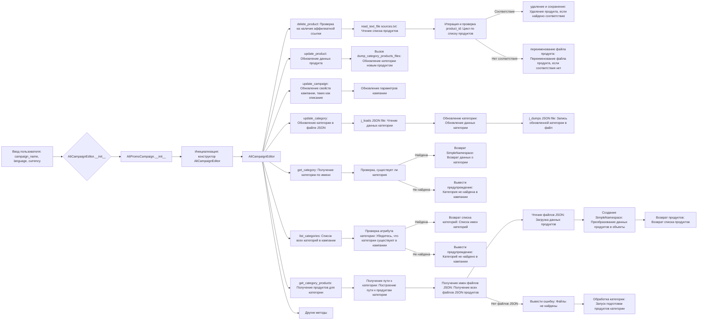
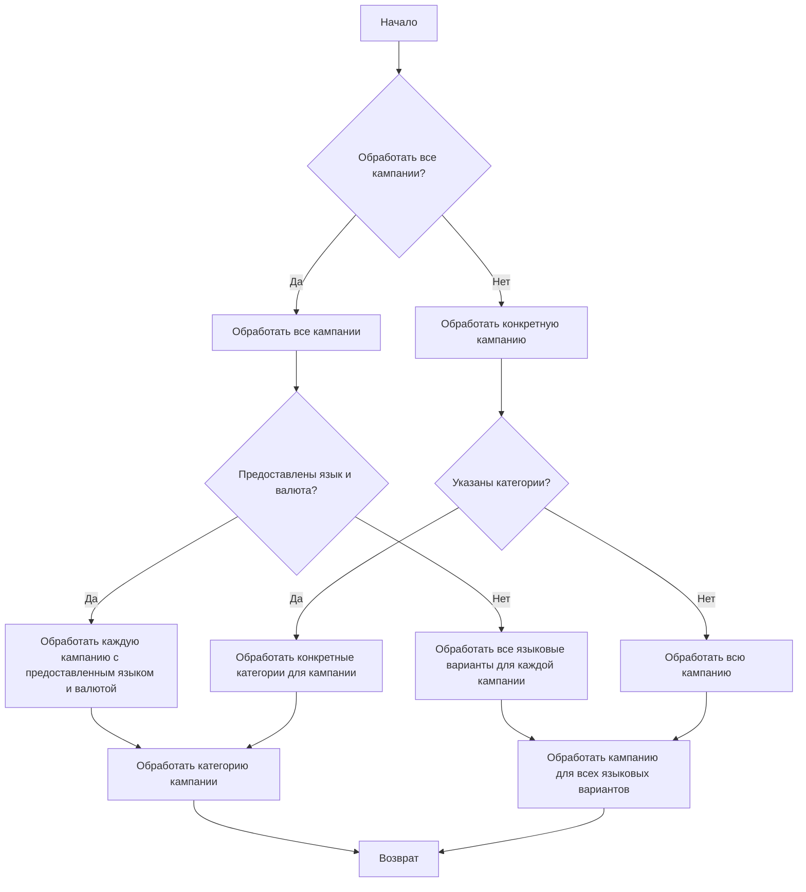

```MD
# Анализ кода модуля `src.suppliers.aliexpress.campaign`

## <input code>

```rst
.. :module: src.suppliers.aliexpress.campaign
```

### `campaign`

The `campaign` module is designed to manage the process of creating and publishing advertising campaigns on Facebook. It includes functionality for initializing campaign parameters (name, language, currency), creating directory structures, saving configurations for the new campaign, collecting and saving product data via `ali` or `html`, generating promotional materials, reviewing the campaign, and publishing it on Facebook.



- **Шаг 1**: Начало - процесс начинается.
- **Шаг 2**: Инициализация данных кампании - определяются имя, язык и валюта кампании. Пример: Имя кампании: "Летняя распродажа", Язык: "Русский", Валюта: "RUB".
- **Шаг 3**: Создание директорий кампании и категорий - создаются необходимые директории или файлы для кампании. Пример: Создается структура папок на файловой системе для хранения активов кампании.
- **Шаг 4**: Сохранение конфигурации кампании - сохранены инициализированные данные кампании. Пример: Данные записываются в базу данных или конфигурационный файл.
- **Шаг 5**: Сбор данных о продуктах - собираются данные о продуктах, которые будут рекламироваться в рамках кампании. Пример: ID продукта, описания, изображения и цены извлекаются из системы инвентаризации.
- **Шаг 6**: Сохранение данных о продуктах - сохранены собранные данные о продуктах. Пример: Данные записываются в таблицу базы данных, предназначенную для продуктов кампании.
- **Шаг 7**: Создание рекламных материалов - генерируются или выбираются графические изображения, баннеры и другие рекламные активы. Пример: Изображения и описания адаптируются для привлечения клиентов.
- **Шаг 8**: Проверка кампании - процесс проверки подтверждает готовность компонентов кампании. Пример: Человек или система проверяют качество и полноту всех компонентов кампании.
- **Шаг 9**: Готова ли кампания? - проверка для определения того, завершена ли кампания и готова ли она к публикации. Пример: Логическая переменная сигнализирует "Да", если все готово, в противном случае "Нет", что запускает цикл обратно к предыдущему шагу для внесения исправлений.
- **Шаг 10**: Публикация кампании - кампания размещается в режиме реального времени на платформе, готовой к маркетинговым усилиям. Пример: выполняется вызов API для публикации кампании на соответствующей платформе.
- **Шаг 11**: Конец - процесс создания кампании завершен.


# Редактирование кампании



# Подготовка кампании



## <algorithm>

(Описание алгоритма работы кода, используя блок-схему)

... (Подробное описание алгоритма, основанное на блок-схемах, представленных в коде. Описать, как данные перемещаются между функциями, классами и методами) ...

## <mermaid>

(Код диаграммы Mermaid уже представлен в коде.)

## <explanation>

**Импорты:**

В данном фрагменте кода нет импортируемых модулей.  Модуль `src.suppliers.aliexpress.campaign` описывает функциональность, а не реализует её непосредственно, то есть это описание, а не код.

**Классы:**

Классы `AliCampaignEditor` и `AliPromoCampaign` (предполагаемые) вероятно, отвечают за различные аспекты создания и управления кампаниями.  Необходимые классы и методы для работы с кампаниями, их созданием и редактированием, вероятно, определены внутри модуля `src.suppliers.aliexpress.campaign`.


**Функции:**

Описание функций (`delete_product`, `update_product`, `update_campaign`, `update_category`, `get_category`, `list_categories`, `get_category_products`) отсутствует.   По блок-схемам можно предположить, что они отвечают за различные операции по работе с кампанией (удаление продуктов, обновление данных, получение категорий и т.д.).

**Переменные:**

Переменные (например, `campaign_name`, `language`, `currency`) используются для хранения данных о кампании.  Типы переменных неявно предполагаются из контекста, но без кода сложно определить точные типы.

**Возможные ошибки и улучшения:**

* Не хватает кода, необходимо больше информации о реализации `AliCampaignEditor` и `AliPromoCampaign` для оценки ошибок и улучшений.
* Необходимо проанализировать полную архитектуру проекта (`src` и другие модули), чтобы оценить зависимость и связности модулей `aliexpress` и `campaign`  с другими частями проекта.
*  Необходимо предоставить код классов и функций для глубокого анализа и оценки ошибок, структуры данных и возможных улучшений в алгоритмах.
* Отсутствие явного указания на типы переменных может привести к ошибкам, если предполагаемые типы не будут соответствовать на практике.
*  Неясно, как осуществляется взаимодействие с внешними системами (Facebook API).  Это может потребовать отдельного анализа взаимодействия с API и корректного обращения с ответами.
*  Для улучшения модуля  полезно было бы использовать классы или структуры данных, которые точно описывают структуру кампании, продуктов и категорий.

**Взаимосвязь с другими частями проекта:**

Без кода невозможно определить точную взаимосвязь с другими частями проекта.  Возможно, модуль `campaign` взаимодействует с модулями, отвечающими за работу с продуктами, категориями, базами данных и Facebook API.  Для понимания связей нужно посмотреть на структуру проекта, определения зависимостей и импорта.


**Итог:**

Данный фрагмент является описанием, а не кодом, поэтому предоставленных данных недостаточно для глубокого анализа.