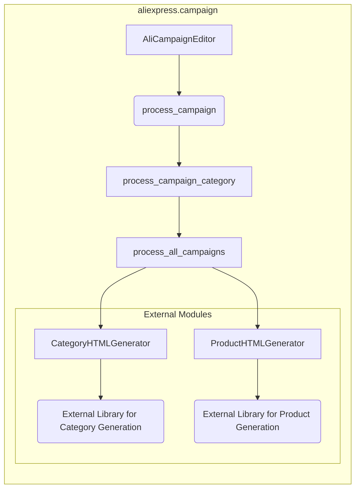

1. <input code>
```python
## \file hypotez/src/suppliers/aliexpress/campaign/__init__.py
# -*- coding: utf-8 -*-
#! venv/Scripts/python.exe
#! venv/bin/python/python3.12

"""
.. module:: src.suppliers.aliexpress.campaign 
	:platform: Windows, Unix
	:synopsis:модули управления рекламной кампанией Aliexpress

"""
MODE = 'dev'


from .ali_campaign_editor import AliCampaignEditor
#from .gsheet import AliCampaignGoogleSheet
from .prepare_campaigns import  process_campaign, process_campaign_category, process_all_campaigns
#from .ali_campaign_editor_jupyter_widgets import JupyterCampaignEditorWidgets
from .html_generators import CategoryHTMLGenerator, ProductHTMLGenerator
```

2. <algorithm>

К сожалению, предоставленный код не содержит достаточно информации для построения подробной блок-схемы алгоритма.  Он лишь импортирует модули и определяет константу.  Без определения функций и классов, невозможно понять, как данные обрабатываются и перемещаются.  Необходимы определения классов `AliCampaignEditor`, `process_campaign`, `process_campaign_category`, `process_all_campaigns`, `CategoryHTMLGenerator`, `ProductHTMLGenerator`, чтобы создать точную блок-схему.

3. <mermaid>


**Описание диаграммы:**

Эта диаграмма представляет собой упрощенное изображение возможной взаимосвязи компонентов внутри пакета `aliexpress.campaign`.  Она не отражает реализацию. Диаграмма демонстрирует взаимодействие, но детали реализации скрыты.


4. <explanation>

* **Импорты:**
    * `from .ali_campaign_editor import AliCampaignEditor`: Импортирует класс `AliCampaignEditor` из модуля `ali_campaign_editor.py` в текущем пакете.  Это указывает, что этот модуль вероятно содержит логику редактирования рекламных кампаний Aliexpress.
    * `from .prepare_campaigns import  process_campaign, process_campaign_category, process_all_campaigns`: Импортирует функции `process_campaign`, `process_campaign_category`, `process_all_campaigns` из модуля `prepare_campaigns.py` в текущем пакете.  Эти функции, вероятно, отвечают за подготовку данных для рекламных кампаний.
    * `from .html_generators import CategoryHTMLGenerator, ProductHTMLGenerator`: Импортирует классы `CategoryHTMLGenerator` и `ProductHTMLGenerator` из модуля `html_generators.py`. Эти классы, скорее всего, генерируют HTML-представления категорий и продуктов.

* **Классы:**
    * `AliCampaignEditor`:  Вероятно, представляет класс, позволяющий работать с кампаниями Aliexpress.  Необходимо изучить код этого класса, чтобы понять его функциональность, атрибуты и методы.
    * `CategoryHTMLGenerator` и `ProductHTMLGenerator`: Классы для генерации HTML, вероятно, содержат логику преобразования данных в HTML-структуру для категорий и продуктов.

* **Функции:**
    * `process_campaign`, `process_campaign_category`, `process_all_campaigns`: Эти функции, вероятно, принимают данные (возможно, из базы данных, API или другого источника) и выполняют операции подготовки для дальнейшего использования или вывода.

* **Переменные:**
    * `MODE = 'dev'`:  Константа, вероятно, задает режим работы (разработка или производство).


* **Возможные ошибки и улучшения:**
    * Отсутствует информация о взаимодействии с другими модулями.
    * Отсутствует описание функций и методов, что затрудняет понимание внутренней работы кода.
    * Необходимо определить, откуда берутся данные для обработки.

**Цепочка взаимосвязей:**

Из предоставленного кода сложно определить полную цепочку взаимосвязей с другими частями проекта.  Скорее всего, данные поступают от внешних источников (API, базы данных), обрабатываются функциями подготовки, затем данные передаются классам для генерации HTML, и в конечном итоге, эти данные выводятся или сохраняются в других частях проекта. Для того, чтобы определить полные взаимосвязи, нужно просмотреть код связанных файлов.