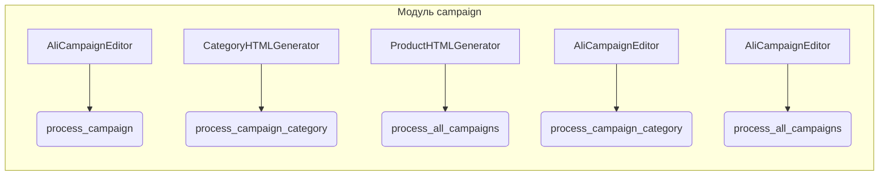

```MD
1. **<input code>**:

```python
## \file hypotez/src/suppliers/aliexpress/campaign/__init__.py
# -*- coding: utf-8 -*-
#! venv/Scripts/python.exe
#! venv/bin/python/python3.12

"""
.. module: src.suppliers.aliexpress.campaign 
	:platform: Windows, Unix
	:synopsis:модули управления рекламной кампанией Aliexpress

"""
MODE = 'dev'


from .ali_campaign_editor import AliCampaignEditor
#from .gsheet import AliCampaignGoogleSheet
from .prepare_campaigns import  process_campaign, process_campaign_category, process_all_campaigns
#from .ali_campaign_editor_jupyter_widgets import JupyterCampaignEditorWidgets
from .html_generators import CategoryHTMLGenerator, ProductHTMLGenerator
```

2. **<algorithm>**:

Этот код представляет собой модуль `__init__.py`, который импортирует различные классы и функции из подпапок внутри `hypotez/src/suppliers/aliexpress/campaign`.  Блок-схема в данном случае невозможна, так как нет вызовов функций и логики. Модуль отвечает только за импорт.

3. **<mermaid>**:



**Объяснение зависимостей**: Модуль `campaign` импортирует классы и функции из других модулей внутри того же пакета.  `AliCampaignEditor` взаимодействует с `process_campaign`, `process_campaign_category` и `process_all_campaigns`.  `CategoryHTMLGenerator` и `ProductHTMLGenerator` видимо связаны с обработкой данных кампаний, но конкретные связи не видны без детального рассмотрения соответствующих файлов.

4. **<explanation>**:

* **Импорты**:
    * `from .ali_campaign_editor import AliCampaignEditor`: Импортирует класс `AliCampaignEditor` из модуля `ali_campaign_editor.py` в текущем пакете. Этот класс, вероятно, отвечает за редактирование рекламных кампаний AliExpress.
    * `from .prepare_campaigns import  process_campaign, process_campaign_category, process_all_campaigns`: Импортирует функции `process_campaign`, `process_campaign_category` и `process_all_campaigns` из модуля `prepare_campaigns.py`. Вероятно, эти функции отвечают за подготовку данных рекламных кампаний.
    * `from .html_generators import CategoryHTMLGenerator, ProductHTMLGenerator`: Импортирует классы `CategoryHTMLGenerator` и `ProductHTMLGenerator` из модуля `html_generators.py`. Вероятно, эти классы отвечают за генерацию HTML-представлений данных о категориях и продуктах для кампаний.
    Все импорты начинаются с `.` , что указывает на то, что импортируемые элементы находятся в подпапках текущего пакета `campaign`.

* **Классы**:
    * `AliCampaignEditor`: Вероятно, предоставляет методы для управления объектами кампаний AliExpress.
    * `CategoryHTMLGenerator`:  Предполагается, что отвечает за генерацию HTML-кода для представления категорий кампаний.
    * `ProductHTMLGenerator`:  Предполагается, что отвечает за генерацию HTML-кода для представления продуктов кампаний.

* **Функции**:
    * `process_campaign`, `process_campaign_category`, `process_all_campaigns`: Вероятно, принимают данные о кампаниях и обрабатывают их. Взаимодействие между этими функциями и классами не указано.

* **Переменные**:
    * `MODE = 'dev'`: Вероятно, конфигурационная переменная, определяющая режим работы модуля (например, разработка, производство).

* **Возможные ошибки/улучшения**:
    * Отсутствует явная документация (документационные строки) к функциям и классам. Документация улучшила бы понимание функциональности.
    * Не показано, как функции и классы взаимодействуют друг с другом. Не хватает информации о потоках данных. Не определен процесс работы (например, чтение данных, обработка, сохранение результатов).


**Цепочка взаимосвязей**:

Модуль `campaign` является частью более крупного проекта `hypotez`. Взаимодействие с другими частями проекта невозможно определить без дополнительных файлов проекта.  Скорее всего, данный модуль отвечает за обработку данных AliExpress и подготавливает их для дальнейшей обработки или отображения.