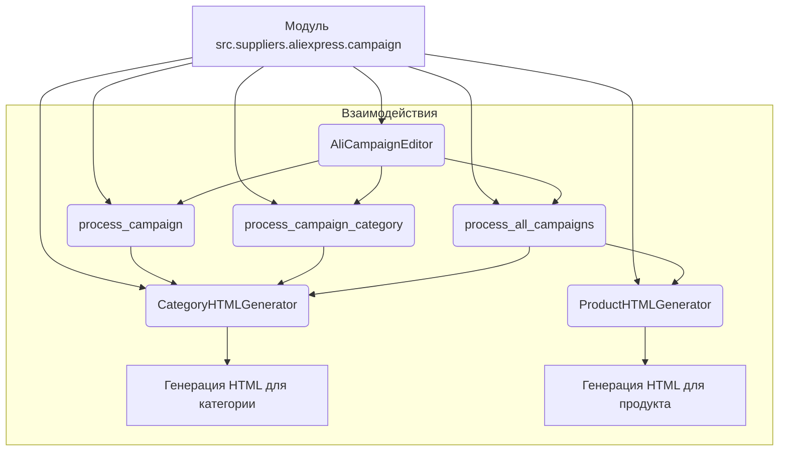
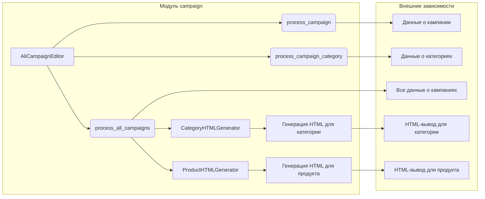

# <input code>

```python
## \file hypotez/src/suppliers/aliexpress/campaign/__init__.py
# -*- coding: utf-8 -*-
#! venv/Scripts/python.exe
#! venv/bin/python/python3.12

"""
.. module: src.suppliers.aliexpress.campaign 
	:platform: Windows, Unix
	:synopsis:модули управления рекламной кампанией Aliexpress

"""
MODE = 'dev'


from .ali_campaign_editor import AliCampaignEditor
#from .gsheet import AliCampaignGoogleSheet
from .prepare_campaigns import  process_campaign, process_campaign_category, process_all_campaigns
#from .ali_campaign_editor_jupyter_widgets import JupyterCampaignEditorWidgets
from .html_generators import CategoryHTMLGenerator, ProductHTMLGenerator
```

# <algorithm>



**Описание алгоритма:**

Модуль `src.suppliers.aliexpress.campaign` предоставляет инструменты для управления рекламными кампаниями Aliexpress.  Он импортирует классы и функции из своих подмодулей.  `AliCampaignEditor`  по-видимому, отвечает за редактирование кампаний.  Функции `process_campaign`, `process_campaign_category`, `process_all_campaigns` обрабатывают данные о кампаниях различными способами.  `CategoryHTMLGenerator` и `ProductHTMLGenerator` генерируют HTML-представления для категорий и продуктов.  Логика предполагает обработку данных о кампаниях и создание HTML-отчётов.


# <mermaid>



**Объяснение диаграммы:**

* **campaign**: Центральный модуль, содержащий классы и функции для управления кампаниями.
* **AliCampaignEditor**: Основной класс для взаимодействия с данными кампаний.
* **process_campaign, process_campaign_category, process_all_campaigns**: Функции, обрабатывающие данные кампаний.
* **CategoryHTMLGenerator, ProductHTMLGenerator**: Функции для генерации HTML.
* **Данные о кампании, Данные о категориях, Все данные о кампаниях**: Внешние данные, используемые для обработки.
* **HTML-вывод для категории, HTML-вывод для продукта**: Результат обработки, HTML-документы.


# <explanation>

**Импорты:**

* `from .ali_campaign_editor import AliCampaignEditor`: Импортирует класс `AliCampaignEditor` из подмодуля `ali_campaign_editor`.  Связь: `ali_campaign_editor` - подмодуль `campaign`, обеспечивающий функции редактирования кампаний.
* `from .prepare_campaigns import process_campaign, process_campaign_category, process_all_campaigns`: Импортирует функции, вероятно, отвечающие за подготовку/обработку данных кампаний.
* `from .html_generators import CategoryHTMLGenerator, ProductHTMLGenerator`: Импортирует классы для генерации HTML. Связь: модули генерации HTML-вывода.

**Классы:**

* `AliCampaignEditor`: Вероятно, класс, отвечающий за операции редактирования данных кампании. Подробности о его методах и атрибутах неизвестны из предоставленного фрагмента кода.


**Функции:**

* `process_campaign`, `process_campaign_category`, `process_all_campaigns`: Скорее всего, функции для обработки данных о кампаниях. `process_all_campaigns` обрабатывает всю коллекцию данных, в то время как другие обрабатывают данные о конкретной кампании или категории.


**Переменные:**

* `MODE = 'dev'`: Переменная, определяющая режим работы (вероятно, 'dev' - режим разработки).


**Возможные ошибки и улучшения:**

* Отсутствуют комментарии внутри функций и методов.  Добавление подробных комментариев улучшит читаемость и понимание кода.
* Отсутствует описание типов данных для переменных и аргументов функций.
* Не указана структура данных для хранения информации о кампаниях.


**Взаимосвязи с другими частями проекта:**

* Модуль `aliexpress/campaign` скорее всего работает с данными из других модулей проекта (например, хранилище данных или другие поставщики данных).
* Необходимо изучить другие модули, чтобы установить точную связь.  Предполагается, что данные о кампаниях загружаются откуда-то и затем обрабатываются функциями из модуля `campaign`.

**Важно:** Для более детального анализа необходимо изучить файлы, импортируемые из `src`, а также контекст проекта в целом.