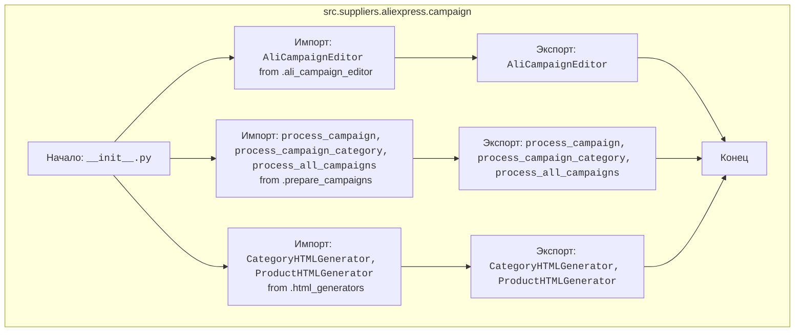

## АНАЛИЗ КОДА: `hypotez/src/suppliers/aliexpress/campaign/__init__.py`

### <алгоритм>

1.  **Импорт модулей:**
    *   Импортируется `AliCampaignEditor` из `./ali_campaign_editor.py`. Этот класс, вероятно, отвечает за редактирование параметров рекламных кампаний AliExpress.
    *   Импортируются `process_campaign`, `process_campaign_category` и `process_all_campaigns` из `./prepare_campaigns.py`. Эти функции, вероятно, отвечают за обработку и подготовку данных для рекламных кампаний.
        *  `process_campaign` - обрабатывает отдельную кампанию (например, применяет настройки или форматирует данные).
        *  `process_campaign_category` - обрабатывает кампании по определенным категориям (группирует кампании по категориям и применяет настройки).
        * `process_all_campaigns` - обрабатывает все кампании (прогоняет все кампании через единый процесс).
    *   Импортируются `CategoryHTMLGenerator` и `ProductHTMLGenerator` из `./html_generators.py`. Эти классы, вероятно, отвечают за генерацию HTML-отчетов для рекламных кампаний, разделяя их по категориям и продуктам.

2.  **Экспорт импортированных сущностей:**

    *   Модуль `__init__.py` делает доступными импортированные классы и функции для использования в других модулях, импортирующих пакет `src.suppliers.aliexpress.campaign`.

### <mermaid>

**Объяснение:**

*   Диаграмма показывает импорт классов и функций в `__init__.py` из других модулей в пакете `src.suppliers.aliexpress.campaign` и последующий их экспорт, делая их доступными при импорте пакета.
*   `AliCampaignEditor` - класс, предназначенный для редактирования рекламных кампаний.
*   `process_campaign`, `process_campaign_category`, `process_all_campaigns` - функции, предназначенные для обработки и подготовки данных кампаний.
*   `CategoryHTMLGenerator` и `ProductHTMLGenerator` - классы для генерации HTML отчетов по категориям и продуктам кампаний.
*   Связи `-->` показывают поток импорта и экспорта.

### <объяснение>

**Импорты:**

*   `from .ali_campaign_editor import AliCampaignEditor`: импортирует класс `AliCampaignEditor` из модуля `ali_campaign_editor.py`, расположенного в том же пакете. `AliCampaignEditor`, вероятно, используется для управления и редактирования параметров кампаний AliExpress.
*   `from .prepare_campaigns import process_campaign, process_campaign_category, process_all_campaigns`: импортирует функции для подготовки кампаний из модуля `prepare_campaigns.py`, расположенного в том же пакете.
    *   `process_campaign`: Функция для обработки отдельной кампании.
    *   `process_campaign_category`: Функция для обработки кампаний по категориям.
    *   `process_all_campaigns`: Функция для обработки всех кампаний.
*   `from .html_generators import CategoryHTMLGenerator, ProductHTMLGenerator`: импортирует классы для генерации HTML отчетов из модуля `html_generators.py`.
    *   `CategoryHTMLGenerator`: Класс для генерации HTML отчетов по категориям.
    *   `ProductHTMLGenerator`: Класс для генерации HTML отчетов по продуктам.

**Классы:**

*   `AliCampaignEditor`: класс, предназначенный для редактирования рекламных кампаний. Он будет иметь методы для управления настройками, ставками, бюджетами и другими параметрами кампаний.

*   `CategoryHTMLGenerator`: класс, предназначенный для генерации HTML-представлений отчетов по категориям. Он будет иметь методы для форматирования данных в HTML-формате.

*   `ProductHTMLGenerator`: класс, предназначенный для генерации HTML-представлений отчетов по продуктам. Он будет иметь методы для форматирования данных в HTML-формате.

**Функции:**

*   `process_campaign`: Функция для обработки отдельных кампаний, скорее всего, включает операции такие как загрузка данных, применение трансформаций, и валидация.

*   `process_campaign_category`: Функция обрабатывает кампании по категориям, что предполагает группировку и возможно применение общих правил для каждой категории.

*   `process_all_campaigns`: Функция обрабатывает все кампании, возможно в цикле, применяя общий набор правил.

**Переменные:**

*   Переменные явно не определены в файле `__init__.py`.

**Взаимосвязи:**

*   Модуль `__init__.py` действует как точка входа и сборки для пакета `src.suppliers.aliexpress.campaign`. Он импортирует классы и функции из подмодулей, делая их доступными для других частей системы.
*   `AliCampaignEditor` зависит от других модулей для доступа к данным кампаний.
*   Модули `prepare_campaigns` могут зависеть от `AliCampaignEditor` для получения данных о кампаниях.
*   Модули `html_generators` будут использовать данные, полученные из `prepare_campaigns` и `AliCampaignEditor` для генерации HTML.

**Потенциальные ошибки и улучшения:**

*   Не хватает документации (docstring) внутри модулей для более подробного описания их функциональности.
*   Использование комментариев `#from .gsheet import AliCampaignGoogleSheet` и `#from .ali_campaign_editor_jupyter_widgets import JupyterCampaignEditorWidgets`  показывает наличие неиспользуемого кода, который может быть удален.
*   Возможно, стоит добавить проверку типов данных, для большей надежности.

**Цепочка взаимосвязей:**

*   Пакет `src.suppliers.aliexpress.campaign` является частью более широкого проекта, который, вероятно, включает в себя модули для работы с другими поставщиками и общие вспомогательные модули (`src`).
*   Другие модули проекта будут импортировать данный пакет и использовать его функциональность для управления рекламными кампаниями на AliExpress.