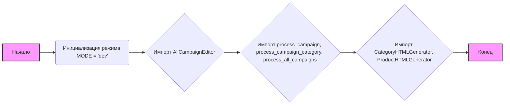
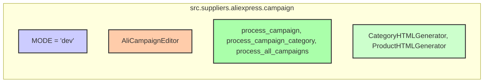

## Анализ кода `hypotez/src/suppliers/aliexpress/campaign/__init__.py`

### 1. <алгоритм>

**Блок-схема:**

**Примеры:**

1.  **`MODE = 'dev'`**: Установка режима разработки. Этот режим может влиять на поведение других модулей, например, при включении отладочных сообщений или использовании тестовых данных.
2.  **`from .ali_campaign_editor import AliCampaignEditor`**: Импорт класса `AliCampaignEditor`, который, предположительно, используется для управления рекламными кампаниями на Aliexpress.
3.  **`from .prepare_campaigns import process_campaign, process_campaign_category, process_all_campaigns`**: Импорт функций для обработки рекламных кампаний.
    *   `process_campaign` может обрабатывать одну кампанию.
    *   `process_campaign_category` может обрабатывать кампании для определённой категории.
    *   `process_all_campaigns` может обрабатывать все кампании.
4.  **`from .html_generators import CategoryHTMLGenerator, ProductHTMLGenerator`**: Импорт классов для генерации HTML-кода.
    *   `CategoryHTMLGenerator` может генерировать HTML для категорий кампаний.
    *   `ProductHTMLGenerator` может генерировать HTML для продуктов в кампаниях.

**Поток данных:**

*   Данные (например, информация о кампаниях) могут поступать в функции `process_campaign`, `process_campaign_category`, `process_all_campaigns`.
*   `AliCampaignEditor` может использовать данные из этих функций для редактирования кампаний.
*   `CategoryHTMLGenerator` и `ProductHTMLGenerator` могут генерировать HTML-отчёты на основе обработанных данных.

### 2. <mermaid>

**Анализ зависимостей:**

*   **`src.suppliers.aliexpress.campaign`**: Это основной модуль, который связывает все импортированные компоненты.
*   **`MODE`**: Глобальная переменная, устанавливающая режим работы модуля (в данном случае, "dev").  Может влиять на работу других частей программы, но не имеет прямых зависимостей с другими импортированными модулями.
*   **`AliCampaignEditor`**: Класс для редактирования рекламных кампаний. Предположительно, он зависит от других модулей, чтобы получать и обрабатывать данные о кампаниях, однако это не отображено в коде `__init__.py`.
*   **`prepare_campaigns`**: Модуль, содержащий функции для обработки кампаний. Функции `process_campaign`, `process_campaign_category` и `process_all_campaigns`  могут обрабатывать данные и, возможно, передавать их в `AliCampaignEditor` или `html_generators`, но это не видно из `__init__.py`.
*   **`html_generators`**: Модуль, содержащий классы для генерации HTML-отчетов,  `CategoryHTMLGenerator` и `ProductHTMLGenerator` , предполагается, что  они используют данные полученные из других частей модуля.

### 3. <объяснение>

**Импорты:**

*   **`from .ali_campaign_editor import AliCampaignEditor`**:
    *   **Назначение**: Импортирует класс `AliCampaignEditor` из модуля `ali_campaign_editor.py`, расположенного в том же каталоге.
    *   **Взаимосвязь**: Предполагается, что `AliCampaignEditor` используется для управления рекламными кампаниями, возможно, с использованием данных, обработанных другими модулями в этом же пакете.
*   **`from .prepare_campaigns import process_campaign, process_campaign_category, process_all_campaigns`**:
    *   **Назначение**: Импортирует функции `process_campaign`, `process_campaign_category`, `process_all_campaigns` из модуля `prepare_campaigns.py`.
    *   **Взаимосвязь**: Эти функции, вероятно, отвечают за предварительную обработку данных о кампаниях перед их использованием в `AliCampaignEditor` или генерации отчётов.
*   **`from .html_generators import CategoryHTMLGenerator, ProductHTMLGenerator`**:
    *   **Назначение**: Импортирует классы `CategoryHTMLGenerator` и `ProductHTMLGenerator` из модуля `html_generators.py`.
    *   **Взаимосвязь**: Эти классы отвечают за генерацию HTML-кода для отчётов, возможно, на основе данных, обработанных функциями из `prepare_campaigns.py`.

**Классы:**

*   **`AliCampaignEditor`**:
    *   **Роль**: Класс, отвечающий за управление рекламными кампаниями Aliexpress.
    *   **Атрибуты**: Атрибуты и методы не видны в этом файле, но можно предположить, что они включают функциональность для загрузки, редактирования и сохранения информации о кампаниях.
    *   **Взаимодействие**: Может взаимодействовать с функциями из `prepare_campaigns.py` для получения данных, а также с другими частями проекта для сохранения изменений.
*   **`CategoryHTMLGenerator`**:
    *   **Роль**: Класс для генерации HTML-кода для отчётов о категориях кампаний.
    *   **Атрибуты**: Атрибуты и методы не видны в этом файле, но можно предположить, что они будут включать логику для создания HTML-таблиц или других HTML-элементов на основе данных о кампаниях.
    *   **Взаимодействие**: Может взаимодействовать с функциями из `prepare_campaigns.py` для получения данных о категориях.
*   **`ProductHTMLGenerator`**:
    *   **Роль**: Класс для генерации HTML-кода для отчётов о продуктах в кампаниях.
    *   **Атрибуты**: Атрибуты и методы не видны в этом файле, но можно предположить, что они будут включать логику для создания HTML-таблиц или других HTML-элементов на основе данных о продуктах в кампаниях.
    *   **Взаимодействие**: Может взаимодействовать с функциями из `prepare_campaigns.py` для получения данных о продуктах.

**Функции:**

*   **`process_campaign`**:
    *   **Аргументы**: Не известны из этого файла.
    *   **Возвращаемое значение**: Не известно из этого файла.
    *   **Назначение**: Предполагается, что эта функция обрабатывает данные одной рекламной кампании.
    *   **Пример**: Обработка данных по конкретной кампании (извлечение определенных параметров или преобразование данных)
*   **`process_campaign_category`**:
    *   **Аргументы**: Не известны из этого файла.
    *   **Возвращаемое значение**: Не известно из этого файла.
    *   **Назначение**: Предполагается, что эта функция обрабатывает данные кампаний для определенной категории.
    *   **Пример**: Обработка данных для всех кампаний категории "Одежда"
*   **`process_all_campaigns`**:
    *   **Аргументы**: Не известны из этого файла.
    *   **Возвращаемое значение**: Не известно из этого файла.
    *   **Назначение**: Предполагается, что эта функция обрабатывает все рекламные кампании.
    *   **Пример**: Обработка данных для всех рекламных кампаний в аккаунте.

**Переменные:**

*   **`MODE`**:
    *   **Тип**: Строка (`str`).
    *   **Использование**:  Устанавливает режим работы модуля.  В данном случае установлен режим `dev`, что указывает на то, что это режим разработки.

**Потенциальные ошибки и области для улучшения:**

*   **Отсутствие конкретики:** Файл `__init__.py`  сам по себе не содержит никакой логики,  кроме импорта и объявления режима работы.  Подробную информацию о работе нужно искать в импортируемых модулях.  Отсутствие явных зависимостей между импортированными компонентами затрудняет понимание общего потока данных.
*   **`MODE`**:  Использование глобальной переменной `MODE` для переключения режимов работы может быть не лучшим решением в больших проектах.  Лучше использовать конфигурационные файлы или аргументы командной строки.
*   **Отсутствие документации:** Код не содержит подробной документации, поэтому назначение функций, классов и переменных приходится определять по их именам.

**Взаимосвязь с другими частями проекта:**

*   Этот модуль (пакет `campaign`)  предположительно является частью более крупного проекта `hypotez`, который, по-видимому, занимается управлением рекламными кампаниями.  Он является частью  поставщика `aliexpress` и содержит логику, специфичную для работы с площадкой Aliexpress.
*   Он может использовать другие модули для работы с данными (например, для работы с API Aliexpress или базой данных).

В целом, `__init__.py` выполняет свою роль по объединению различных модулей в единый пакет, но не раскрывает все тонкости работы.  Для более глубокого понимания нужно анализировать код импортируемых модулей.