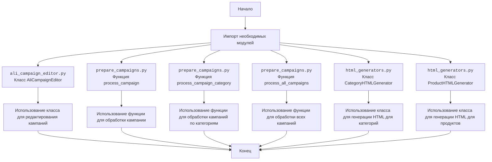

## Анализ кода `hypotez/src/suppliers/aliexpress/campaign/__init__.py`

### <алгоритм>

1.  **Импорт модулей:**
    *   Импортируются модули для работы с рекламными кампаниями AliExpress.
    *   `AliCampaignEditor`: Редактирование кампаний. Пример: создание, изменение, удаление кампаний.
    *   `process_campaign`: Обработка одной кампании. Пример: подготовка данных для кампании.
    *   `process_campaign_category`: Обработка кампаний по категориям. Пример: обработка всех кампаний в категории "Одежда".
    *   `process_all_campaigns`: Обработка всех кампаний. Пример: обработка всех существующих кампаний.
    *   `CategoryHTMLGenerator`: Генерация HTML для категорий. Пример: создание HTML-отчета для категории "Электроника".
    *   `ProductHTMLGenerator`: Генерация HTML для продуктов. Пример: создание HTML-отчета для конкретного продукта.

2.  **Логика работы:**
    *   Модуль `__init__.py` служит точкой входа для пакета `campaign`.
    *   Импортированные модули предоставляют инструменты для различных операций с рекламными кампаниями.
    *   Использование: вызываем необходимые методы классов для выполнения нужных действий.
    *   Поток данных: Данные о кампаниях могут передаваться между функциями и классами, например `process_campaign` может использовать методы класса `AliCampaignEditor`.

### <mermaid>



### <объяснение>

*   **Импорты:**
    *   `from .ali_campaign_editor import AliCampaignEditor`: Импортирует класс `AliCampaignEditor` из модуля `ali_campaign_editor.py` внутри текущего пакета. Этот класс предназначен для редактирования рекламных кампаний на AliExpress.  
    *   `from .prepare_campaigns import  process_campaign, process_campaign_category, process_all_campaigns`: Импортирует функции `process_campaign`, `process_campaign_category` и `process_all_campaigns` из модуля `prepare_campaigns.py`. Эти функции отвечают за обработку кампаний, включая подготовку данных и управление ими.
    *   `from .html_generators import CategoryHTMLGenerator, ProductHTMLGenerator`: Импортирует классы `CategoryHTMLGenerator` и `ProductHTMLGenerator` из модуля `html_generators.py`. Эти классы предназначены для генерации HTML-отчетов.

*   **Назначение:**
    *   `__init__.py` делает пакет `campaign` модулем, позволяя импортировать классы и функции из других модулей пакета.
    *   Импортированные модули содержат классы и функции для управления рекламными кампаниями AliExpress, включая редактирование, обработку и генерацию отчетов.

*   **Взаимосвязи:**
    *   Импортированные модули (например, `ali_campaign_editor`, `prepare_campaigns` и `html_generators`) предоставляют функциональность для манипуляций с рекламными кампаниями.
    *   Классы `AliCampaignEditor`, `CategoryHTMLGenerator`, и `ProductHTMLGenerator` представляют собой инструменты для конкретных задач.
    *   Функции `process_campaign`, `process_campaign_category` и `process_all_campaigns` предоставляют логику для обработки кампаний.

*   **Пример использования:**
    ```python
    from src.suppliers.aliexpress.campaign import AliCampaignEditor, process_campaign, CategoryHTMLGenerator

    # Создание экземпляра класса AliCampaignEditor
    campaign_editor = AliCampaignEditor()
    # Редактирование кампании
    campaign_editor.update_campaign(campaign_id='12345', new_name='New Campaign Name')

    # Обработка кампании
    campaign_data = process_campaign(campaign_id='12345')
    
    # Создание HTML отчета
    html_generator = CategoryHTMLGenerator()
    html_report = html_generator.generate_html(category_name='Electronics')
    ```

*   **Потенциальные ошибки и улучшения:**
    *   Может потребоваться дополнительная обработка ошибок.
    *   Может потребоваться добавление новых модулей для поддержки дополнительных функций.

Цепочка взаимосвязей:
1.  `src.suppliers.aliexpress.campaign` является пакетом, который предоставляет модули для работы с кампаниями AliExpress.
2.  Этот пакет может использовать другие части проекта, например, `src.gs` для глобальных настроек или `src.db` для взаимодействия с базой данных, хотя это не видно в данном фрагменте кода.
3.  `ali_campaign_editor` отвечает за редактирование, `prepare_campaigns` за подготовку и `html_generators` за генерацию отчетов.
4.  Эти модули могут использовать другие части проекта для получения необходимых данных.