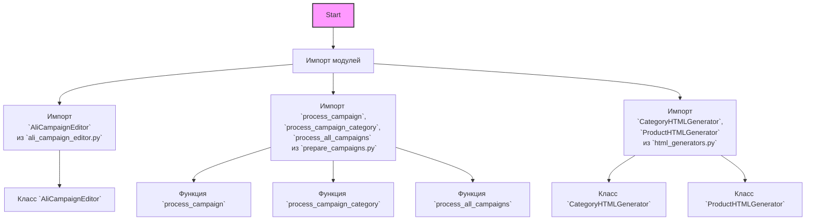

## АНАЛИЗ КОДА: `hypotez/src/suppliers/aliexpress/campaign/__init__.py`

### <алгоритм>

1.  **Импорт модулей:**
    *   Импортируются модули из текущего пакета `src.suppliers.aliexpress.campaign`.
    *   Примеры:
        *   `from .ali_campaign_editor import AliCampaignEditor`: импорт класса `AliCampaignEditor` для управления рекламными кампаниями.
        *   `from .prepare_campaigns import process_campaign, process_campaign_category, process_all_campaigns`: импорт функций для обработки кампаний.
        *   `from .html_generators import CategoryHTMLGenerator, ProductHTMLGenerator`: импорт классов для генерации HTML-контента.

2. **Инициализация пакета:**
    *  `__init__.py` файл не содержит исполняемого кода, а только определяет, какие модули из пакета будут доступны при импорте пакета в другие модули.
    *  Служит как входная точка для пакета `src.suppliers.aliexpress.campaign`, позволяя импортировать его подмодули как единое целое.
    *  Пример: при импорте `from src.suppliers.aliexpress import campaign`, можно будет использовать импортированные классы/функции, например: `campaign.AliCampaignEditor`.

3. **Цепочка вызовов:**
    *   Пользователь инициирует взаимодействие с модулем, импортируя его.
    *   В зависимости от требуемой функциональности, используются либо классы `AliCampaignEditor`, `CategoryHTMLGenerator`, `ProductHTMLGenerator` или функции `process_campaign`, `process_campaign_category`, `process_all_campaigns`.
    *   Например, для редактирования кампании будет использоваться `AliCampaignEditor`, для генерации HTML - `CategoryHTMLGenerator` или `ProductHTMLGenerator`, а для обработки данных кампаний - функции из `prepare_campaigns`.

### <mermaid>

### <объяснение>

**Импорты:**

*   `from .ali_campaign_editor import AliCampaignEditor`: импортирует класс `AliCampaignEditor` из модуля `ali_campaign_editor.py`, находящегося в том же пакете. Этот класс, вероятно, отвечает за логику редактирования рекламных кампаний AliExpress.
*   `from .prepare_campaigns import process_campaign, process_campaign_category, process_all_campaigns`: импортирует функции `process_campaign`, `process_campaign_category` и `process_all_campaigns` из модуля `prepare_campaigns.py`. Эти функции, вероятно, предназначены для обработки и подготовки данных рекламных кампаний, разделенных по кампаниям, категориям, или всех кампаний сразу.
*   `from .html_generators import CategoryHTMLGenerator, ProductHTMLGenerator`: импортирует классы `CategoryHTMLGenerator` и `ProductHTMLGenerator` из модуля `html_generators.py`. Эти классы, вероятно, отвечают за генерацию HTML-контента на основе данных о категориях и продуктах для кампаний.

**Классы:**

*   `AliCampaignEditor`: класс для редактирования рекламных кампаний AliExpress. Скорее всего содержит методы для загрузки, изменения и сохранения данных кампаний.
*   `CategoryHTMLGenerator`: класс для генерации HTML-контента, связанного с категориями товаров в кампаниях. Может содержать методы для форматирования данных в HTML.
*   `ProductHTMLGenerator`: класс для генерации HTML-контента, связанного с продуктами в кампаниях. Может содержать методы для форматирования данных о продуктах в HTML.

**Функции:**

*   `process_campaign`: функция для обработки данных отдельной рекламной кампании. Может принимать на вход данные кампании и возвращать обработанные данные.
*   `process_campaign_category`: функция для обработки данных рекламных кампаний по категориям. Может принимать на вход данные о категориях и возвращать обработанные данные.
*   `process_all_campaigns`: функция для обработки данных всех рекламных кампаний. Может принимать на вход данные всех кампаний и возвращать обработанные данные.

**Переменные:**

*   В файле `__init__.py` нет глобальных переменных. Он используется для импорта и инициализации модуля.

**Цепочка взаимосвязей с другими частями проекта:**

*   Этот пакет `src.suppliers.aliexpress.campaign` является частью более крупной системы, скорее всего, связанной с управлением рекламными кампаниями на AliExpress. Он взаимодействует с другими модулями проекта для получения и обработки данных, а также для генерации отчетов. В частности, он может зависеть от модуля `src` в целом, через `gs` (global settings) и другие модули для работы с API AliExpress, базами данных или другими сервисами.

**Потенциальные ошибки и области для улучшения:**

*   Отсутствие документации (docstrings) для классов и функций. Рекомендуется добавить docstrings для улучшения понимания кода.
*   Комментарии `#from .gsheet import AliCampaignGoogleSheet` и `#from .ali_campaign_editor_jupyter_widgets import JupyterCampaignEditorWidgets` указывают на то, что некоторые модули не используются в текущей версии кода. Возможно, их следует удалить или пересмотреть.

В целом, `__init__.py` файл определяет, какие компоненты пакета `src.suppliers.aliexpress.campaign` доступны для импорта и использования в других частях проекта. Он предоставляет интерфейс для управления рекламными кампаниями на AliExpress, включая редактирование, обработку данных и генерацию HTML-контента.