# Анализ кода модуля `campaign` для AliExpress

## <input code>

```
### Overview

The `campaign` module in the AliExpress system is designed to manage and edit promotional campaigns, interact with Google Sheets for data, and prepare campaign data for use. Below is a high-level overview of the algorithm and workflow within the module.
<pre>
# ... (Код описания модуля) ...
</pre>
### Algorithm

(Подробное описание алгоритма, представленное в исходном коде, опускается для краткости.  Вместо него будет предоставлена более структурированная блок-схема.)

```mermaid
graph LR
    A[AliPromoCampaign.__init__] --> B{Загрузка данных из JSON};
    B --> C[Инициализация self.campaign];
    C --> D[Получение категории из кампании];
    D --> E[Получение продуктов категории];
    E --> F[Подготовка продуктов];
    F --> G[Сохранение подготовленных продуктов];
    
    subgraph Подготовка продуктов
        F --> H[Получение подготовленных продуктов];
        H --> I[Чтение источников.txt];
        I --> J[Чтение источников.csv];
        J --> K[Извлечение id продуктов];
        K --> L[Обработка продуктов-партнёров];
    end

    style B fill:#f9f,stroke:#333,stroke-width:2px;
    style C fill:#ccf,stroke:#333,stroke-width:2px;
    style D fill:#ccf,stroke:#333,stroke-width:2px;
    style E fill:#ccf,stroke:#333,stroke-width:2px;
    style F fill:#ccf,stroke:#333,stroke-width:2px;
    style G fill:#ccf,stroke:#333,stroke-width:2px;
    style H fill:#ccf,stroke:#333,stroke-width:2px;
    style I fill:#ccf,stroke:#333,stroke-width:2px;
    style J fill:#ccf,stroke:#333,stroke-width:2px;
    style K fill:#ccf,stroke:#333,stroke-width:2px;
    style L fill:#ccf,stroke:#333,stroke-width:2px;
```

## <mermaid>



**Описание зависимостей:**

*   `AliPromoCampaign` использует `gs` для работы с Google Drive.
*   Используются классы и функции из `src.utils` (например, `j_loads_ns`, `csv2dict`).
*   Подключается функционал работы с файлами (из `src.utils.file`).
*   Используются вспомогательные функции `extract_prod_ids` и `ensure_https` для обработки данных продуктов и URL.
*   Для обработки JSON и CSV используются соответствующие функции.
*   Взаимодействие с Google Sheets происходит с использованием модулей `gspread` и `pandas`.

## <explanation>

**Импорты:**

*   `from pathlib import Path`: Импортирует класс `Path` для работы с путями к файлам.
*   `from typing import List, Optional`: Используются для объявления типов аргументов и возвращаемых значений.
*   `from types import SimpleNamespace`: Импортирует класс `SimpleNamespace`, используемый для создания объектов с атрибутами, подобных словарям.
*   `from src import gs`: Подключает модуль `gs`, вероятно, для работы с Google Sheets.  Нужно уточнить структуру проекта `src` для понимания всех зависимостей.
*   `from src.suppliers.aliexpress.affiliated_products_generator import AliAffiliatedProducts`: Вероятно, предоставляет инструменты для работы с партнерскими продуктами AliExpress.
*   `from src.suppliers.aliexpress.utils.extract_product_id import extract_prod_ids`: Импортирует функцию для извлечения идентификаторов продуктов.
*   `from src.suppliers.aliexpress.utils.set_full_https import ensure_https`: Возможно для обработки URL.
*   `from src.utils import j_loads_ns, j_loads, pprint`: Функции для работы с JSON.
*   `from src.utils.convertors import list2string, csv2dict`: Функции для преобразования данных.
*   `from src.utils.file import read_text_file, get_filenames`: Функции для работы с файлами.
*   `from src.logger import logger`: Модуль для ведения логов.


**Классы:**

*   `AliPromoCampaign`: Класс для управления рекламными кампаниями AliExpress.  Он хранит информацию о кампании, категории и продуктах.  Методы позволяют инициализировать кампанию, получать продукты из категории и готовить их к использованию.

**Функции:**

*   `__init__`: Конструктор класса `AliPromoCampaign`.  Инициализирует объект и загружает данные из JSON.
*   `initialize_campaign`: Метод для инициализации объекта кампании.
*   `get_category_from_campaign`: Метод для извлечения информации о категории из данных кампании.
*   `get_category_products`: Метод для загрузки продуктов, относящихся к данной категории.  Если аргумент `force_update` равен `True`, выполняется обновление данных.
*   `create_product_namespace`, `create_campaign_namespace`: Используются для создания объектов `SimpleNamespace`.
*   `prepare_products`: Метод для подготовки данных о продуктах для использования.

**Переменные:**

*   `campaign_name`, `category_name`, `language`, `currency`, `force_update`: Атрибуты, описывающие данные кампании.


**Возможные ошибки и улучшения:**

*   Отсутствует явное описание типа возвращаемых значений некоторых методов, что может привести к ошибкам в будущем.
*   Необходимо более точно описать работу с внешними зависимостями (например, `gs`).
*   Не хватает проверок на корректность вводимых данных.
*   Логика подготовки продуктов может быть переработана, чтобы быть более понятной и поддерживаемой.


**Взаимосвязь с другими частями проекта:**

Модуль `campaign` тесно связан с другими модулями в проекте, особенно с `src.suppliers.aliexpress`, `src.utils`, и `src.settings.gs`.  Он взаимодействует с внешними сервисами, такими как Google Sheets, для получения и обработки данных.


**Подробное объяснение алгоритма (на основе блок-схемы):**

(Здесь нужно дополнить объяснение каждого шага, отображенного на блок-схеме, с описанием действий, данных и потоков управления.)