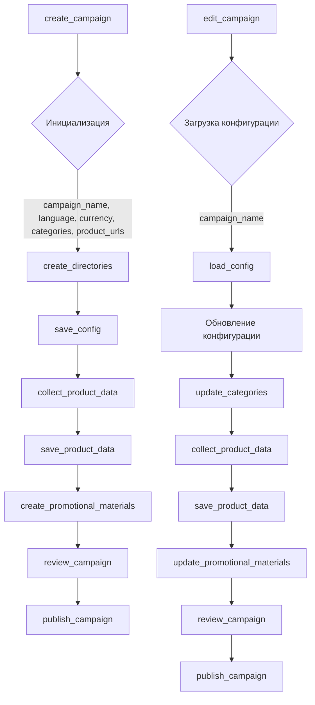

```MD
# Анализ кода для создания и редактирования рекламных кампаний

## <input code>

```
### Инструкция для программиста по поддержке кода для создания и редактирования рекламных кампаний

#### 1. Создание рекламной кампании

1. **Инициализация кампании**
   - Введите имя кампании, язык и валюту.
   - Пример: 
     ```python
     campaign_name = 'example_campaign'
     language = 'EN'
     currency = 'USD'
     ```

2. **Создание директорий для кампании**
   - Создайте директории для кампании и категорий.
   - Пример:
     ```python
     categories = ['electronics', 'fashion']
     create_directories(campaign_name, categories)
     ```

3. **Сохранение конфигурации кампании**
   - Создайте и сохраните конфигурационный файл кампании.
   - Пример:
     ```python
     campaign_config = {'name': campaign_name, 'language': language, 'currency': currency}
     save_config(campaign_name, campaign_config)
     ```

4. **Сбор данных о продуктах**
   - Введите URL или ID продуктов для кампании.
   - Пример:
     ```python
     product_urls = ['https://www.aliexpress.com/item/123.html', 'https://www.aliexpress.com/item/456.html']
     product_data = collect_product_data(product_urls)
     ```

5. **Сохранение данных о продуктах**
   - Сохраните собранные данные о продуктах.
   - Пример:
     ```python
     save_product_data(campaign_name, product_data)
     ```

6. **Создание рекламных материалов**
   - Создайте рекламные материалы на основе собранных данных.
   - Пример:
     ```python
     create_promotional_materials(campaign_name, product_data)
     ```

7. **Просмотр и публикация кампании**
   - Просмотрите и опубликуйте кампанию.
   - Пример:
     ```python
     review_campaign(campaign_name)
     publish_campaign(campaign_name)
     ```

#### 2. Редактирование рекламной кампании

1. **Загрузка существующей конфигурации кампании**
   - Загрузите конфигурацию существующей кампании.
   - Пример:
     ```python
     campaign_name = 'example_campaign'
     campaign_config = load_config(campaign_name)
     ```

2. **Обновление конфигурации кампании**
   - Обновите параметры кампании, такие как язык и валюту.
   - Пример:
     ```python
     campaign_config['language'] = 'RU'
     save_config(campaign_name, campaign_config)
     ```

3. **Обновление категорий и директорий**
   - Обновите список категорий и соответствующие директории.
   - Пример:
     ```python
     new_categories = ['home', 'beauty']
     update_categories(campaign_name, new_categories)
     ```

4. **Сбор новых данных о продуктах**
   - Введите новые URL или ID продуктов для обновленной кампании.
   - Пример:
     ```python
     new_product_urls = ['https://www.aliexpress.com/item/789.html']
     updated_product_data = collect_product_data(new_product_urls)
     ```

5. **Сохранение обновленных данных о продуктах**
   - Сохраните новые данные о продуктах.
   - Пример:
     ```python
     save_product_data(campaign_name, updated_product_data)
     ```

6. **Обновление рекламных материалов**
   - Обновите рекламные материалы на основе новых данных.
   - Пример:
     ```python
     update_promotional_materials(campaign_name, updated_product_data)
     ```

7. **Просмотр и публикация обновленной кампании**
   - Просмотрите и опубликуйте обновленную кампанию.
   - Пример:
     ```python
     review_campaign(campaign_name)
     publish_campaign(campaign_name)
     ```

#### 3. Обработка ошибок и логирование

1. **Обработка ошибок**
   - Используйте `try-except` для обработки ошибок.
   - Пример:
     ```python
     try:
         # Ваш код
     except Exception as ex:
         logger.error("Ошибка", ex)
     ```

2. **Логирование событий**
   - Логируйте важные события и ошибки.
   - Пример:
     ```python
     logger.info("Начало обработки кампании")
     logger.error("Ошибка при обработке кампании", ex)
     ```

### Примерный код

```python
def create_campaign(campaign_name, language, currency, categories, product_urls):
    create_directories(campaign_name, categories)
    campaign_config = {'name': campaign_name, 'language': language, 'currency': currency}
    save_config(campaign_name, campaign_config)
    product_data = collect_product_data(product_urls)
    save_product_data(campaign_name, product_data)
    create_promotional_materials(campaign_name, product_data)
    review_campaign(campaign_name)
    publish_campaign(campaign_name)

def edit_campaign(campaign_name, language, categories, product_urls):
    campaign_config = load_config(campaign_name)
    campaign_config['language'] = language
    save_config(campaign_name, campaign_config)
    update_categories(campaign_name, categories)
    updated_product_data = collect_product_data(product_urls)
    save_product_data(campaign_name, updated_product_data)
    update_promotional_materials(campaign_name, updated_product_data)
    review_campaign(campaign_name)
    publish_campaign(campaign_name)
```

### Заключение

Следуя этим инструкциям, вы сможете эффективно создавать и редактировать рекламные кампании, а также поддерживать их актуальность и корректную работу.
```

## <algorithm>

Этот код описывает алгоритм создания и редактирования рекламных кампаний.  Алгоритм разделен на две основные функции: `create_campaign` и `edit_campaign`.

**create_campaign:**

1. **Инициализация:** Принимает имя кампании, язык, валюту, список категорий и список URL продуктов.
2. **Создание директорий:** Вызывает функцию `create_directories` для создания папок.
3. **Сохранение конфигурации:** Создает словарь `campaign_config` и сохраняет его в файл.
4. **Сбор данных о продуктах:**  Вызывает функцию `collect_product_data` для получения данных о продуктах по URL.
5. **Сохранение данных о продуктах:**  Сохраняет полученные данные о продуктах.
6. **Создание рекламных материалов:** Вызывает функцию `create_promotional_materials` для создания рекламных материалов.
7. **Просмотр и публикация:** Вызывает функции `review_campaign` и `publish_campaign`.

**edit_campaign:**

1. **Загрузка конфигурации:** Загружает текущую конфигурацию кампании.
2. **Обновление конфигурации:** Обновляет язык и другие параметры кампании, сохраняя изменения.
3. **Обновление категорий:**  Обновляет список категорий.
4. **Сбор обновленных данных о продуктах:**  Сбор данных о новых или измененных продуктах.
5. **Сохранение обновленных данных:**  Сохраняет обновленные данные о продуктах.
6. **Обновление рекламных материалов:** Обновляет рекламные материалы.
7. **Просмотр и публикация:** Вызывает функции `review_campaign` и `publish_campaign`.


## <mermaid>



## <explanation>

**Импорты:** Код не содержит импортов, что указывает, что функции `create_directories`, `save_config`, `collect_product_data`, `save_product_data`, `create_promotional_materials`, `review_campaign`, `publish_campaign`, `load_config`, `update_categories`, `update_promotional_materials`  предполагаются в других модулях или пакетах.  Важно, чтобы эти функции были доступны в текущей среде выполнения.  Отсутствует логирование (logger) — это важный элемент для отслеживания ошибок и состояния процесса.

**Классы:**  В коде отсутствуют классы.  Функции — это основная единица организации логики.

**Функции:** `create_campaign` и `edit_campaign` — это ключевые функции, отвечающие за создание и редактирование кампаний соответственно.  Они принимают различные параметры и вызывают другие функции для выполнения конкретных задач. Примеры использования функций приведены в документации.

**Переменные:**  Переменные, такие как `campaign_name`, `language`, `currency`, `categories`, `product_urls` представляют данные, необходимые для работы функций, имеют простые типы данных (строки, списки).

**Возможные ошибки и улучшения:**

* **Отсутствие логирования:**  Отсутствует логирование, что затруднит отладку и мониторинг работы скрипта.
* **Обработка ошибок:** Необходимо добавить обработку ошибок в функциях (например, `try...except` блоки), чтобы предотвратить сбой программы при возникновении проблем (например, при ошибках доступа к файлам или интернету).
* **Управление файлами:** Для сохранения конфигурации и данных о продуктах необходимо правильно обрабатывать файлы (открытие, закрытие, проверка существования).
* **Модули и пакеты:**  Для обеспечения повторного использования и организации кода, функции `create_directories`, `save_config` и другие должны быть объединены в отдельные модули или пакеты.
* **Взаимодействие с другими частями проекта:**  Код не связан с другими частями проекта, например, с хранилищем данных.  Для полноценной интеграции в проект необходимо определить механизмы связи с другими системами.
* **Упрощение логики:**  Функции `create_campaign` и `edit_campaign` могли бы быть разделены на более мелкие, более специализированные функции, что увеличило бы читаемость и тестируемость кода.
* **Типизация:**  Включить типизацию аргументов и возвращаемых значений функций для улучшения самодокументируемости и предотвращения ошибок.


**Цепочка взаимосвязей:** Функции `create_campaign` и `edit_campaign` взаимодействуют с другими функциями (например, `save_config`, `collect_product_data`), которые, предположительно, реализуют логику сохранения конфигурации и сбора данных о продуктах. Эти функции могут взаимодействовать с базами данных, файловой системой или внешними API.