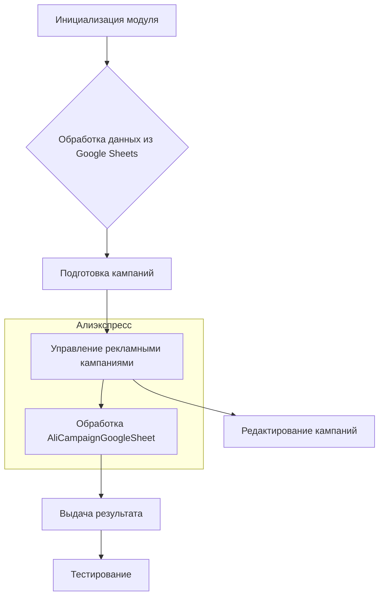
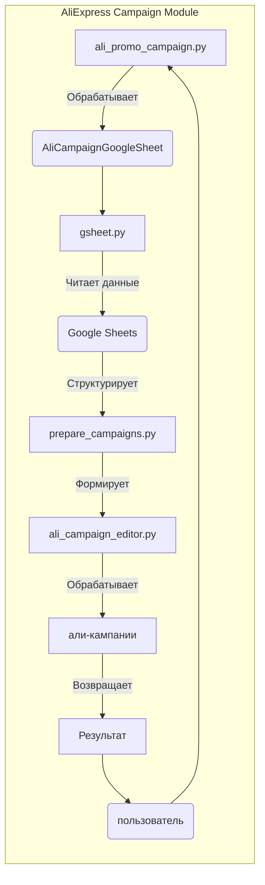

```MD
# Анализ кода модуля AliExpress campaign

## <input code>

```
campaign/                                   # AliExpress campaign management module
├── __init__.py                             # Initializes the campaign module
├── ali_campaign_editor.py                  # Main logic for editing AliExpress campaigns
├── ali_promo_campaign.py                   # Manages promotional campaigns for AliExpress
│   ├── Dependencies:
│   │   └── from src.suppliers.aliexpress import AliCampaignGoogleSheet
├── gsheet.py                               # Handles interactions with Google Sheets for campaign data
│   ├── Dependencies:
│   │   └── gspread
│   │   └── pandas
│   │   └── src.settings.gs
├── header.py                               # Common functions or classes used across the campaign module
├── prepare_campaigns.py                    # Sets up and organizes necessary data for campaigns
├── ttypes.py                               # Defines types and structures used in the campaign module
├── version.py                              # Contains version information for the campaign module
├── _docs/                                  # Documentation directory
│   ├── campaign.md                         # Documentation for the campaign module
│   ├── code_instructions.md                # Instructions for coding and using the campaign module
│   ├── startup_optioins.md                 # Provides information on startup options for the campaign module
├── _dot/                                   # Graphical representations in DOT format
│   ├── aliexpress_campaign.dot             # DOT file representing the structure of the AliExpress campaign
├── _examples/                              # Example scripts directory
│   ├── _examle_prepare_campains.py         # Example script for preparing campaigns
│   ├── _example_ali_promo_campaign.py      # Example script for AliExpress promotional campaigns
│   ├── _example_edit_campaign.py           # Example script for editing campaigns
│   ├── header.py                           # Header example showing common imports and settings
├── _mermaid/                               # Graphical representations in Mermaid format
│   ├── AliAffiliatedProducts.mer           # Mermaid diagram file for affiliated products
│   ├── aliexpress_campaign.mer             # Mermaid diagram file for AliExpress campaign
├── _pytest/                                # Test scripts directory
│   ├── guide_test.md                       # Guide for testing the campaign module
│   ├── test_alipromo_campaign.py           # Test script for the ali_promo_campaign module
│   ├── test_campaign_integration.py        # Test script for integration testing of the campaign module
│   ├── test_edit_capmaign.py               # Test script for editing campaigns
│   ├── test_prepeare_campaigns.py          # Test script for preparing campaigns
```

## <algorithm>



**Пример:**

Пользователь запускает процесс. Модуль инициализируется. Функции обработки данных из Google Sheets извлекают данные о кампаниях. Функция подготовки кампаний структурирует эти данные. Функции управления рекламными кампаниями обрабатывают отдельные типы кампаний. Функция редактирования кампаний позволяет модифицировать данные.  Все шаги выполняются последовательно, результаты обработки данных передаются между модулями.

## <mermaid>



## <explanation>

**Импорты**:

* `from src.suppliers.aliexpress import AliCampaignGoogleSheet`:  Импортирует класс `AliCampaignGoogleSheet` из модуля `aliexpress` внутри пакета `src`.  Это указывает на связь между модулями обработки данных Алиэкспресс и обработкой данных из Google Sheets.
* `gspread`, `pandas`, `src.settings.gs`:  Импорты из внешних библиотек (`gspread`, `pandas`) и внутренних настроек (`src.settings.gs`) необходимы для работы с Google Sheets. Связь с `settings.gs` явно показывает, что настройки Google Sheets хранятся в отдельном модуле.

**Классы**:

* `AliCampaignGoogleSheet`:  Вероятно, класс, отвечающий за взаимодействие с Google Sheets для получения данных о кампаниях AliExpress. Необходим для работы с API Google Sheets.
* Другие классы (`ali_campaign_editor`, `ali_promo_campaign`, `gsheet` и т.д.) - отвечают за конкретные задачи управления кампаниями и взаимодействием с Google Sheets.  

**Функции**:

* Функции в модулях `ali_promo_campaign`, `ali_campaign_editor`, `prepare_campaigns` и `gsheet` отвечают за обработку данных кампаний, их структурирование, взаимодействие с Google Sheets и работу с API Google Sheets.  Недостаточно информации, чтобы точно указать логику каждой функции.


**Переменные**:

* Тип переменных зависит от конкретного контекста. Обычно используются типы данных, необходимые для работы с данными о кампаниях, такими как строки, числа, списки и словари.

**Возможные ошибки и улучшения**:

* Недостаточно информации о логике работы функций и классов. Требуется подробное описание каждой функции и класса для полного понимания их поведения.
* Отсутствие описания возможных исключений или ошибок может привести к трудностям при отладке и тестировании.
* Нет информации о структуре данных из Google Sheets. Нужно знать формат данных, чтобы понять, как происходит их обработка.
* Отсутствует описание архитектуры и взаимодействия других модулей проекта.


**Цепочка взаимосвязей**:

Модуль `aliexpress` взаимодействует с модулем `gsheet`, который, в свою очередь, использует внешние библиотеки (`gspread`, `pandas`) и внутренние настройки (`src.settings.gs`).  Это создаёт цепочку зависимостей, требующих правильного взаимодействия для корректной работы. Результаты работы `gsheet` используются для подготовки и управления кампаниями, что затем используется другими модулями проекта.


**Примечание:** Для более глубокого анализа необходимо предоставление кода соответствующих файлов.  Данный анализ основан на структуре файлов и комментариях к ним.