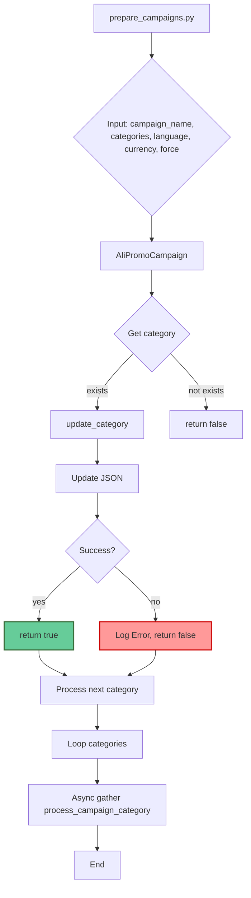

```MD
# Анализ кода для подготовки рекламных кампаний AliExpress

## <input code>

```python
""" Prepare all material in the 'aliexpress/campaigns' directories for advertising campaigns
<pre>
+-------------------------+
| Start                   |
| Создание рекламной      |
| кампании                |
+-----------+-------------+
            |
            v
+-----------+---------------+
| Initialize Campaign Name, |
| Language, and Currency    |
+-----------+---------------+
            |
            v
+-----------+-------------+
| Create Campaign and     |
| Category Directories    |
+-----------+-------------+
            |
            v
+-----------+-----------------+
| Save Campaign Configuration |
+-----------+-----------------+
            |
            v
+-----------+-------------+
| Collect Product Data    |
+-----------+-------------+
            |
            v
+-----------+-------------+
| Save Product Data       |
+-----------+-------------+
            |
            v
+-----------+------------------+
| Create Promotional Materials |
+-----------+------------------+
            |
            v
+-----------+-------------+
| Review Campaign         |
+-----------+-------------+
            |
            v
+-----------+-------------+
| Is Campaign Ready?      |
+-----------+-------------+
   | Yes / No
   v      v
+-----------+-------------+
| Publish Campaign        |
+-----------+-------------+
   |
   v
+-----------+-------------+
| End                     |
| Создание рекламной      |
| кампании                |
+-------------------------+
</pre>
@code
python src/suppliers/aliexpress/campaigns/prepare_campaigns.py <campaign_name> [-c <categories>] [-l <language>] [-cu <currency>] [-f]

python src/suppliers/aliexpress/campaigns/prepare_campaigns.py summer_sale -c electronics -l EN -cu USD -f
@endcode
"""

from types import SimpleNamespace
import asyncio
from pathlib import Path
from typing import List, Optional
from src import gs
from src.suppliers.aliexpress.campaign import AliPromoCampaign
from src.utils import get_directory_names, j_loads, j_loads_ns, j_dumps
from src.logger import logger

# Define the path to the directory with campaigns and languages with currencies
campaigns_directory = gs.path.google_drive / 'aliexpress' / 'campaigns'

# ... (rest of the code)
```

## <algorithm>

**Шаг 1:** Программа принимает имя кампании и опциональные параметры: категории, язык, валюта и флаг принудительного обновления.

**Шаг 2:** Создается объект `AliPromoCampaign`, инициализированный переданными параметрами.

**Шаг 3:** Определяется путь к файлу конфигурации кампании (`_json_path`).

**Шаг 4:** Проверяется, существует ли атрибут `category` у объекта `a`. Если нет, функция возвращает `False`.

**Шаг 5:** Вызывается функция `update_category` для обновления файла конфигурации с указанным путем и атрибутом `category` объекта `a`.

**Шаг 6:** Если обновление прошло успешно, функция возвращает `True`. В противном случае возвращает `False` и записывает предупреждение в лог.

**Пример:**
- Входные данные: `campaign_name = "summer_sale"`, `categories = ["electronics", "fashion"]`.
- Результат: обновить JSON файлы конфигурации для категорий "electronics" и "fashion" в кампании "summer_sale".

**Шаг 7:** Если параметр `categories` не указан, то берутся все доступные категории из директории `_cat_root`.

**Пример:**
- Входные данные: `campaign_name = "summer_sale"`.
- Результат: Получаются все имена директорий в папке "categories" кампании "summer_sale" и далее с ними осуществляется работа.

**Шаг 8:** Обработка каждой категории в цикле.

**Шаг 9:** Для каждой категории вызывается функция `process_campaign_category`.

**Шаг 10:** Результаты обработки категорий сохраняются в списке `results`.

**Шаг 11:** Если есть ошибки при обработке какой-либо категории, то выводится предупреждение.

**Шаг 12:** В функции `main` асинхронно обрабатываются все категории.

## <mermaid>



## <explanation>

**Импорты:**

- `from types import SimpleNamespace`: Импортирует класс `SimpleNamespace`, используемый для создания объектов с атрибутами, как словари.
- `import asyncio`: Импортирует модуль `asyncio` для асинхронной обработки.
- `from pathlib import Path`: Импортирует класс `Path` для работы с путями к файлам.
- `from typing import List, Optional`: Импортирует типы данных `List` и `Optional` для более ясной типизации.
- `from src import gs`: Импортирует модуль `gs` из пакета `src`. Вероятнее всего, он содержит функции для работы с Google Drive.
- `from src.suppliers.aliexpress.campaign import AliPromoCampaign`: Импортирует класс `AliPromoCampaign` из подпакета `campaign` пакета `aliexpress`.  Этот класс вероятно содержит логику работы с рекламными кампаниями AliExpress.
- `from src.utils import get_directory_names, j_loads, j_loads_ns, j_dumps`: Импортирует функции для работы с директориями, загрузкой/выгрузкой JSON данных.
- `from src.logger import logger`: Импортирует объект логгера для записи сообщений об ошибках и успехах в лог файл.

**Классы:**

- `AliPromoCampaign`: Этот класс отвечает за создание и настройку рекламной кампании AliExpress.  У него есть атрибуты (`campaign_name`, `category_name`, `language`, `currency`, `force`) и методы, используемые для работы с кампаниями и категориями.

**Функции:**

- `update_category(json_path: Path, category: SimpleNamespace) -> bool`: Обновляет категорию в JSON файле.  Принимает путь к файлу и объект `category` (`SimpleNamespace`), конвертирует его в словарь и записывает обратно в файл.
- `process_campaign_category(...)`: Обрабатывает одну категорию в рамках кампании.  Создает объект `AliPromoCampaign`, обновляет информацию в соответствующем JSON файле и возвращает `True` при успехе, `False` в случае ошибки.
- `process_campaign(...)`: Обрабатывает всю кампанию, перебирая все категории.
- `main(...)`: Асинхронная функция, которая обрабатывает все категории кампании.


**Переменные:**

- `campaigns_directory`: Путь к каталогу с рекламными кампаниями.

**Возможные ошибки и улучшения:**

- Отсутствует проверка существования файла `json_path` в функции `update_category`. Необходимо добавить проверку и обработку исключения `FileNotFoundError`.
- Необходимо добавить валидацию входных данных, чтобы предотвратить ошибки при некорректных значениях.
- Логирование должно быть более подробным, включая контекстную информацию.


**Взаимосвязи с другими частями проекта:**

- `gs`: Работа с Google Drive.
- `AliPromoCampaign`:  Логика работы с рекламными кампаниями AliExpress, скорее всего взаимодействует с другими модулями для сбора данных о продуктах, создания рекламных материалов и публикацией кампании.
- `utils`:  Функции для работы с JSON, вероятно используется в других частях проекта для работы с данными.
- `logger`:  Связано с системной логикой для отслеживания состояния выполнения.

Код организован в модульный и читабельный способ, но для более сложных кампаний можно рассмотреть декомпозицию функций и классов для улучшения масштабируемости и понимания.  Также полезно будет добавить unit-тесты для проверки корректности работы функций.